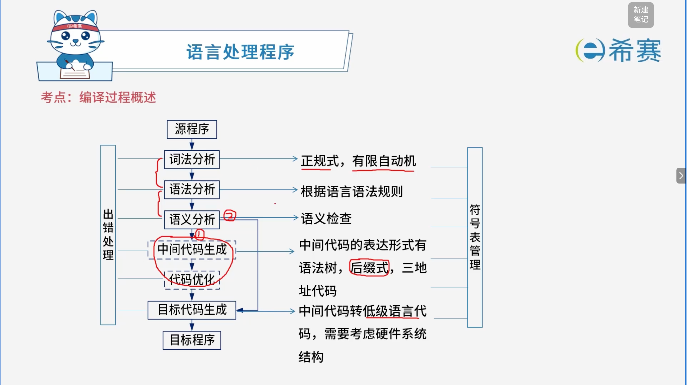
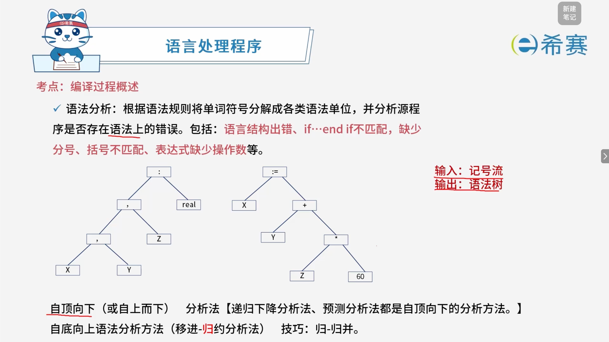
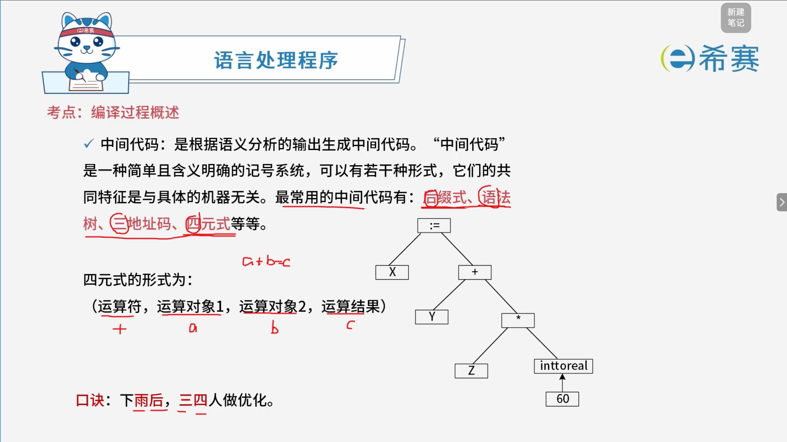
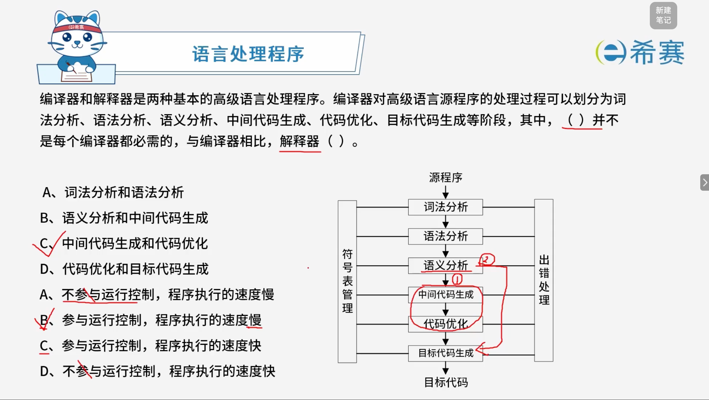

# 编译过程概述

## 1. 考点：编译过程



## 2. 考点：词法分析

- **词法分析**：从左到右逐个扫描源程序中的字符，识别其中如关键字（或称保留字）、标识符、常数、运算符以及分隔符（标点符号和括号）等。【**输出记号流**】

```plaintext
输入：源程序
输出：记号流
```

### 2.1 示例解析

- **源程序代码**：

```python
VAR X,Y,Z: real;
X:=y+Z*60;
```

- **词法分析识别结果（记号流）** ：

  1. 保留字 ​`VAR`
  2. 标识符 ​`X`
  3. 逗号 ​`,`
  4. 标识符 ​`Y`
  5. 逗号 ​`,`
  6. 标识符 ​`Z`
  7. 冒号 ​`:`
  8. 标识符 ​`real`
  9. 分号 ​`;`
  10. 标识符 ​`X`
  11. 赋值号 ​`:=`
  12. 标识符 ​`Y`
  13. 加号 ​`+`
  14. 标识符 ​`Z`
  15. 乘号 ​`*`
  16. 整常数 ​`60`
  17. 分号 ​`;`

## 3. 考点：语法分析



## 4. 考点：语义分析

- **语义分析**​：进行类型分析和检查，主要检测源程序是否存在​**静态语义错误**。包括：运算符和运算类型不符合，如取余时用浮点数。

### 4.1 符号表

- 记录源程序各个符号的必要信息，以辅助语义的正确性检查和代码生成。

|**符号名称**|**类型**|**地址/偏移量**|
| -----| ------| -----|
|X|real|0|
|Y|real|4|
|Z|real|8|
|...|...|...|

## 5. 考点：错误

- **动态错误**

  - 发生在**程序运行时**
  - 也叫动态语义错误
  - 常见例子：陷人死循环、变量取零时做除数、引用数组元素下标越界等错误
- **静态错误**（包含：词法错误、语法错误、静态语义错误）

  - 编译时所发现的程序错误
  - 分为**语法错误**和**静态语义错误**
  - **语法错误**包含：单词拼写错误、标点符号错误、表达式中缺少操作数、括号不匹配等有关语言结构上的错误
  - **静态语义分析**：运算符与运算对象类型不合法等错误

## 6. 考点：中间代码



## 7. 经典例题

### 7.1 题目一

> 

**正确答案：C、B。** 

### 7.2 题目二

> **题目：** 将编译器的工作过程划分为词法分析、语法分析、语义分析、中间代码生成、代码优化和目标代码生成时，语法分析阶段的输入是（）。若程序中的钩子或括号不匹配，则会在（）阶段检查出该错误。
>
> **第一空选项：**
>
> - A、记号流
> - B、字符流
> - C、源程序
> - D、分析树
>
> **第二空选项：**
>
> - A、词法分析
> - B、语法分析
> - C、语义分析
> - D、目标代码生成

**详细解析：**

- **第一空（语法分析阶段的输入）** ：

  - **词法分析**阶段的输入是源程序的​**字符流**​，经过扫描后输出​**记号流**（Token流）。
  - **语法分析**阶段的输入就是词法分析所输出的​**记号流**，其任务是根据文法规则将记号流组建成语法树（分析树）。
- **第二空（括号不匹配的检查阶段）** ：

  - **括号不匹配**属于程序结构上的错误，这属于​**语法错误**。
  - 语法错误是在**语法分析**阶段被检查并报告出来的（而语义分析检查的是类型不匹配、未声明等静态语义错误）。

**正确答案：第一空：A（记号流） / 第二空：B（语法分析）。** 

### 7.3 题目三

> **题目：** 将高级语言源程序先转化为一种中间代码是现代编译器的常见处理方式。常用的中间代码有后缀式、（）、树等。
>
> **选项：**
>
> - **A**、前缀码
> - **B**、三地址码
> - **C**、符号表
> - **D**、补码和移码

**详细解析：**

- **中间代码的形式**​：编译器中常用的中间代码主要有​**后缀式（逆波兰式）** ​、​**三地址码**（四元式、三元式、间接三元式等）和树（语法树/抽象语法树）等。
- **选项辨析**：

  - **B（三地址码）** ：是一种标准且常用的中间代码形式，每条指令最多包含三个地址（两个源操作数、一个结果）。
  - **A（前缀码）** ：虽然前缀式（波兰式）可以作为表达式的表示形式，但在编译器中间代码中通常说的是后缀式。
  - **C（符号表）** ：是编译程序中用来记录源程序中各种符号属性的表格，属于辅助数据结构，而不是中间代码。
  - **D（补码和移码）** ：是计算机底层对数字的机器码表示方法（数据编码方式），与编译中间代码无关。

**正确答案：B、三地址码。**
