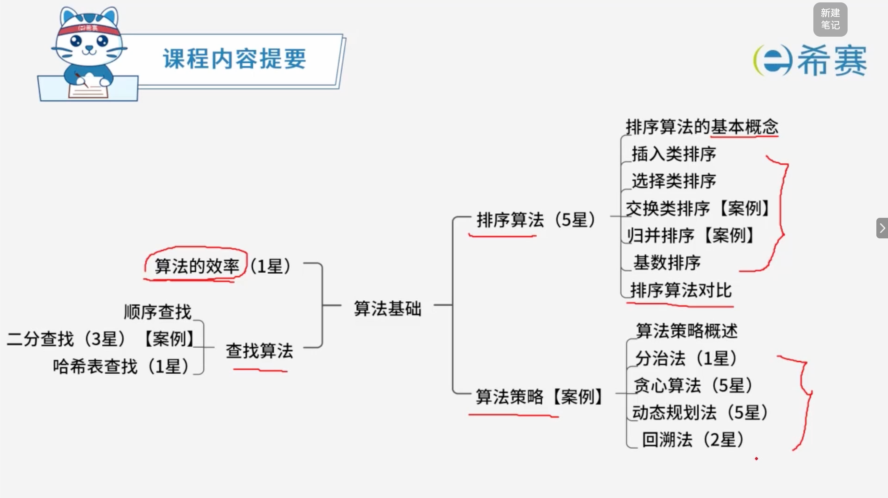
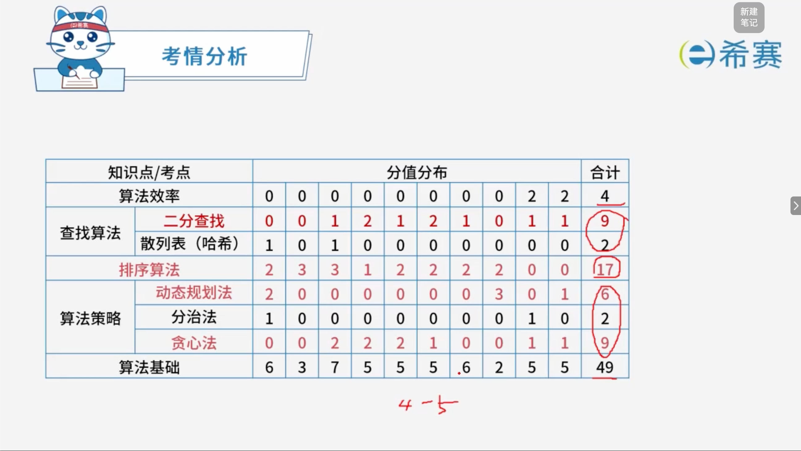

# 算法基础

## 1. 知识点分布

## 2. 历年考试分布

## 学习目录

- [算法的效率](./算法的效率.md)
- [顺序查找](./顺序查找.md)
- [二分查找](./二分查找.md)
- [哈希表查找](./哈希表查找.md)
- [排序算法的基本概念](./排序算法的基本概念.md)
- [插入类排序](./插入类排序.md)
- [选择类排序](./选择类排序.md)
- [交换类排序](./交换类排序.md)
- [归并排序](./归并排序.md)
- [基数排序](./基数排序.md)
- [排序算法对比](./排序算法对比.md)
- [算法策略](./算法策略.md)
