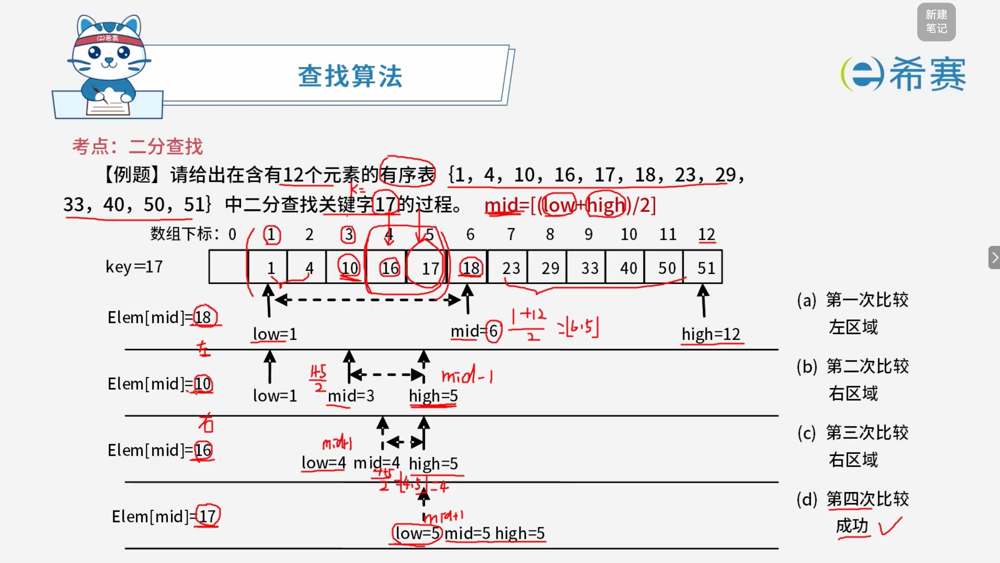

# 二分查找

## 1. 考点：基础概述

**查找算法 —— 二分查找（Binary Search / 折半查找）**

- **基本思想**（设 $R[\text{low}, \cdots, \text{high}]$ 是当前的查找区）：

  1. **确定中点位置**：$\text{mid} = \lfloor (\text{low} + \text{high}) / 2 \rfloor$。
  2. **关键字比较**：将待查的 $k$ 值与 $R[\text{mid}].\text{key}$ 比较：

     - 若相等，则查找成功并返回此位置。
     - 若 $R[\text{mid}].\text{key} > k$，则由表的有序性可知 $R[\text{mid}, \cdots, n].\text{key}$ 均大于 $k$，因此若表中存在关键字等于 $k$ 的结点，该结点必定是在位置 $\text{mid}$ 左边的子表 $R[\text{low}, \cdots, \text{mid}-1]$ 中。因此，新的查找区间是左子表，其中 $\text{high} = \text{mid}-1$。
     - 若 $R[\text{mid}].\text{key} < k$，则要查找的 $k$ 必在 $\text{mid}$ 的右子表 $R[\text{mid}+1, \cdots, \text{high}]$ 中，即新的查找区间是右子表，其中 $\text{low} = \text{mid}+1$。
  3. **重复步骤**：下一次查找是针对新的查找区间进行，重复步骤 (1) 和 (2)。
  4. **终止条件**：在查找过程中，$\text{low}$ 逐步增加，而 $\text{high}$ 逐步减少。如果 $\text{high} < \text{low}$，则查找失败，算法结束。

### 1.1 解析说明

- **前提条件**​：二分查找要求线性表必须采用​**顺序存储结构**​，且表中元素按关键字**有序**排列。
- **时间复杂度**：在最坏情况下，每次查找区间减半，因此时间复杂度为 ​**$O(\log_2 n)$**。

### 1.2 核心结论

- 二分查找通过不断缩小查找区间（折半）来提高效率，适用于静态有序表。

## 2. 考点：实例解析

### 2.1 总结

**查找算法 —— 折半查找（二分查找）核心考点**

- **折半查找的前提**​：必须满足**有序**和**顺序存储**。
- **最大比较次数**：折半查找在查找成功时，关键字的比较次数最多为 $\log_2 n + 1$ 次（通常向下取整后加 1，或直接按最大树深度计算）。
- **时间复杂度**：折半查找的时间复杂度为 $O(\log_2 n)$。

#### 2.1.1 解析说明

- **前提条件剖析**：

  - **有序**：表中的元素必须按关键字的大小升序或降序排列。
  - **顺序存储**：必须采用顺序表（如数组）存储，以便支持随机访问（通过索引直接计算中点 $\text{mid}$），如果采用链式存储则无法高效进行折半。
- **判定树与比较次数**：

  - 折半查找的过程可以用一棵二叉判定树来描述。对于含有 $n$ 个元素的有序表，其查找成功时的最大比较次数不超过 $\lfloor \log_2 n \rfloor + 1$。

## 3. 经典例题

### 3.1 题目一

> **题目：** 在线性表 $L$ 中进行二分查找，要求 $L$（ **C** ）。
>
> - A、顺序存储，元素随机排列
> - B、双向链表存储，元素随机排列
> - C、顺序存储，元素有序排列
> - D、双向链表存储，元素有序排列

 **【解析】**

本题考查的是二分查找（折半查找）的基本前提条件。

- **存储结构要求**​：二分查找需要通过索引直接定位并访问中间元素（即计算 ​`mid`​），因此必须采用​**顺序存储结构**（如数组），而不能采用链式存储（如双向链表）。
- **元素排列要求**​：二分查找通过比较中间元素与目标值的大小来不断缩小查找区间，这依赖于表具有单调性，因此表中的元素必须按关键字**有序排列**。

综上所述，二分查找要求线性表必须是**顺序存储**且**元素有序排列**。对应选项为 C。

**正确选项：C。** 

### 3.2 题目二

> **题目：** 对某有序表进行折半查找（二分查找）时，进行比较的关键字序列不可能是（ ）。
>
> - A、42, 61, 90, 85, 77
> - B、42, 90, 85, 61, 77
> - C、90, 85, 61, 77, 42
> - D、90, 85, 77, 61, 42

 **【解析】**

本题考查折半查找（二分查找）的判定树（比较路径）特性。

在有序表的折半查找过程中，每次比较的关键字序列必须满足​**二叉排序树（BST）的插入路径特性**。即对于序列中的任意一个元素，它之后的所有元素，要么全部小于它（如果它在左子树方向），要么全部大于它（如果它在右子树方向）。

**核心规律：**  在查找路径中，如果当前比较的关键字是 ​`mid`​，那么下一次比较的关键字 ​`next`：

- 如果 ​`next < mid`​，则 ​`next`​ 必须落在 ​`mid`​ 的左半区（比 ​`mid` 小）。
- 如果 ​`next > mid`​，则 ​`next`​ 必须落在 ​`mid`​ 的右半区（比 ​`mid` 大）。
- **一旦确定了方向，后续所有元素都必须在该方向的区间内。**

我们逐一分析选项：

- **A、42, 61, 90, 85, 77**

  - 42 -\> 61 (61 \> 42，向右，后续必须 \> 42)
  - 61 -\> 90 (90 \> 61，向右，后续必须 \> 61)
  - 90 -\> 85 (85 \< 90，向左，后续必须在 61 和 90 之间)
  - 85 -\> 77 (77 \< 85，向左，后续必须在 61 和 85 之间)
  - 77 在 61 和 85 之间，符合逻辑。​**可能**。
- **B、42, 90, 85, 61, 77**

  - 42 -\> 90 (90 \> 42，向右，后续必须 \> 42)
  - 90 -\> 85 (85 \< 90，向左，后续必须在 42 和 90 之间)
  - 85 -\> 61 (61 \< 85，向左，后续必须在 42 和 85 之间)
  - 61 -\> 77 (77 \> 61，向右，后续必须在 61 和 85 之间)
  - 77 在 61 和 85 之间，符合逻辑。​**可能**。
- **C、90, 85, 61, 77, 42**

  - 90 -\> 85 (85 \< 90，向左，后续必须 \< 90)
  - 85 -\> 61 (61 \< 85，向左，后续必须 \< 85)
  - 61 -\> 77 (77 \> 61，向右，后续必须在 61 和 85 之间)
  - 77 -\> 42 (42 \< 77，向左，后续必须在 61 和 77 之间)
  - **矛盾出现**​：42 不在 61 和 77 之间（42 \< 61）。因此，这个序列​**不可能**。
- **D、90, 85, 77, 61, 42**

  - 90 -\> 85 (85 \< 90，向左，后续必须 \< 90)
  - 85 -\> 77 (77 \< 85，向左，后续必须 \< 85)
  - 77 -\> 61 (61 \< 77，向左，后续必须 \< 77)
  - 61 -\> 42 (42 \< 61，向左，后续必须 \< 61)
  - 全部满足向左递减的规律，符合逻辑。​**可能**。

**正确选项：C。** 

‍
