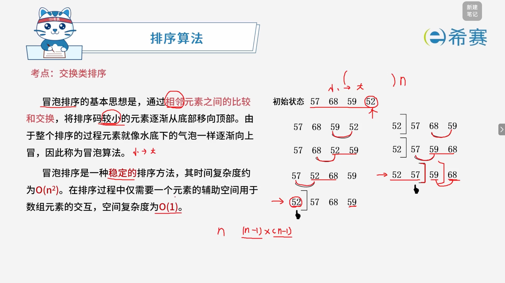
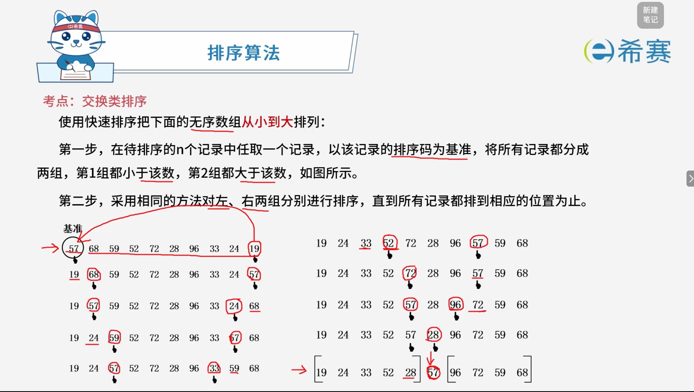

# 交换类排序

## 1. 考点：冒泡排序

### 1.1 知识点概览

**排序算法 —— 交换类排序：冒泡排序（Bubble Sort）**

- **基本思想**： 通过相邻元素之间的比较和交换，将排序码较小的元素逐渐从底部移向顶部。由于整个排序的过程元素就像水底的气泡一样逐渐向上冒，因此称为冒泡算法。
- **算法特性**：

  - **稳定性**​：冒泡排序是一种**稳定**的排序方法。
  - **时间复杂度**：其时间复杂度约为 **$O(n^2)$**。
  - **空间复杂度**：在排序过程中仅需要一个元素的辅助空间用于数组元素的交互，空间复杂度为 **$O(1)$**。

### 1.2 经典示例演示（从小到大排列）

给定初始状态序列：​`57, 68, 59, 52`

1. **第一趟**：

   - 从底端开始，相邻元素两两比较并交换：

     - 比较 ​`59`​ 与 ​`52`​，​`52 < 59`​，交换，序列变为 ​`57, 68, 52, 59`。
     - 比较 ​`68`​ 与 ​`52`​，​`52 < 68`​，交换，序列变为 ​`57, 52, 68, 59`。
     - 比较 ​`57`​ 与 ​`52`​，​`52 < 57`​，交换，序列变为 ​`52, 57, 68, 59`。
   - 最小值 ​`52` 经冒泡上升至最顶部。
2. **第二趟**：

   - 对剩余元素进行第二轮相邻比较与交换：

     - 比较 ​`59`​ 与 ​`68`​，​`59 < 68`​，交换，序列变为 ​`52, 57, 59, 68`。
     - 比较 ​`57`​ 与 ​`59`​，​`57 < 59`，不交换。
   - 第二小的值 ​`57` 就位。
3. **第三趟**：

   - 比较 ​`59`​ 与 ​`68`，无需交换，排序完成。
   - **最终结果**​：​`52, 57, 59, 68`。

### 1.3 核心要点总结

- **核心逻辑**：每一趟从后往前或从前往后对相邻元素进行比较，将极值逐步“冒泡”到边界位置，重复该过程直至整体有序。

## 2. 考点：快速排序

### 2.1 知识点概览

**排序算法 —— 交换类排序：快速排序（Quick Sort）**

- **基本思想**​：  
  快速排序采用的是​**分治法**，其基本思想是将原问题分解成若干个规模更小但结构与原问题相似的子问题。通过递归地解决这些子问题，然后再将这些子问题的解组合成原问题的解。
- **算法特性**：

  - **性能表现**：在 $O(n\log_2 n)$ 时间量级上，快速排序的平均性能最好。

### 2.2 详细执行过程

### 2.3 **快速排序的特性与复杂度**

- **基准元素（Pivot）** ：一般是第一个元素，也可以设置中位数。
- **算法特性**：

  - **稳定性**​：快速排序是一种**不稳定**的排序方法。
  - **时间复杂度**​：平均和最优情况下时间复杂度约为 **$O(n\log_2 n)$**。
- **辅助空间**：

  1. 如果只需一个辅助空间用于交换，空间复杂度为 ​**$O(1)$**。
  2. 如果需要辅助空间存储左侧数组和右侧数组时，空间复杂度为 ​**$O(n)$**。
  3. 如果递归调用需要借助栈，栈空间复杂度为 ​**$O(\log_2 n)$**。
- **最差情况（基本有序）** ：

  - 以第一个元素为基准元素，此时时间复杂度为 ​**$O(n^2)$**。
  - 以中位数为基准元素，此时时间复杂度仍为 **$O(n\log_2 n)$**。

#### 2.3.1 快速排序时间复杂度 $O(n\log_2 n)$ 的推导过程

在平均或最优情况下，每次选择的基准元素（Pivot）能够将当前序列​**均匀地划分为左右两个等长的子序列**（即每次都平分数组）。

##### 2.3.1.1 建立递推关系式

设对规模为 $n$ 的数组进行快速排序所需的时间为 $T(n)$：

- **划分代价**：在每一轮中，需要用基准元素对整个当前子序列进行一次扫描和交换，其时间与当前序列长度成正比，记为 $O(n)$。
- **子问题代价**：划分完成后，得到两个规模均为 $\frac{n}{2}$ 的子数组，分别需要递归进行快速排序，耗时为 $2T\left(\frac{n}{2}\right)$。

由此，可以得出快速排序的递归表达式（递推公式）：

$$
T(n) = 2T\left(\frac{n}{2}\right) + O(n) \quad (\text{当 } n > 1)
$$

$$
T(1) = O(1) \quad (\text{当 } n = 1)
$$

##### 2.3.1.2 利用“递归树法”求解递推式

我们可以通过展开递归树来计算总工作量：

- **树的高度（层数）** ：  
  每次问题的规模减半（$n \rightarrow \frac{n}{2} \rightarrow \frac{n}{4} \rightarrow \dots \rightarrow 1$），直到子数组规模缩减为 1。这是一棵高度（层数）约为 **$\log_2 n$** 的完全二叉树（共 $\log_2 n + 1$ 层，从第 $0$ 层到第 $\log_2 n$ 层）。
- **每一层的总开销**：

  - **第 0 层（根节点）** ：有 $1$ 个子问题，规模为 $n$，该层划分总耗时为 $1 \times cn = cn$。
  - **第 1 层**：有 $2$ 个子问题，规模为 $\frac{n}{2}$，该层总耗时为 $2 \times c\left(\frac{n}{2}\right) = cn$。
  - **第 2 层**：有 $4$ 个子问题，规模为 $\frac{n}{4}$，该层总耗时为 $4 \times c\left(\frac{n}{4}\right) = cn$。
  - ......
  - **第** **$k$** **层**：有 $2^k$ 个子问题，规模为 $\frac{n}{2^k}$，该层总耗时为 $2^k \times c\left(\frac{n}{2^k}\right) = cn$。
- **总时间开销**：  
  将递归树每一层的开销累加起来（共有 $\log_2 n + 1$ 层）：

  $$
  T(n) = \sum_{k=0}^{\log_2 n} cn = c \cdot n \cdot (\log_2 n + 1)
  $$

##### 2.3.1.3 结论

忽略低阶项和常数系数 $c$，其渐进时间复杂度为：

$$
T(n) = O(n\log_2 n)
$$

### 2.4 核心要点总结

- **性能瓶颈**：当序列基本有序且每次选择第一个元素作为基准时，快速排序会退化为类似冒泡排序的最坏情况，$O(n^2)$ 的低效表现可以通过优化基准选择（如取中位数）来避免。
- **核心策略**：分治思想（Divide and Conquer），通过选取基准元素（Pivot）将序列划分为左右两部分，分别进行递归排序。

## 3. 经典例题

### 3.1 题目一

> **题目：** 对数组 $A = (2, 8, 7, 1, 3, 5, 6, 4)$ 用快速排序算法的划分方法进行一趟划分后得到的数组 $A$ 为（ **C** ），（非递减排序，以最后一个元素为基准元素）。进行一趟划分的计算时间为（ **C** ）。
>
> - **数组选项**：
>
>   - A、$(1, 2, 8, 7, 3, 5, 6, 4)$
>   - B、$(1, 2, 3, 4, 8, 7, 5, 6)$
>   - C、$(2, 3, 1, 4, 7, 5, 6, 8)$
>   - D、$(2, 1, 3, 4, 8, 7, 5, 6)$
> - **时间复杂度选项**：
>
>   - A、$O(1)$
>   - B、$O(\log n)$
>   - C、$O(n)$
>   - D、$O(n\log n)$

**正确答案：C、C。** 

‍
