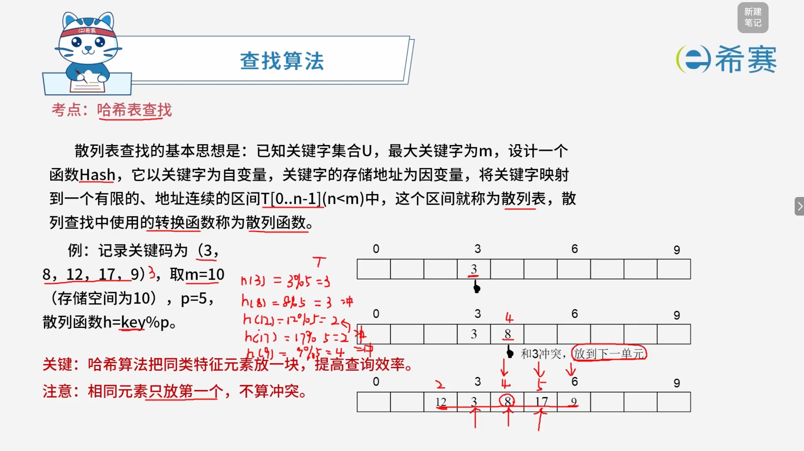

# 哈希表查找

## 1. 考点：实例讲解

### 1.1 知识点概览

**查找算法 —— 哈希表查找（Hash Table Search / 散列表查找）**

- **基本思想**： 已知关键字集合 $U$，最大关键字为 $m$，设计一个函数 $\text{Hash}$，它以关键字为自变量，关键字的存储地址为因变量，将关键字映射到一个有限的、地址连续的区间 $T[0..n-1]$（其中 $n < m$）中，这个区间称为​**散列表**​（或哈希表），查找中使用的转换函数称为**散列函数**。

### 1.2 经典示例演示

假设有一组记录关键码为 ​**$(3, 8, 12, 17, 9)$**，存储空间大小设为 $10$（即 $0 \sim 9$），选择除留余数法，设 $p = 5$，散列函数为：

$$
\text{h}(\text{key}) = \text{key} \pmod p
$$

我们通过开放定址法（线性探测法，冲突时往后顺延一个单元）来逐步构造散列表：

1. **插入** ​**​`3`​**：

   - 计算地址：$3 \pmod 5 = 3$。
   - 状态：直接存入位置 **$3$**。
2. **插入** ​**​`8`​**：

   - 计算地址：$8 \pmod 5 = 3$。
   - 状态：位置 $3$ 已被占用，发生​**冲突**。顺延到下一空单元，存入位置 **$4$**。
3. **插入** ​**​`12`​**：

   - 计算地址：$12 \pmod 5 = 2$。
   - 状态：直接存入位置 **$2$**。
4. **插入** ​**​`17`​**：

   - 计算地址：$17 \pmod 5 = 2$。
   - 状态：位置 $2$ 已被占用（与 $12$ 冲突），顺延到下一空单元，存入位置 **$5$**。
5. **插入** ​**​`9`​**：

   - 计算地址：$9 \pmod 5 = 4$。
   - 状态：位置 $4$ 已被占用（与 $8$ 冲突），顺延到下一个空单元，存入位置 **$6$**。

最终内存分布呈现为：位置 $2$ 放 $12$，位置 $3$ 放 $3$，位置 $4$ 放 $8$，位置 $5$ 放 $17$，位置 $6$ 放 $9$。

### 1.3 核心要点总结

- **核心目的**：哈希算法通过建立关键字与存储位置的直接映射关系，极大地提高了查询效率（平均查找长度接近 $O(1)$）。
- **冲突处理**：当不同的关键字映射到相同的散列地址时，就会产生“冲突”（如上面示例中的处理方式）。
- **注意事项**：相同元素在表中通常只存放第一个，重复出现时不重复计算冲突。
- **关键：** 哈希算法把同类特征元素放一块，提高查询效率。

## 2. 经典例题

### 2.1 题目一

> **题目：** 用哈希表存储元素时，需要进行冲突（碰撞）处理，冲突是指（ **B** ）。
>
> - A、关键字被依次映射到地址编号连续的存储位置
> - B、关键字不同的元素被映射到相同的存储位置
> - C、关键字相同的元素被映射到不同的存储位置
> - D、关键字被映射到哈希表之外的位置

 **【解析】**

本题考查的是哈希表（散列表）中“冲突”的概念。

- **哈希函数映射**：哈希表通过哈希函数将不同的关键字（Key）映射到指定地址空间的存储位置上。
- **冲突的定义**​：由于哈希函数的输入空间通常远大于输出空间（即表长），因此可能会出现**两个或多个不同的关键字**通过哈希函数计算后，得到了​**相同的存储地址**。这种现象在数据结构中就被称为“冲突”或“碰撞”。

对照选项：

- A 描述的是正常的连续存储或线性探测现象，非冲突本质。
- B 准确描述了不同关键字映射到同一位置的冲突定义。
- C 违反了哈希函数单射/确定的基本特性（相同关键字必然映射到相同位置）。
- D 属于越界或哈希函数设计不当，不符合冲突的标准定义。

**正确选项：B。** 

### 2.2 题目二

> **题目：** 设散列函数为 $H(\text{key}) = \text{key} \pmod{11}$，对于关键码序列 $(23, 40, 91, 17, 19, 10, 31, 65, 26)$，用线性探查法解决冲突构造的哈希表为（ ）。
>
> - **A**、
>
>   |**哈希地址**|**0**|**1**|**2**|**3**|**4**|**5**|**6**|**7**|**8**|**9**|**10**|
>   | --------| ----| ----| --| ----| ----| --| ----| ----| ----| ----| ----|
>   |关键码|10|23||91|26||17|40|19|31|65|
> - **B**、
>
>   |**哈希地址**|**0**|**1**|**2**|**3**|**4**|**5**|**6**|**7**|**8**|**9**|**10**|
>   | --------| ----| ----| --| ----| ----| --| ----| ----| ----| ----| ----|
>   |关键码|65|23||91|26||17|40|19|31|10|
> - **C**、
>
>   |**哈希地址**|**0**|**1**|**2**|**3**|**4**|**5**|**6**|**7**|**8**|**9**|**10**|
>   | --------| --| ----| ----| ----| ----| --| ----| ----| ----| ----| ----|
>   |关键码||23|10|91|26||17|40|19|31|65|
> - **D**、
>
>   |**哈希地址**|**0**|**1**|**2**|**3**|**4**|**5**|**6**|**7**|**8**|**9**|**10**|
>   | --------| --| ----| ----| ----| ----| --| ----| ----| ----| ----| ----|
>   |关键码||23|65|91|26||17|40|19|31|10|

 **【解析】**

本题考察哈希表（散列表）的构造以及使用​**线性探查法**（Linear Probing）处理冲突的过程。散列函数为 $H(\text{key}) = \text{key} \pmod{11}$。

我们依次插入关键码序列进行模拟：

1. **​`23`​**：$23 \pmod{11} = 1$，存入地址 ​**1**。
2. **​`40`​**：$40 \pmod{11} = 7$，存入地址 ​**7**。
3. **​`91`​**：$91 \pmod{11} = 3$，存入地址 ​**3**。
4. **​`17`​**：$17 \pmod{11} = 6$，存入地址 ​**6**。
5. **​`19`​**：$19 \pmod{11} = 8$，存入地址 ​**8**。
6. **​`10`​**：$10 \pmod{11} = 10$，存入地址 ​**10**。
7. **​`31`​**：$31 \pmod{11} = 9$，存入地址 ​**9**。
8. **​`65`​**：$65 \pmod{11} = 10$。此时地址 10 已被 ​`10` 占用，发生冲突。根据线性探查法，顺延到下一个单元：$(10 + 1) \pmod{11} = 0$，存入地址 ​**0**。
9. **​`26`​**：$26 \pmod{11} = 4$，存入地址 ​**4**。

最终构造出来的哈希表各地址分布为：

- 地址 0：​`65`
- 地址 1：​`23`
- 地址 2：空
- 地址 3：​`91`
- 地址 4：​`26`
- 地址 5：空
- 地址 6：​`17`
- 地址 7：​`40`
- 地址 8：​`19`
- 地址 9：​`31`
- 地址 10：​`10`

对比各个选项，发现该结果与 **B** 选项完全一致。

**正确选项：B。** 

‍
