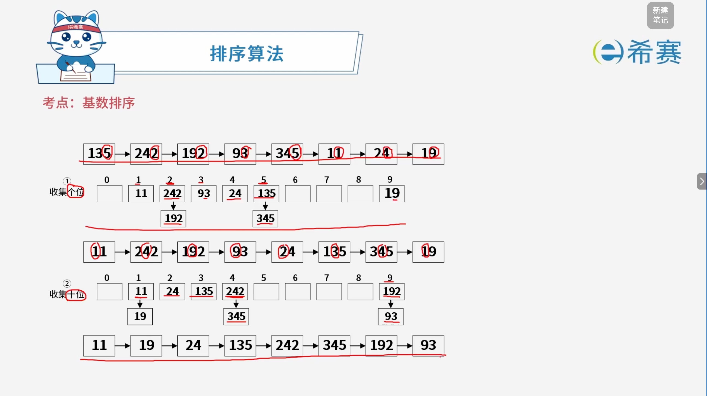
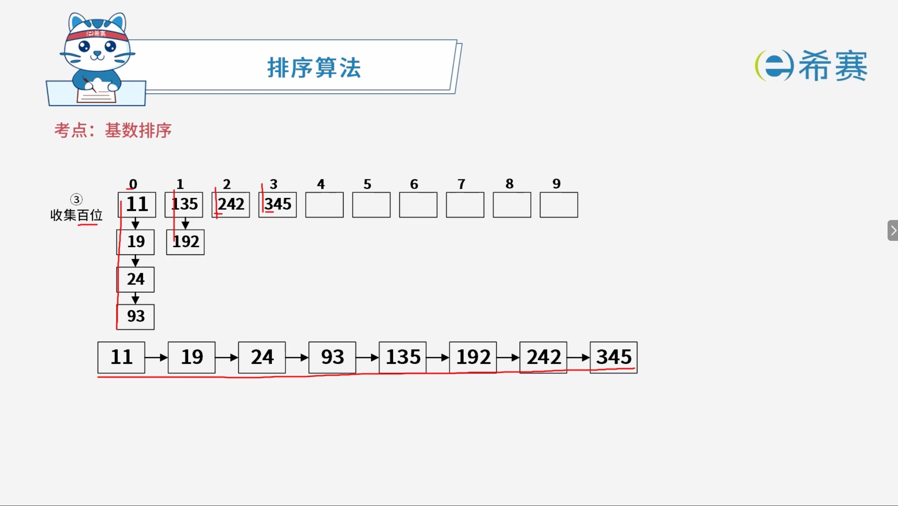

# 基数排序

## 1. 考点：基础概况

### 1.1 知识点概览

**排序算法 —— 其他类排序：基数排序（Radix Sort）**

- **基本思想**：

  - 基数排序是一种借助**多关键字排序思想**对单逻辑关键字进行排序的方法。
  - 它**不是基于关键字比较**的排序方法，因此非常适合于元素数量很多但关键字较少的序列。
  - 基数选择和关键字的分解取决于关键字的类型，例如十进制数可按个位、十位进行分解。

### 1.2 算法特性与复杂度

- **稳定性**​：基数排序是一种**稳定**的排序方法。
- **时间复杂度**：约为 **$O(d(n+rd))$**。
- **空间复杂度**​：在排序过程中虽然仅需要一个元素的辅助空间用于数组元素的交互，但由于需要用到链表等桶结构，其空间复杂度为 **$O(rd)$**。
- **符号含义**：

  - **$d$**：最大数字的位数。
  - **$n$**：待排序数组的长度。
  - **$r$**：数字的基数（例如十进制系统的基数 $r=10$）。

### 1.3 核心要点总结

- **非比较排序**：打破了基于元素间比较大小的传统排序界限，通过“分配”与“收集”过程实现高效排序。

### 1.4 实例讲解

