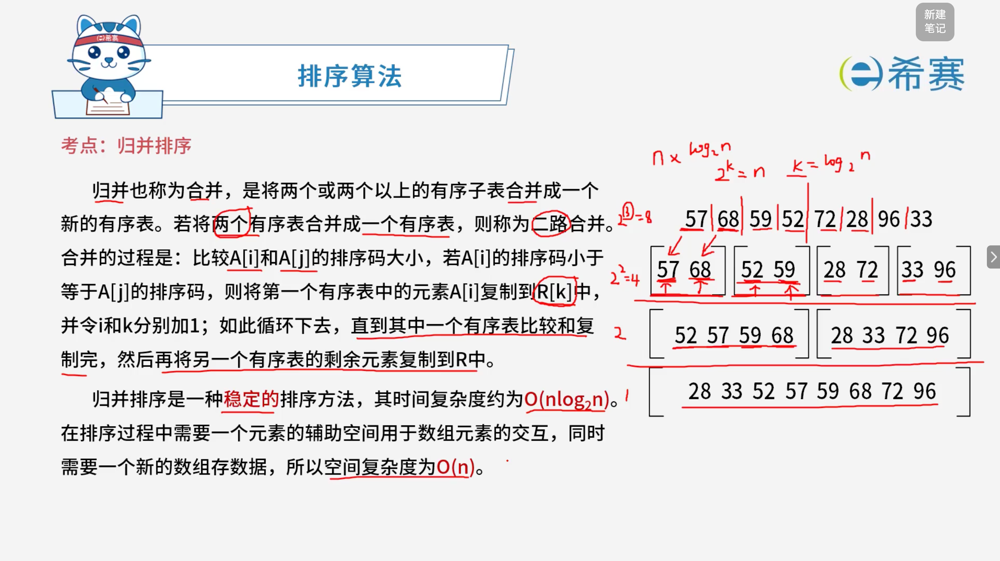

# 归并排序

## 1. 考点：基础概念

**排序算法 —— 归并排序（Merge Sort）**

- **基本思想**： 归并也称为合并，是将两个或两个以上的有序子表合并成一个新的有序表。若将两个有序表合并成一个有序表，则称为二路合并。

  - **合并过程**：比较 $A[i]$ 和 $A[j]$ 的排序码大小，若 $A[i]$ 的排序码小于等于 $A[j]$ 的排序码，则将第一个有序表中的元素 $A[i]$ 复制到 $R[k]$ 中，并令 $i$ 和 $k$ 分别加 1；如此循环下去，直到其中一个有序表比较和复制完，然后再将另一个有序表的剩余元素复制到 $R$ 中。
- **算法特性**：

  - **稳定性**​：归并排序是一种**稳定**的排序方法。
  - **时间复杂度**：其时间复杂度约为 **$O(n\log_2 n)$**。
  - **空间复杂度**：在排序过程中需要一个元素的辅助空间用于数组元素的交互，同时需要一个新的数组存数据，所以空间复杂度为 **$O(n)$**。

### 1.1 经典示例演示（从小到大排列）

‍

给定初始状态序列：​`57, 68, 59, 52, 72, 28, 96, 33`

1. **第一步（划分与初级合并）** ：

   - 将序列划分为单元素或两元素小组，两两进行二路归并：

     - `[57, 68]`​ 与 ​`[52, 59]`​ 归并为 ​`[52, 57, 59, 68]`。
     - `[28, 72]`​ 与 ​`[33, 96]`​ 归并为 ​`[28, 33, 72, 96]`。
2. **第二步（最终合并）** ：

   - 将两个已经有序的子表 ​`[52, 57, 59, 68]`​ 和 ​`[28, 33, 72, 96]` 进行最终的二路归并。
   - **最终结果**​：​`28, 33, 52, 57, 59, 68, 72, 96`。

### 1.2 核心要点总结

- **核心策略**：采用分治法（Divide and Conquer），先递归地将序列划分为极小的子序列，再自底向上通过二路归并逐步组合成有序长序列。

## 2. 经典例题

### 2.1 题目一

> **题目：** 对 $n$ 个数排序，最坏情况下时间复杂度最低的算法是（ **C** ）排序算法。
>
> - **A**、插入
> - **B**、冒泡
> - **C**、归并
> - **D**、快速

 **【解析】**

各选项在最坏情况下的时间复杂度对比如下：

1. **插入排序（A）** ：当输入数组完全逆序时，需要进行大量的比较和移动，最坏情况下的时间复杂度为 ​**$O(n^2)$**。
2. **冒泡排序（B）** ：当输入数组完全逆序时，每一轮都需要执行完整的比较与交换，最坏情况下的时间复杂度为 ​**$O(n^2)$**。
3. **归并排序（C）** ：采用分治策略，无论原始数据的排列顺序如何，其递归树的深度总是 $\log_2 n$，每一层合并的开销为 $O(n)$，因此在最好、平均以及最坏情况下的时间复杂度始终稳定保持为 ​**$O(n\log_2 n)$**。
4. **快速排序（D）** ：当选择不当（例如序列基本有序且每次都选第一个元素作为基准）时，分割极度不均匀，最坏情况下的时间复杂度会退化为 ​**$O(n^2)$**。

综合各选项在最坏情况下的表现，时间复杂度最低（最优）的是归并排序。

**正确选项**：**C（归并）** 。

‍
