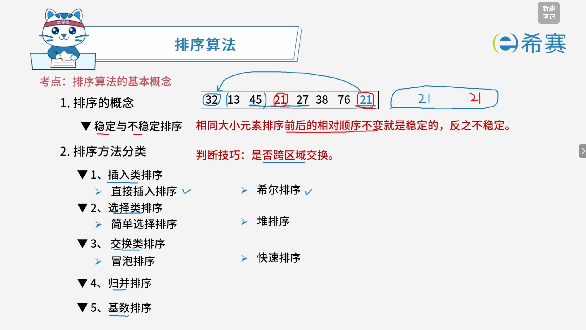

# 排序算法的基本概念

## 1. 考点：知识点概览

**排序算法 —— 基本概念与分类**

- **排序的概念**：

  - **稳定与不稳定排序**：相同大小元素排序前后的相对顺序不变就是稳定的，反之不稳定。
  - 判断技巧：是否跨区域交换。
- **排序方法分类**：

  - **1、插入类排序**：直接插入排序、希尔排序。
  - **2、选择类排序**：简单选择排序、堆排序。
  - **3、交换类排序**：冒泡排序、快速排序。
  - **4、归并排序**。
  - **5、基数排序**。

### 1.1 解析说明

- **稳定性判定**：稳定性是衡量排序算法特性的重要指标。稳定的排序算法在面对键值相同的记录时，能够保证它们原本的相对前后次序不变。
- **分类逻辑与判断技巧**：

  - 核心判断技巧：**是否跨区域交换**。例如，快速排序和希尔排序等由于存在跨较大间隔或区域的元素交换，通常属于不稳定排序；而直接插入排序、冒泡排序、归并排序等相邻或局部操作则更容易实现稳定性。

### 1.2 核心结论

- 熟练掌握常见内部排序算法的四大分类（插入、选择、交换、归并、基数）及其稳定性，是数据结构考试中高频考察的基础知识点。
