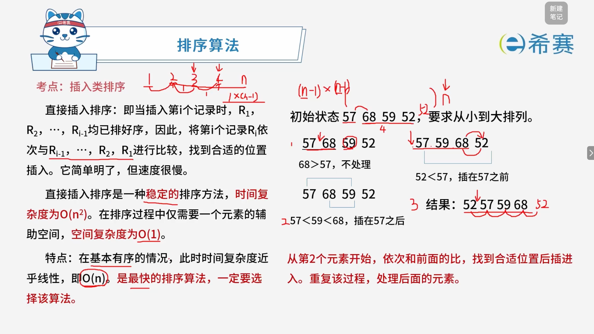
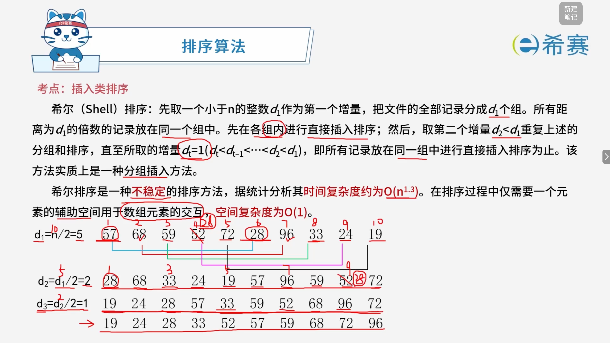

# 插入类排序

## 1. 考点：直接插入排序

### 1.1 知识点概览

**排序算法 —— 插入类排序：直接插入排序（Straight Insertion Sort）**

- **基本思想**： 当插入第 $i$ 个记录时，$R_1, R_2, \cdots, R_{i-1}$ 均已排好序。因此，将第 $i$ 个记录 $R_i$ 依次与 $R_{i-1}, \cdots, R_2, R_1$ 进行比较，找到合适的位置插入。它简单明了，但速度很慢。
- **算法特性**：

  - **稳定性**​：直接插入排序是一种**稳定**的排序方法。
  - **时间复杂度**：平均和最坏情况下时间复杂度为 **$O(n^2)$**；在**基本有序**的情况下，时间复杂度接近线性，即 **$O(n)$**。
  - **空间复杂度**：在排序过程中仅需要一个元素的辅助空间，空间复杂度为 **$O(1)$**。

### 1.2 经典示例演示（从小到大排列）

给定初始状态序列：​`57, 68, 59, 52`

1. **处理第一个元素** ​**​`57`​**：默认单个元素已有序。
2. **插入第二个元素** ​**​`68`​**：

   - 比较 $68 > 57$，不处理，顺序保持 ​`57, 68`。
3. **插入第三个元素** ​**​`59`​**：

   - 依次向前比较：$59 < 68$，继续向前；$59 > 57$，因此插在 ​`57`​ 之后，序列更新为 ​`57, 59, 68`。
4. **插入第四个元素** ​**​`52`​**：

   - 依次向前比较：$52 < 68$、$52 < 59$、$52 < 57$，最终插在 ​`57` 之前。
   - **最终结果**​：​`52, 57, 59, 68`。

### 1.3 核心要点总结

- **操作口诀**：从第 2 个元素开始，依次和前面的比，找到合适位置后插进去。重复该过程，处理后面的元素。
- **应用场景**：当待排序记录基本有序时，直接插入排序是效率非常高的排序算法。

## 2. 考点：希尔排序

### 2.1 知识点概览

**排序算法 —— 插入类排序：希尔排序（Shell Sort）**

- **基本思想**： 先取一个小于 $n$ 的整数 $d_1$ 作为第一个增量，把文件的全部记录分成 $d_1$ 个组。所有距离为 $d_1$ 的倍数的记录放在同一个组中。先在各组内进行直接插入排序；然后，取第二个增量 $d_2 < d_1$ 重复上述的分组和排序，直至所取的增量 $d_t = 1$（$d_t < d_{t-1} < \cdots < d_2 < d_1$），即所有记录放在同一组中进行直接插入排序为止。该方法实质上是一种**分组插入**方法。

### 2.2 解析说明

- **核心特性**：

  - **稳定性**​：由于相同的元素可能会被分到不同的组中并进行跨越式移动，因此希尔排序是一种**不稳定**的排序方法。
  - **时间复杂度**：希尔排序的时间复杂度比较复杂，受增量序列的选择影响，据统计分析其平均时间复杂度约为 $O(n^{1.3})$（最坏情况下为 $O(n^2)$）。
  - **空间复杂度**：在排序过程中仅需要一个元素的辅助空间用于数组元素的交换，空间复杂度为 **$O(1)$**。
- **工作原理（以图示为例）** ：

  - 初始序列有 10 个元素：​`57, 68, 59, 52, 72, 28, 96, 33, 24, 19`。
  - **第一趟增量** **$d_1 = 5$**：分为 5 组，组内各自进行直接插入排序。
  - **第二趟增量** **$d_2 = 2$**：分为 2 组，进一步调整元素相对位置。
  - **第三趟增量** **$d_3 = 1$**：增量减至 1 时，相当于对全体元素进行了一次直接插入排序，此时由于前面已经达到“宏观基本有序”，最后一次插入排序的效率会极高。

### 2.3 核心结论

- 希尔排序通过“缩小增量”的多趟排序，使整个序列先“局部有序”再到“全局有序”，克服了直接插入排序在元素较多且无序时效率低的缺点。

## 3. 经典例题

### 3.1 题目一

> **题目：** 现需要对一个**基本有序**的数组进行排序。此时最适宜采用的算法为（ **A** ）排序算法，时间复杂度为（ **A** ）。
>
> - **算法选项**：
>
>   - A、插入
>   - B、快速
>   - C、归并
>   - D、堆
> - **时间复杂度选项**：
>
>   - A、$O(n)$
>   - B、$O(n\log n)$
>   - C、$O(n^2)$
>   - D、$O(n^2\log n)$

 **【解析】**

- **算法选择**：当待排序的记录**基本有序**时，**直接插入排序**（插入类排序）是效率最高的排序算法。因为此时大部分元素已经就位，向前的比较和移动次数极少。
- **时间复杂度**：在基本有序的情况下，直接插入排序的时间复杂度会从平均和最坏情况下的 $O(n^2)$ 降低并​**接近线性**，即 **$O(n)$**。

**正确选项：第一空选 A（插入），第二空选 A（** **$O(n)$** **）。** 

‍
