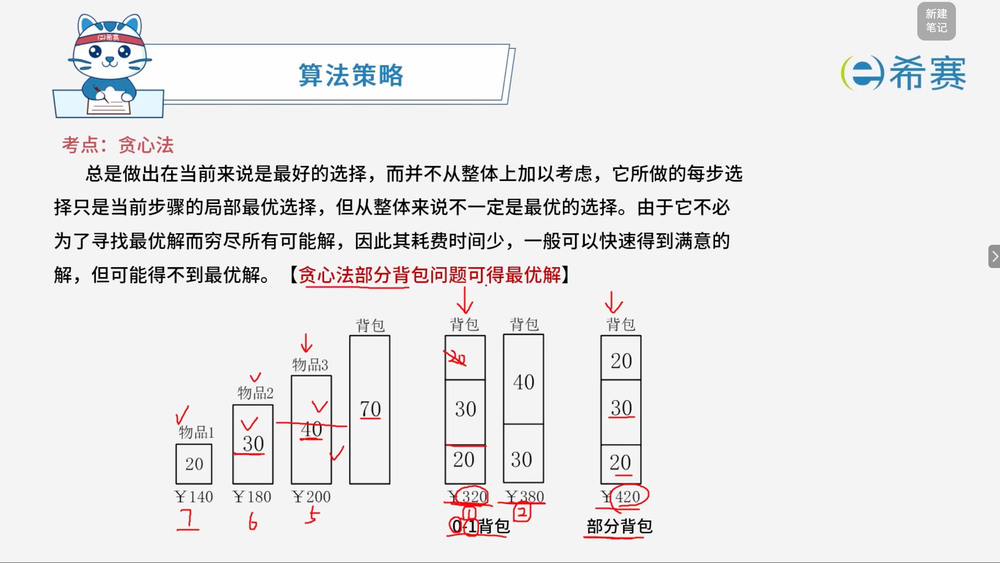
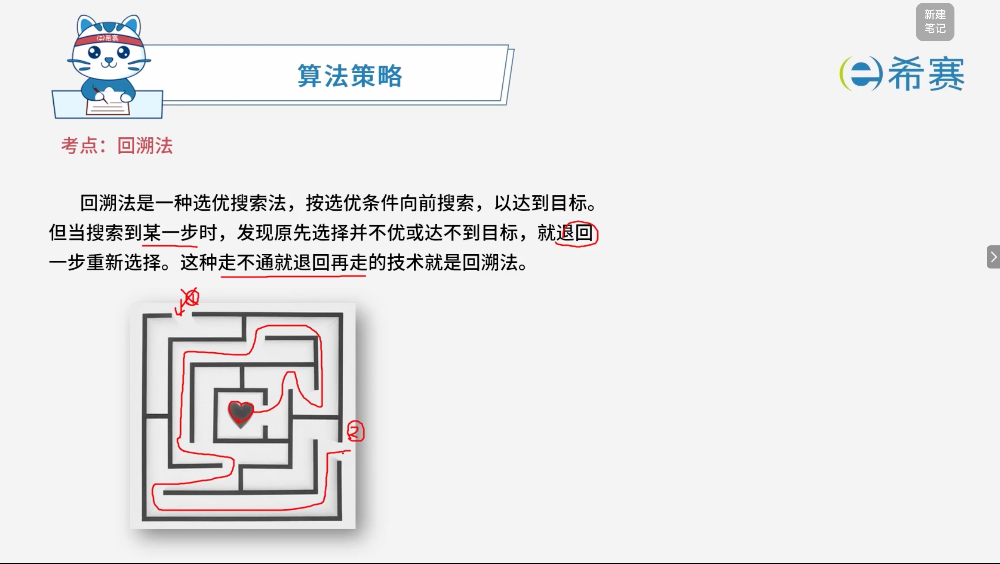

# 算法策略

<style>
#markdown-content {
  overflow-x: auto;
}

#markdown-content table {
  width: max-content;
  min-width: 100%;
  margin: 1rem 0;
  white-space: nowrap;
}

#markdown-content table th,
#markdown-content table td {
  min-width: 96px;
  padding: 0.65em 0.8em;
  text-align: center;
  vertical-align: middle;
}

#markdown-content table th:first-child,
#markdown-content table td:first-child {
  min-width: 165px;
  white-space: nowrap;
}

#markdown-content table:nth-of-type(1) th:first-child,
#markdown-content table:nth-of-type(1) td:first-child {
  min-width: 72px;
}

#markdown-content table:nth-of-type(1) th:not(:first-child),
#markdown-content table:nth-of-type(1) td:not(:first-child) {
  min-width: 82px;
}

#markdown-content table:nth-of-type(2) th:not(:first-child),
#markdown-content table:nth-of-type(2) td:not(:first-child) {
  min-width: 108px;
}

#markdown-content table:nth-of-type(2) tbody tr:last-child td {
  vertical-align: top;
}
</style>

## 1. 考点：**分治法**

### 1.1 知识点概览

**算法策略 —— 考点：算法策略概述（分治法）**

- **特征**：把一个问题拆分成多个小规模的相同子问题，一般用递归解决，也可以用循环。
- **经典问题**：归并排序、快速排序、矩阵乘法、二分搜索、斐波那契数列、大整数乘法、汉诺塔。
- **关键词**：一分为二、一一合二。
- **注意**：不要陷入到递归调用的证明，直接调用下层即可。

### 1.2 核心要点总结

- **核心思想**：分而治之（Divide and Conquer），通过将复杂大问题转化为结构相同的多个子问题，简化求解过程。

### 1.3 实例解析:**分治法-二分查找的递归实现**

```JavaScript
function Binary_Search(L, a, b, x) {
    if (a > b) return -1;
    else {
        let m = Math.floor((a + b) / 2);
        if (x === L[m]) return m;
        else if (x > L[m])
            return Binary_Search(L, m + 1, b, x);
        else
            return Binary_Search(L, a, m - 1, x);
    }
}
```

## 2. 考点：贪心法

### 2.1 知识点概览

**算法策略 —— 考点：算法策略概述（贪心法）**

- **基本用途**：一般用于求满意解。
- **特征**：局部最优，但整体不见得最优。每步有明确的、既定的策略。
- **经典问题**：

  - 最小生成树问题（普里姆算法、克鲁斯卡尔算法）
  - 背包问题（如装箱）
  - 活动场地安排
  - 多机调度
  - 找零问题
- **关键词**：某一刻，按照某个标准找到合适的就行。最后解可能最优，可能不是最优。

### 2.2 核心要点总结

- **贪心策略核心**：每一步都采取当下看起来最好的选择（局部最优），期望最终达到全局最优，但由于缺乏全局视野，最终得到的往往是满意解而非绝对最优解。

### 2.3 贪心法（Greedy Algorithm）与背包问题



- **核心概念**：

  - 贪心法总是做出在当前来看是最好的选择，而并不从整体上加以考虑。
  - 它所做的每步选择只是当前步骤的​**局部最优选择**​，但从整体来说**不一定**是最优的选择。
  - 由于它不必为了寻找最优解而穷尽所有可能解，因此其耗费时间少，一般可以快速得到满意的解，但可能得不到最优解。
- **重要特性**：

  -  **【贪心法部分背包问题可得最优解】** 。

#### 2.3.1 经典图解分析：0-1背包 vs. 部分背包

图中以背包总容量为 ​`70`，且有三件物品为例：

- **物品1**：重量 20，价值 ¥140（红字标注单位价值为 7）
- **物品2**：重量 30，价值 ¥180（红字标注单位价值为 6）
- **物品3**：重量 40，价值 ¥200（红字标注单位价值为 5）

按照贪心策略（优先选择单位价值最高的物品进行装载）：

1. **0-1背包（物品不可分割）** ：

   - 若严格按照贪心法，先装物品1和物品2（总重量50，价值320），剩余容量20无法装下物品3，导致总价值仅为 ¥320。
   - 而实际的最优解是直接装入物品2和物品3（总重量70，完全装满），总价值可达 ¥380。
   - **结论**​：贪心法在 0-1 背包问题中容易陷入局部最优，**无法保证**得到全局最优解。
2. **部分背包（物品可分割）** ：

   - 按照单位价值排序依次装入：先放入物品1（重量20），再放入物品2（重量30），此时背包剩余容量为 20。
   - 将物品3进行分割，只取其一半（重量20）放入背包中。
   - 最终总价值 \= 140（物品1） + 180（物品2） + 100（物品3的一半） \= ​ **¥420**。
   - **结论**：贪心法能够完美解决部分背包问题，取得全局最优解。

#### 2.3.2 核心要点总结

- **贪心策略的局限与适用场景**​：贪心法高度依赖局部的最优判断标准（如“性价比最高”）。它能高效地求出**部分背包问题**的最优解，但在面对不可分割的 **0-1 背包问题**时，往往只能给出一个近似的满意解。

## 3. 考点：动态规划

### 3.1 知识点概览

**算法策略 —— 考点：算法策略概述（动态规划法）**

- **基本用途**：用于求最优解，核心在于“最优子结构”与递推式。
- **主要特征**：

  - 划分子问题，使用数组存储子问题的结果，并利用查询子问题的结果来构造最终问题的结果。
  - 可选择自上而下的递归（记忆化搜索），亦可选择自下而上的循环（迭代）。
- **复杂度表现**：

  - **时间复杂度**：自顶向下时间复杂度为 $O(2^n)$（未优化时），自底向上时间复杂度为 $O(n^a)$。
  - **空间复杂度**：通常为 $O(n)$ 或者 $O(n^2)$。
- **经典问题**：矩阵乘法、背包问题、LCS 最长公共子序列。
- **关键词**：最优子结构、动态规划、子规模。
- **学习提示**：不要过度陷入递归调用以及查表操作的繁琐细节，直接理解并应用其递推规律即可。

### 3.2 核心要点总结

- **动态规划的精髓**：透过“空间换时间”的思想，将重叠子问题的解存储起来，从而避免了指数级的重复计算，是解决复杂最优化问题的关键策略。

## 4. 考点：回溯法



### 4.1 知识点概览

**算法策略 —— 考点：回溯法（Backtracking）**

- **基本定义**：

  - 回溯法是一种选优搜索法，按选优条件向前搜索，以达到目标。
- **核心特征**：

  - 当搜索到某一步时，发现原先选择并不优或达不到目标，就退回一步重新选择。
  - 这种“走不通就退回再走”的技术就是回溯法。

### 4.2 核心要点总结

- **试探与纠错**：通过深度优先地系统搜索问题的解空间，在遇到死路（不满足条件或无法到达目标）时及时“回溯”并撤销上一步的选择，从而系统地寻找可行解或最优解。

- **特征**：系统地搜索一个问题的所有解或任一解。
- **经典问题**：N皇后问题、图的遍历（深度遍历）、迷宫、背包问题。
- **关键词**：冲突、返回。

- **系统搜索与试探**：回溯法通过系统性地遍历解空间树，在遇到冲突时执行返回（回溯）操作，从而高效地找出满足条件的所有解或任意解。

## 5. 经典例题

### 5.1 题目一

> **题目：** 采用贪心算法保证能求得最优解的问题是（ **D** ）。
>
> - **A**、0-1背包
> - **B**、矩阵链乘
> - **C**、最长公共子序列
> - **D**、部分（分数）背包

 **【解析】**

1. **A、0-1背包**：物品不可分割，贪心算法容易陷入局部最优，无法保证求得全局最优解。
2. **B、矩阵链乘**：通常使用动态规划法求解以避免指数级重复计算。
3. **C、最长公共子序列（LCS）** ：属于典型的动态规划问题。
4. **D、部分（分数）背包**：物品可以分割，按照单位价值（性价比）从高到低进行贪心选择，能够保证求得全局最优解。

**正确选项**<span data-type="text" style="background-color: var(--b3-inline-builtin-success-background-color, var(--b3-card-success-background)); color: var(--b3-inline-builtin-success-color, var(--b3-card-success-color));">：</span>**D。** 

### 5.2 题目二

> **背景与原理说明】**
>
> 现需要申请一些场地举办一批活动，每个活动有开始时间和结束时间。在同一个场地中，如果一个活动结束之前，另一个活动开始，即两个活动冲突。若活动A从1时间开始，5时间结束，活动B从5时间开始，8时间结束，则活动A和B不冲突。现要计算 $n$ 个活动需要的最少场地数。
>
> 求解该问题的基本思路如下（假设需要场地数为 $m$，活动数为 $n$，场地集合为 $P_1, P_2, \dots, P_m$，初始条件 $P_i$ 均无活动安排）：
>
> 1. 采用快速排序算法对 $n$ 个活动的开始时间从小到大排序，得到活动 $a_1, a_2, \dots, a_n$，对每个活动 $a_i$（$i$ 从 1 到 $n$），重复步骤 (2)、(3) 和 (4)；
> 2. 从 $P_1$ 开始，判断 $a_i$ 与 $P_1$ 的最后一个活动是否冲突，若冲突，考虑下一个场地 $P_2, \dots$；
> 3. 一旦发现 $a_i$ 与某个 $P_j$ 的最后一个活动不冲突，则将 $a_i$ 安排到 $P_j$，考虑下一个活动；
> 4. 若 $a_i$ 与所有已安排活动的 $P_j$ 的最后一个活动均冲突，则将 $a_i$ 安排到一个新的场地，考虑下一个活动；
> 5. 将 $n$ 减去没有安排活动的场地数即可得到所用的最少场地数。
>
>  **【题目及选项】**
>
> 算法首先采用了快速排序算法进行排序，其算法设计策略是（ **A** ）；后面步骤采用的算法设计策略是（ **C** ）。整个算法的时间复杂度是（ **D** ）。下表给出了 $n=11$ 的活动集合，根据上述算法，得到的最少场地数为（ **B** ）。
>
> |**i**|**1**|**2**|**3**|**4**|**5**|**6**|**7**|**8**|**9**|**10**|**11**|
> | ------------| ---| ---| ----| ---| ---| ---| ---| ----| ----| ----| ----|
> |开始时间$s_i$|0|1|2|3|3|5|5|6|8|8|12|
> |结束时间$f_i$|6|4|13|5|8|7|9|10|11|12|14|
>
> - **第一空选项**：A、分治 $\quad$ B、动态规划 $\quad$ C、贪心 $\quad$ D、回溯
> - **第二空选项**：A、分治 $\quad$ B、动态规划 $\quad$ C、贪心 $\quad$ D、回溯
> - **第三空选项**：A、$\Theta(\log n)$ $\quad$ B、$\Theta(n)$ $\quad$ C、$\Theta(n \log n)$ $\quad$ D、$\Theta(n^2)$
> - **第四空选项**：A、4 $\quad$ B、5 $\quad$ C、6 $\quad$ D、7

 **【详细解析】**

1. **第一空分析**：

   - 快速排序算法通过“分而治之”的思想将大数组递归划分为小数组进行排序，其算法设计策略是**分治**。
2. **第二空分析**：

   - 后续步骤在为每个活动分配场地时，总是优先复用当前不冲突的已有场地（局部最优选择），其算法设计策略是**贪心**。
3. **第三空分析**：

   - 排序阶段的时间复杂度为 $O(n \log n)$。
   - 在贪心分配阶段，最坏情况下每一个活动都需要遍历当前所有的场地 $m$（最多可达 $n$ 级别）来检测冲突，因此匹配开销为 $O(n \times m) = O(n^2)$。
   - 整体渐进时间复杂度由嵌套分配步骤主导，即 ​**$\Theta(n^2)$**（选项D）。
4. **第四空分析**：

   - 按照题目给出的算法规则，首先将 11 个活动按**开始时间升序**排序（若开始时间相同，则按结束时间先后排序）。随后依次将活动放入场地（要求放入的活动开始时间必须大于或等于该场地最后一个活动的结束时间，否则需新开场地）。

     下表为您详细列出每个活动在分配过程中的状态与最终落入的场地编号：

|**属性 / 项目**|**活动1**|**活动2**|**活动3**|**活动4**|**活动5**|**活动6**|**活动7**|**活动8**|**活动9**|**活动10**|**活动11**|
| ----| --------| --------| ------------| ----------------| --------------------| --------------------| --------------------| --------------------| --------------------| --------------------| --------------------|
|**开始时间** $\boldsymbol{s_i}$|0|1|2|3|3|5|5|6|8|8|12|
|**结束时间** $\boldsymbol{f_i}$|6|4|13|5|8|7|9|10|11|12|14|
|**分配结果 / 动作说明**|放入**$P_1$**|新开**$P_2$**|新开**$P_3$**|新开**$P_4$**|新开**$P_5$**|放入**$P_2$**|放入**$P_4$**|放入**$P_1$**|放入**$P_5$**|放入**$P_2$**|放入**$P_2$**|
|**各场地当前结束时间状态**|$P_1 = 6$|$P_1 = 6$<br /><br />$P_2 = 4$|$P_1 = 6$<br /><br />$P_2 = 4$<br /><br />$P_3 = 13$|$P_1 = 6$<br /><br />$P_2 = 4$<br /><br />$P_3 = 13$<br /><br />$P_4 = 5$|$P_1 = 6$<br /><br />$P_2 = 4$<br /><br />$P_3 = 13$<br /><br />$P_4 = 5$<br /><br />$P_5 = 8$|$P_1 = 6$<br /><br />$P_2 = 7$<br /><br />$P_3 = 13$<br /><br />$P_4 = 5$<br /><br />$P_5 = 8$|$P_1 = 6$<br /><br />$P_2 = 7$<br /><br />$P_3 = 13$<br /><br />$P_4 = 9$<br /><br />$P_5 = 8$|$P_1 = 10$<br /><br />$P_2 = 7$<br /><br />$P_3 = 13$<br /><br />$P_4 = 9$<br /><br />$P_5 = 8$|$P_1 = 10$<br /><br />$P_2 = 7$<br /><br />$P_3 = 13$<br /><br />$P_4 = 9$<br /><br />$P_5 = 11$|$P_1 = 10$<br /><br />$P_2 = 12$<br /><br />$P_3 = 13$<br /><br />$P_4 = 9$<br /><br />$P_5 = 11$|$P_1 = 10$<br /><br />$P_2 = 14$<br /><br />$P_3 = 13$<br /><br />$P_4 = 9$<br /><br />$P_5 = 11$|
   - 最终实际同时或总共投入使用的最少场地数为 **5**（选项B）。

**正确答案：A、C、D、B。**
