# 选择类排序

## 1. 考点：直接选择排序

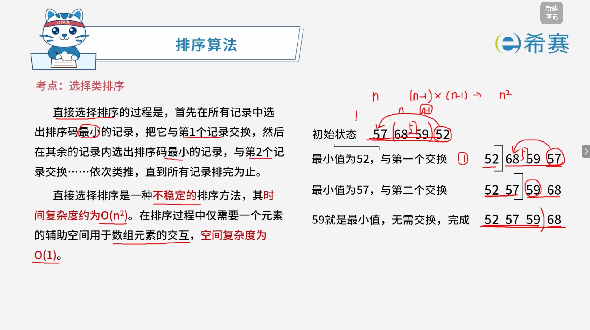

### 1.1 知识点概览

**排序算法 —— 选择类排序：直接选择排序（Straight Selection Sort）**

- **基本思想**： 首先在所有记录中选出排序码最小的记录，把它与第 1 个记录交换，然后在其余的记录内选出排序码最小的记录，与第 2 个记录交换……依次类推，直到所有记录排完为止。
- **算法特性**：

  - **稳定性**​：直接选择排序是一种**不稳定**的排序方法。
  - **时间复杂度**：其时间复杂度约为 **$O(n^2)$**。
  - **空间复杂度**：在排序过程中仅需要一个元素的辅助空间用于数组元素的交互，空间复杂度为 **$O(1)$**。

### 1.2 经典示例演示（从小到大排列）

给定初始状态序列：​`57, 68, 59, 52`

1. **第一趟**：

   - 在所有记录中选出最小值 ​`52`，把它与第 1 个记录交换。
   - 序列更新为：​`52, 68, 59, 57`。
2. **第二趟**：

   - 在其余记录中选出最小值 ​`57`，把它与第 2 个记录交换。
   - 序列更新为：​`52, 57, 59, 68`。
3. **第三趟**：

   - `59` 就是最小值，无需交换，排序完成。
   - **最终结果**​：​`52, 57, 59, 68`。

### 1.3 核心要点总结

- **核心逻辑**：每一趟遍历未排序的部分，找出其中的最小值并“选择”放到已排序序列的末尾，重复该过程直至整体有序。

## 2. 考点：选择类排序-堆与堆排序（Heap & Heap Sort）

### 2.1 堆的定义与分类

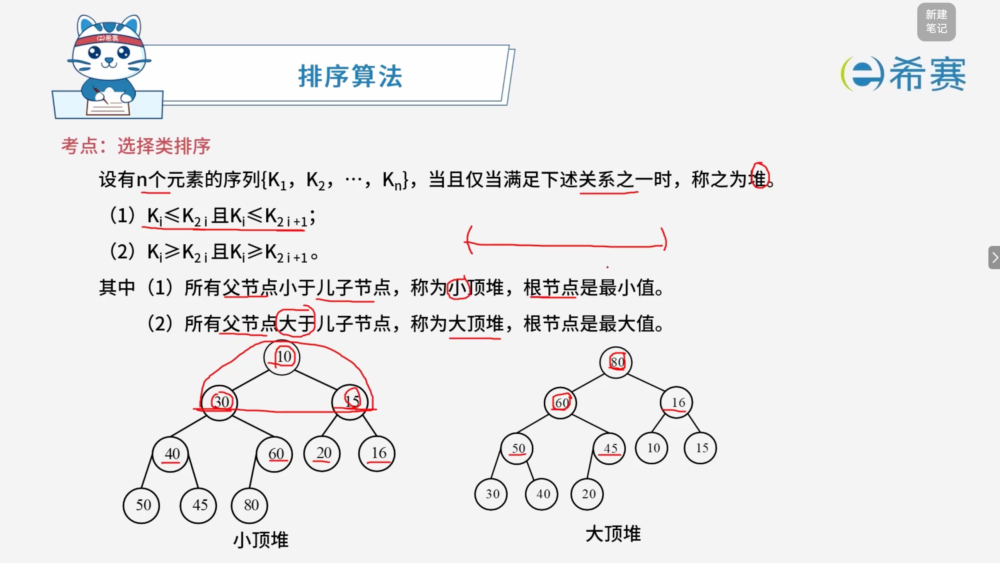

堆是一种特殊的完全二叉树结构，根据父子节点间的大小关系可分为两种类型：

- **小顶堆 (Min-Heap)**

  - **满足关系**：所有父节点小于或等于子节点（$K_i \leqslant K_{2i}$ 且 $K_i \leqslant K_{2i+1}$）。
  - **核心特性**​：根节点为整棵树的**最小值**。
- **大顶堆 (Max-Heap)**

  - **满足关系**：所有父节点大于或等于子节点（$K_i \ge K_{2i}$ 且 $K_i \ge K_{2i+1}$）。
  - **核心特性**​：根节点为整棵树的**最大值**。

### 2.2 堆排序的基本思想

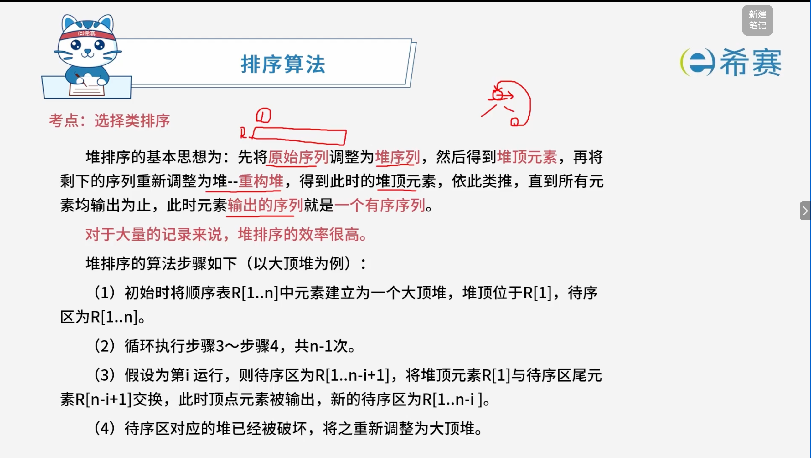

- **核心原理**：先将原始序列调整为堆序列，获取堆顶极值后，将剩余序列重新调整为堆（重构堆），依次循环直至所有元素输出完毕，从而得到有序序列。
- **效率优势**：堆排序在处理大量记录时表现出极高的效率。

### 2.3 堆排序的算法步骤（以大顶堆为例）

1. **初始建堆**：将顺序表 $R[1..n]$ 中的元素建立为一个大顶堆，此时堆顶位于 $R[1]$，待序区为 $R[1..n]$。
2. **循环迭代**：重复执行步骤 3 至步骤 4，共循环 $n-1$ 次。
3. **交换与输出**：假设为第 $i$ 次运行（待序区为 $R[1..n-i+1]$），将堆顶元素 $R[1]$ 与待序区尾元素 $R[n-i+1]$ 交换，此时顶点元素被成功输出，新的待序区缩减为 $R[1..n-i]$。
4. **重建堆**：由于堆结构已被破坏，需将剩余的待序区重新调整为大顶堆。

### 2.4 实例讲解

#### 2.4.1 初始建堆

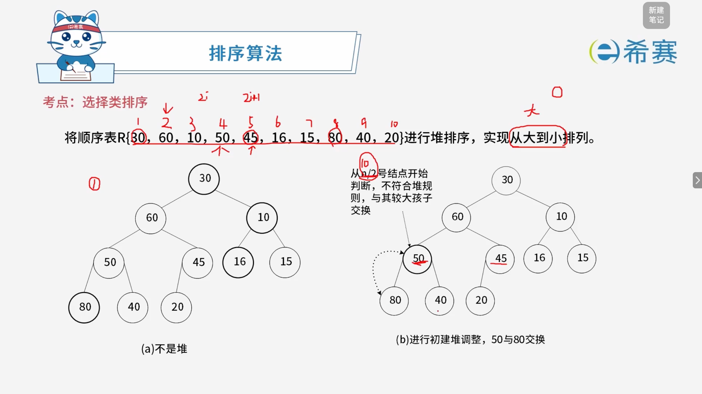

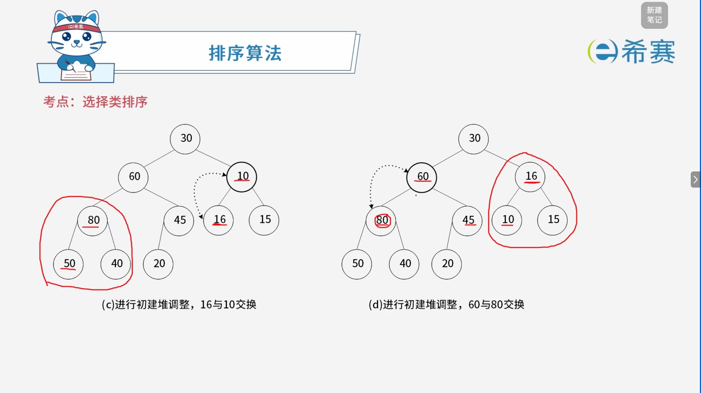

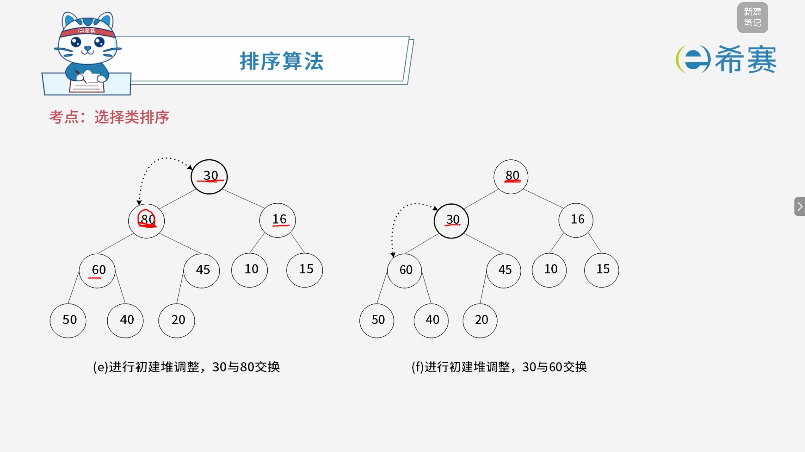

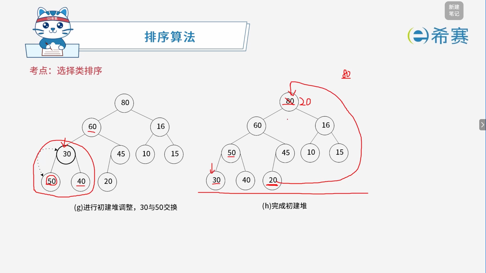

#### 2.4.2 堆重构

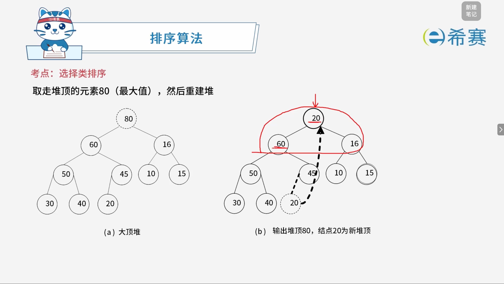

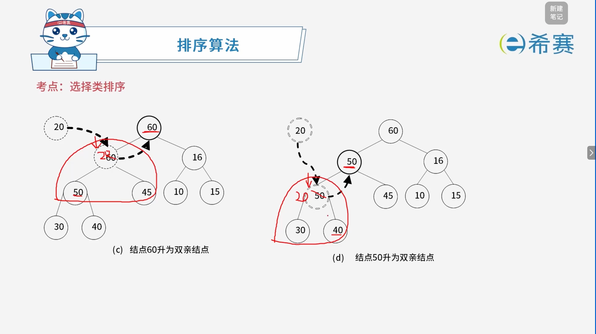

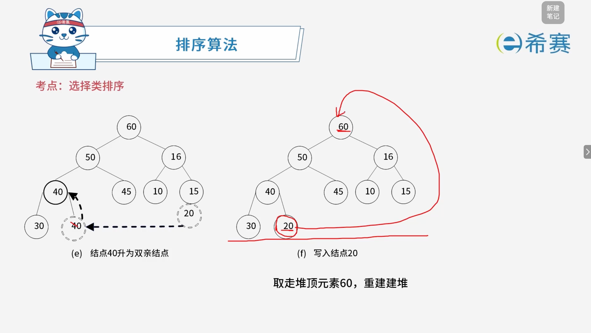

### 2.5 总结

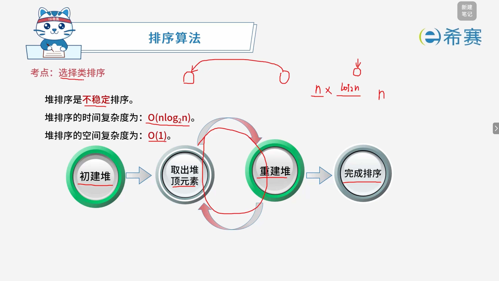

- 堆排序是**不稳定**的排序。
- 堆排序的时间复杂度为：$O(n\log_2 n)$。
- 堆排序的空间复杂度为：$O(1)$。

#### 2.5.1 时间复杂度的推导过程

堆排序的整体时间复杂度为 **$O(n\log_2 n)$**，它由以下两个核心阶段组成：

1. **初建堆阶段（**​**$O(n)$**​ **）** ：

   - 从最后一个非叶子节点开始，自底向上对整棵完全二叉树进行筛选和下沉调整。虽然涉及多层元素的调整，但数学推导表明其总耗费时间与元素个数 $n$ 成正比，时间复杂度为 $O(n)$。
2. **循环重建阶段（**​**$O(n\log_2 n)$**​ **）** ：

   - **循环次数**：需要进行 $n-1$ 次循环（通常按 $n$ 次计算）。每次循环将堆顶极值与当前待序区末尾元素交换，使堆的规模减 1。
   - **单次调整代价**​：每次交换后，根节点破坏了堆的结构，需要进行向下“下沉”调整。因为这是一棵完全二叉树，其​**树的高度为** **$\log_2 n$**，所以单次重建堆的比较与移动次数最多不超过树的高度，即单次代价为 $O(\log_2 n)$。
   - **阶段总计**：总共进行 $n$ 次循环，每次循环执行高度为 $\log_2 n$ 的调整，因此这一阶段的总时间复杂度为 ​**$n \times \log_2 n$**。

**综合评定**：

$$
T(n) = O(n) + O(n\log_2 n) = O(n\log_2 n)
$$

因此，堆排序的整体时间复杂度为 **$O(n\log_2 n)$**。

## 3. 经典例题

### 3.1 题目一

> **题目：** 对数组 $A = (2, 8, 7, 1, 3, 5, 6, 4)$ 构建大顶堆为（ **C** ）（用数组表示）
>
> - **A**、$(1, 2, 3, 4, 5, 6, 7, 8)$
> - **B**、$(1, 2, 5, 4, 3, 7, 6, 8)$
> - **C**、$(8, 4, 7, 2, 3, 5, 6, 1)$
> - **D**、$(8, 7, 6, 5, 4, 3, 2, 1)$

 **「解析」**

【初始状态】

数组元素：​`[2, 8, 7, 1, 3, 5, 6, 4]`​，最后一个非叶子节点为索引 4（值 ​`1`）。

```Plaintext
               2
             /   \
           8       7
          / \     / \
         1   3   5   6
        /
       4
```

【步骤 1：处理索引 4 的节点（值 1）】

- **操作**：子节点 ​`4`​ 大于父节点 ​`1`​，将 ​`1`​ 与 ​`4` 交换。

```Plaintext
               2
             /   \
           8       7
          / \     / \
         4   3   5   6
        /
       1
```

【步骤 2：处理索引 3 的节点（值 7）】

- **操作**：父节点 ​`7`​ 大于其所有孩子（​`5`​ 和 ​`6`），无需调整，结构保持不变。

```Plaintext
               2
             /   \
           8       7
          / \     / \
         4   3   5   6
        /
       1
```

【步骤 3：处理索引 2 的节点（值 8）】

- **操作**：父节点 ​`8`​ 大于其所有孩子（​`4`​ 和 ​`3`），无需调整，结构保持不变。

```Plaintext
               2
             /   \
           8       7
          / \     / \
         4   3   5   6
        /
       1
```

【步骤 4：处理索引 1 的根节点（值 2）—— 第一次下沉调整】

- **操作**：根节点 ​`2`​ 与左右孩子中的最大值 ​`8` 交换。

```Plaintext
               8
             /   \
           2       7
          / \     / \
         4   3   5   6
        /
       1
```

【步骤 5：根节点下沉的后续调整】

- **操作**：被换到下层的 ​`2`​ 其子节点为 ​`4`​ 和 ​`3`​，最大值为 ​`4`​，将 ​`2`​ 与 ​`4` 交换，最终构建出大顶堆。

```Plaintext
               8
             /   \
           4       7
          / \     / \
         2   3   5   6
        /
       1
```

**正确答案：C。**
