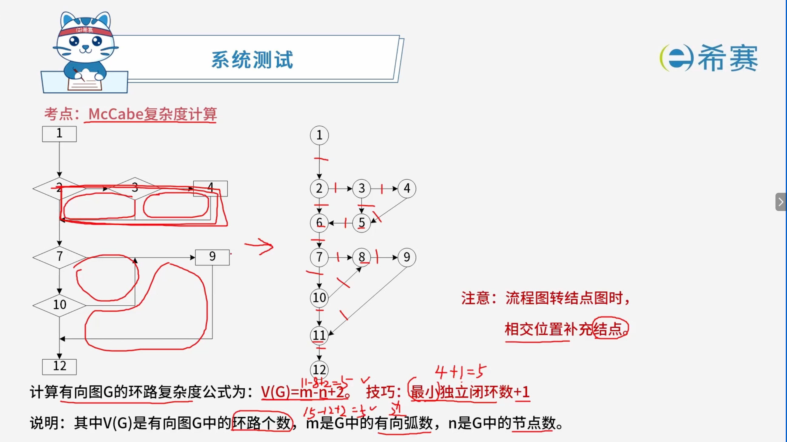
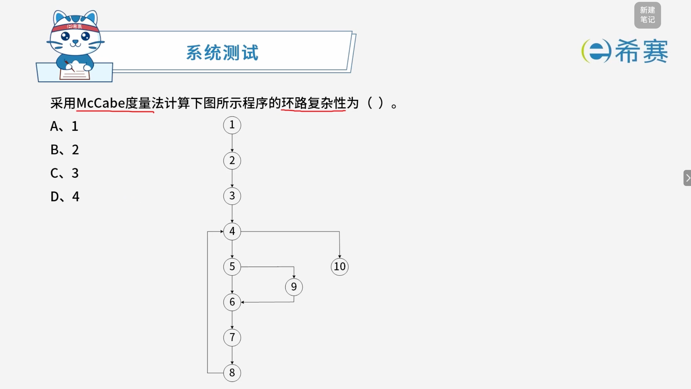
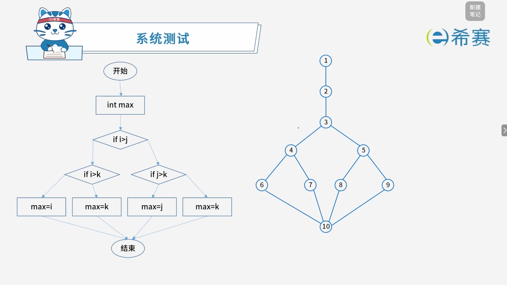

# McCabe复杂度计算

## 1. 考点精要：McCabe 复杂度（圈复杂度）

> **核心作用**：用于衡量计算机程序的逻辑复杂度。



### 1.1 核心计算方法

- **公式法**：$V(G) = m - n + 2$  

  - $m$：有向图中的有向弧数（边数）
  - $n$：图中的节点数
- **秒杀技巧**​：​**最小独立闭环数 + 1**（考试中最推荐、最高效的计算方式）

### 1.2 避坑指南与注意事项

- **流程图转换**：当把程序流程图转换为控制流图（节点图）时，若线条在途中**相交**，必须在**相交位置补充一个节点**，否则直接套用公式会导致计算错误。

## 2. 经典例题

### 2.1 题目一

> 

 **【解析】**

- **正确答案：C**
- **解析说明：**

  - **统计结点数 n**​***n***​：图中节点编号为 1 到 10，共 n\=10*n*\=10 个节点。
  - **统计有向弧数 m**​***m***：

    - 1 → 2
    - 2 → 3
    - 3 → 4
    - 4 → 5
    - 5 → 6
    - 6 → 7
    - 7 → 8
    - 4 → 10
    - 5 → 9
    - 9 → 6
    - 8 → 4
    - 共 m\=11*m*\=11 条有向弧。
  - **代入公式计算**​：V(G)\=m−n+2\=11−10+2\=3*V*(*G*)\=*m*−*n*+2\=11−10+2\=3。
- **技巧验证**：最小独立闭环数 + 1。

  - 图中有 **2 个**独立闭环：

    1. 4 → 5 → 6 → 7 → 8 → 4
    2. 5 → 9 → 6 → 7 → 8 → 4 → 5（与第一个共享部分路径，但独立闭环为 2 个）
  - 2+1\=32+1\=3，与公式计算结果一致。

**正确答案：C（3）。** 

### 2.2 题目二

> **题目：**  若用白盒测试方法测试以下代码，并满足条件覆盖，则至少需要（ ）个测试用例。采用 McCabe 度量法算出该程序的环路复杂度为（ ）。
>
> ```C
> int find_max (int i, int j, int k) {
>     int max;
>     if (i > j) then
>         if (i > k) then max = i;
>     	else max = k;
>     else if (j > k) then max = j;
>     else max = k;
> }
> ```
>
> **第一组选项：**
>
> - A、3
> - B、4
> - C、5
> - D、6
>
> **第二组选项：**
>
> - A、1
> - B、2
> - C、3
> - D、4

 **【解析】**



- **正确答案：第一空选 B，第二空选 D。**
- **解析说明：**

  - **第一空：满足条件覆盖，至少需要（ B ）个测试用例。**

    - 题目要求满足​**条件覆盖**，即每个判定中的每个条件的真假取值都至少出现一次。
    - 代码中共有 3 个判定条件：

      1. **判定1**​：​`i > j`
      2. **判定2**​：​`i > k`
      3. **判定3**​：​`j > k`
    - 需要让这 3 个条件的真假取值都出现。至少需要 **4 个**测试用例，例如：

      - 用例1：​`i>j`​ 为真，​`i>k`​ 为真（如 i\=3, j\=1, k\=2）
      - 用例2：​`i>j`​ 为真，​`i>k`​ 为假（如 i\=2, j\=1, k\=3）
      - 用例3：​`i>j`​ 为假，​`j>k`​ 为真（如 i\=1, j\=3, k\=2）
      - 用例4：​`i>j`​ 为假，​`j>k`​ 为假（如 i\=1, j\=2, k\=3）
    - 因此，至少需要 **4 个**测试用例。
  - **第二空：采用 McCabe 度量法算出该程序的环路复杂度为（ D ）个。**

    - 根据右侧控制流图：

      - **节点数 n**​***n***​：图中节点编号为 1 到 10，共 n\=10*n*\=10 个节点。
      - **有向弧数 m**​***m***：

        - 1 → 2
        - 2 → 3
        - 3 → 4
        - 3 → 5
        - 4 → 6
        - 4 → 7
        - 5 → 8
        - 5 → 9
        - 6 → 10
        - 7 → 10
        - 8 → 10
        - 9 → 10
        - 共 m\=12*m*\=12 条有向弧。
      - 代入公式：V(G)\=m−n+2\=12−10+2\=4*V*(*G*)\=*m*−*n*+2\=12−10+2\=4。
    - 技巧验证：“最小独立闭环数 + 1”。

      - 图中有 **3 个**独立闭环：

        1. 3 → 4 → 7 → 10 → ...（经判定链回环）
        2. 3 → 5 → 8 → 10 → ...
        3. 3 → 4 → 6 → 10 → ...（与判定链构成闭环）
      - 3+1\=43+1\=4，与公式计算结果一致。

**正确答案：第一空 B（4），第二空 D（4）。** 

‍
