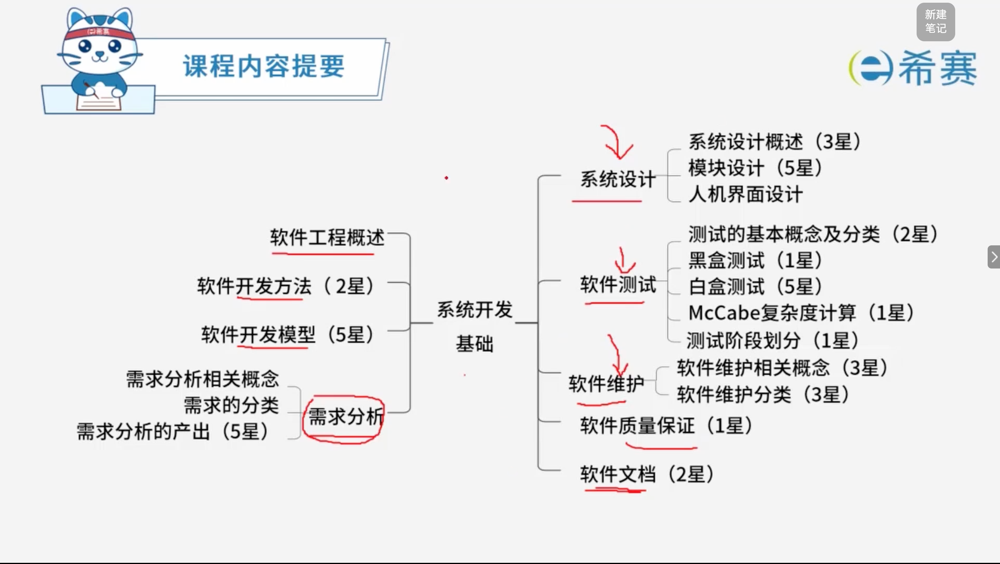
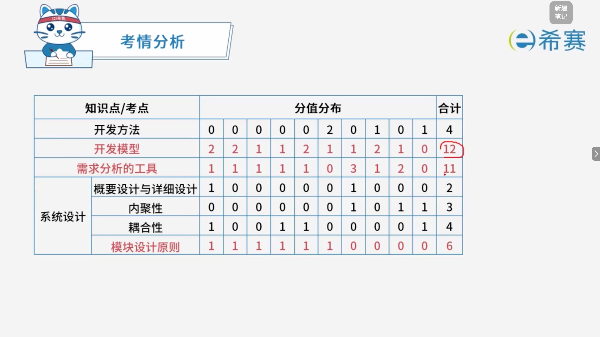
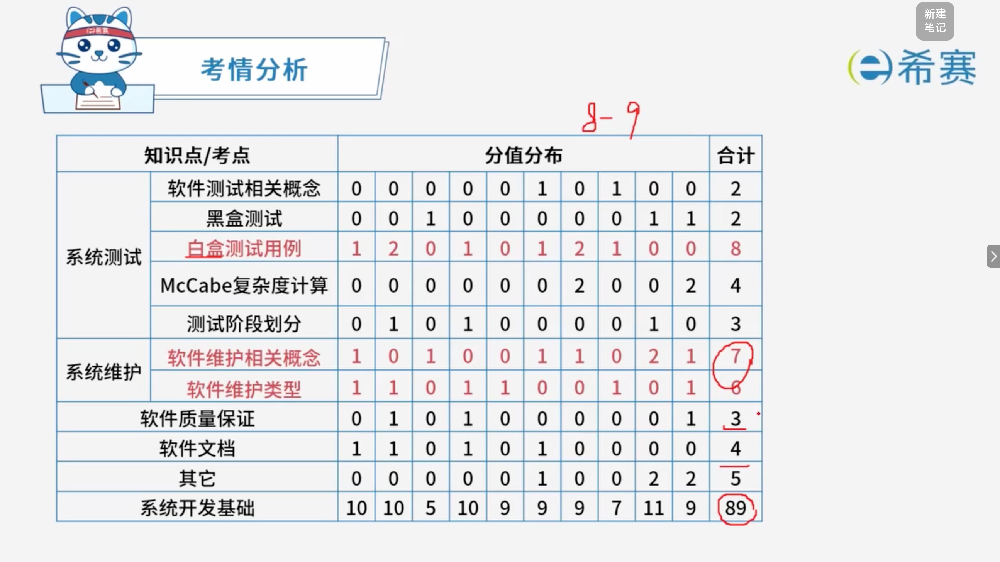

# 系统开发基础

## 1. 知识点分布

## 2. 历年考试分布

## 学习目录

- [软件工程概述](./软件工程概述.md)
- [开发模型](./开发模型.md)
- [开发方法](./开发方法.md)
- [需求分析](./需求分析.md)
- [系统设计](./系统设计.md)
- [模块设计](./模块设计.md)
- [人机界面设计](./人机界面设计.md)
- [软件文档](./软件文档.md)
- [软件质量保证](./软件质量保证.md)
- [系统测试的基本原则](./系统测试的基本原则.md)
- [测试的阶段划分](./测试的阶段划分.md)
- [测试的分类](./测试的分类.md)
- [McCabe复杂度计算](./McCabe复杂度计算.md)
- [系统维护](./系统维护.md)
