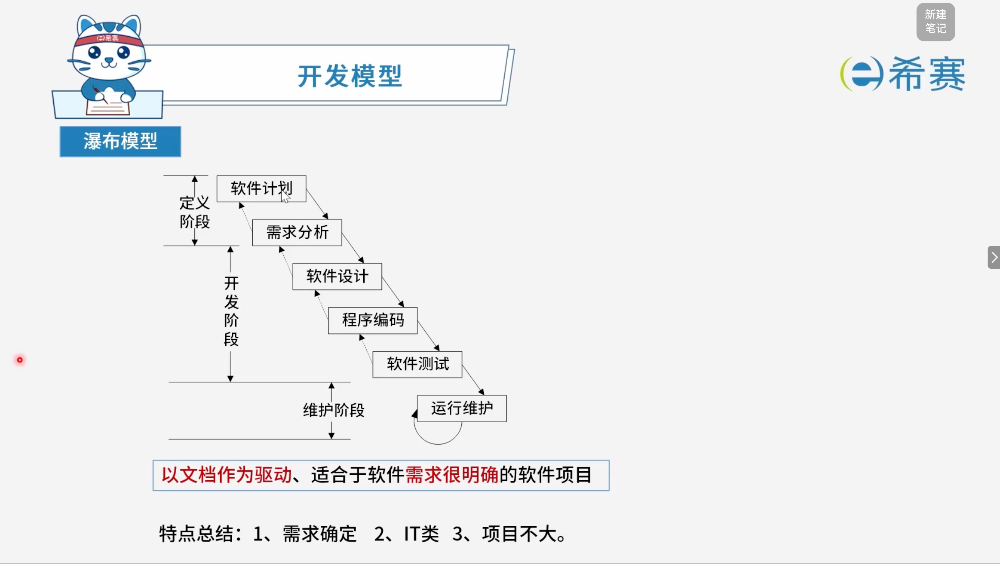
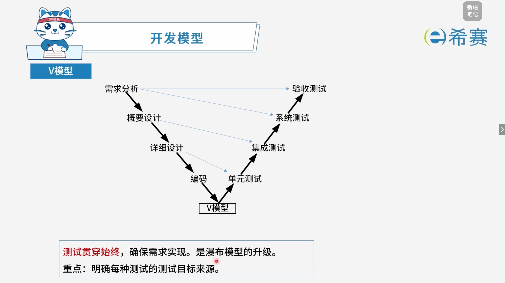
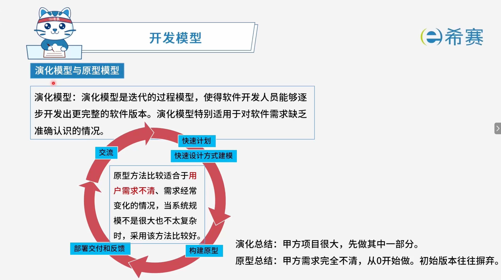
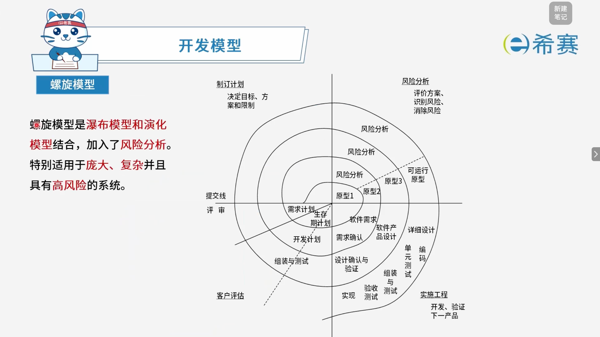
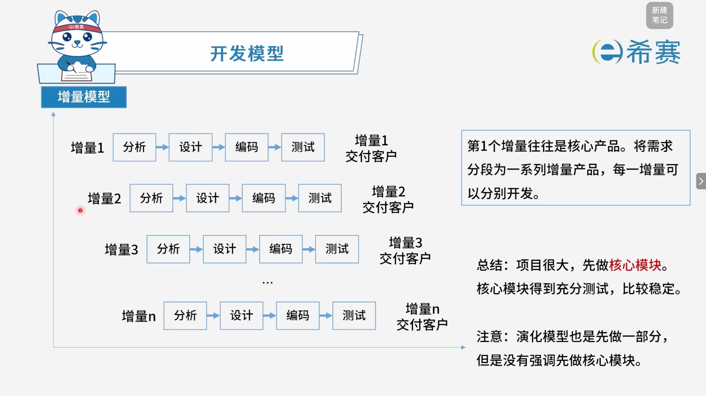
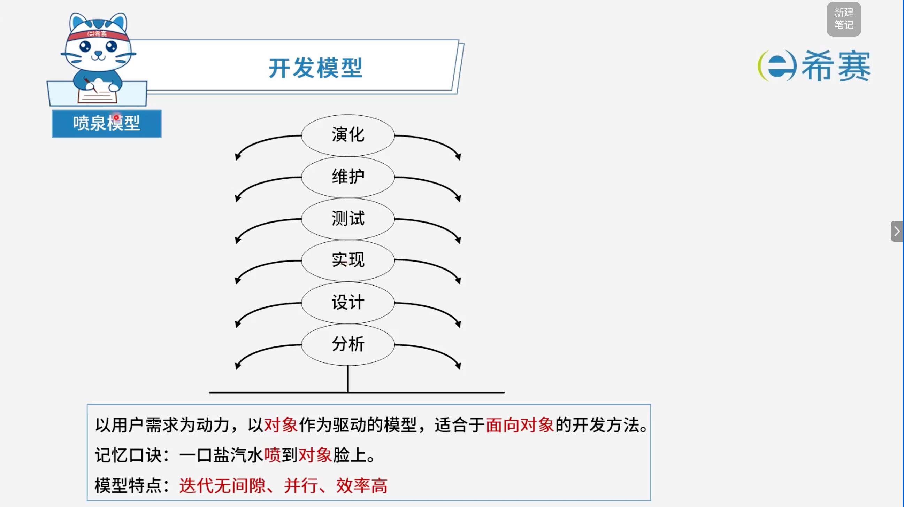
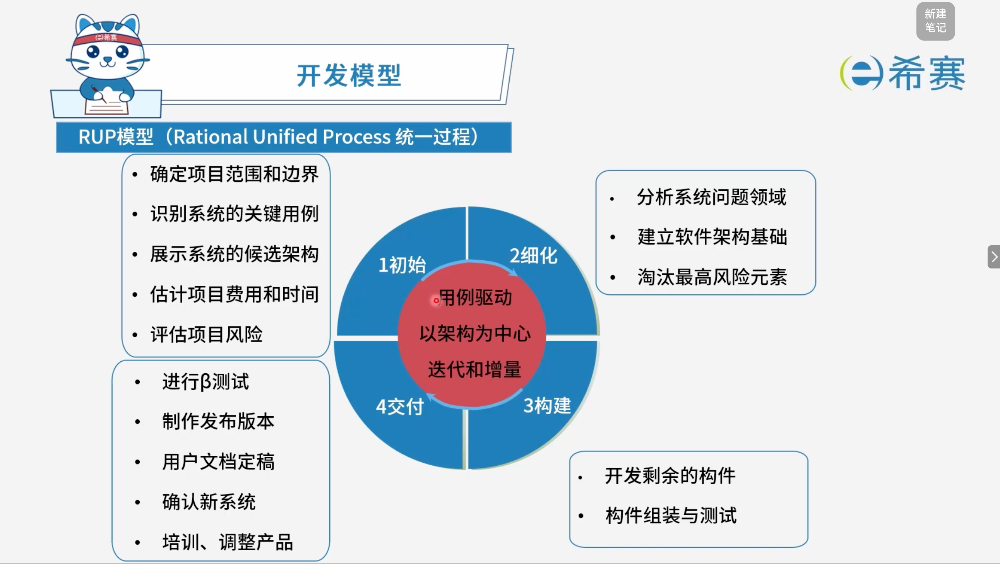
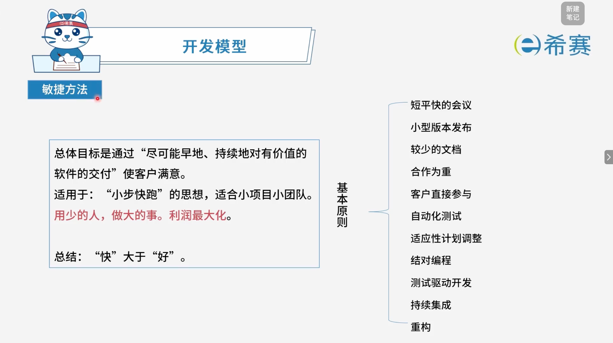

# 开发模型

## 1. 考点：瀑布模型

- **阶段划分**：

  - **定义阶段**：包含软件计划、需求分析。
  - **开发阶段**：包含软件设计、程序编码、软件测试。
  - **维护阶段**：包含运行维护。
- **核心特点**​：以文档作为驱动，适合于软件需求很明确的软件项目。
- **特点总结**：

  1. 需求确定。
  2. IT类。
  3. 项目不大。

## 2. 考点：V模型

- **左侧开发阶段**：

  - 需求分析
  - 概要设计
  - 详细设计
  - 编码
- **右侧测试阶段**：

  - 单元测试
  - 集成测试
  - 系统测试
  - 验收测试
- **核心特点**​：测试贯穿始终，确保需求实现，是瀑布模型的升级。
- **重点**：明确每种测试的测试目标来源。

## 3. 考点：演化模型与原型模型

- **演化模型**​：演化模型是迭代的过程模型，使得软件开发人员能够逐步开发出更完整的软件版本，特别适用于对软件需求缺乏准确认识的情况。
- **原型方法**​：比较适合于用户需求不清、需求经常变化的情况，当系统规模不是很大也不太复杂时，采用该方法比较好。
- **核心循环步骤**：交流 $\rightarrow$ 快速计划 $\rightarrow$ 快速设计方式建模 $\rightarrow$ 构建原型 $\rightarrow$ 部署交付和反馈。
- **核心总结**：

  - **演化总结**：甲方项目很大，先做其中一部分。
  - **原型总结**：甲方需求完全不清，从 0 开始做，初始版本往往摒弃。

## 4. 考点：螺旋模型

- **核心概念**​：螺旋模型是瀑布模型和演化模型结合，加入了风险分析。
- **适用场景**​：特别适用于庞大、复杂并且具有高风险的系统。
- **四个主要象限与活动**：

  - **制定计划**：决定目标、方案和限制。
  - **风险分析**：评价方案、识别风险、消除风险。
  - **实施工程**：开发、验证下一产品（包括需求确认、软件产品设计、详细设计、编码、单元测试、组装与测试、验收测试与验证等）。
  - **客户评估**：提交线、评审、客户评估。
- **核心特点说明**：螺旋模型沿着螺线旋转，每个循环（代表一个阶段或版本）都从制定计划开始，进行风险分析，然后实施工程开发，最后通过客户评估进入下一个循环，这使得开发团队能在早期阶段及时识别并控制项目风险。

## 5. 考点：增量模型

- **核心概念**：将需求分段为一系列增量产品，每一增量可以分别开发，其中第1个增量往往是核心产品。
- **开发步骤**：每一个增量均经历“分析 $\rightarrow$ 设计 $\rightarrow$ 编码 $\rightarrow$ 测试”的过程，随后将该增量交付客户（如增量1、增量2、增量3至增量n）。
- **核心总结**​：项目规模很大时，采用先做核心模块的策略；核心模块能够得到充分测试，因此整体运行比较稳定。
- **对比注意**：演化模型同样是先做一部分，但它没有像增量模型那样强制强调“优先开发核心模块”。
- **缺点：** 模块大小划分是比较困难的。

## 6. 考点：喷泉模型

- **核心定义**​：以用户需求为动力，以对象作为驱动的模型，适合于面向对象的开发方法。
- **过程层次（从下到上）** ：

  - 分析
  - 设计
  - 实现
  - 测试
  - 维护
  - 演化
- **模型特点**​：迭代无间隙、并行、效率高。
- **记忆口诀**：一口盐汽水喷到对象脸上。

## 7. 考点：RUP模型 (Rational Unified Process 统一过程)

- **核心特征（中心红圈）** ：

  - **用例驱动**
  - **以架构为中心**
  - **迭代和增量**
- **四大核心阶段**：

  - **1、初始（Inception）** ：

    - 确定项目范围和边界
    - 识别系统的关键用例
    - 展示系统的候选架构
    - 估计项目费用和时间
    - 评估项目风险
  - **2、细化（Elaboration）** ：

    - 分析系统问题领域
    - 建立软件架构基础
    - 淘汰最高风险元素
  - **3、构建（Construction）** ：

    - 开发剩余的构件
    - 构件组装与测试
  - **4、交付（Transition）** ：

    - 进行 $\beta$ 测试
    - 制作发布版本
    - 用户文档定稿
    - 确认新系统
    - 培训、调整产品

## 8. 考点：敏捷方法

### 8.1 基本概念

- **总体目标**：通过“尽可能早地、持续地对有价值的软件的交付”使客户满意。
- **适用场景**​：秉持“小步快跑”的思想，适合小项目小团队，用少的人，做大的事，追求利润最大化。
- **核心总结**：体现在“快”大于“好”。
- **基本原则**：

  - 短平快的会议
  - 小型版本发布
  - 较少的文档
  - 合作为重
  - 客户直接参与
  - 自动化测试
  - 适应性计划调整
  - 对子编程
  - 测试驱动开发
  - 持续集成
  - 重构

### 8.2 **敏捷方法常见方法与特点：**

|敏捷方法|特点|
| :---------| :--------------------------------------------------------------------------------------------------------------------------------------------------------------------------------------------------------------------------------------------------------------------------------------------------------------------------------------------------|
|**极限编程 XP**|包含 4 大价值观、5 个原则、12 个最佳实践。|
|**水晶法 (Crystal)**|认为每一个不同的项目都需要一套不同的策略、约定和方法论（以项目为本），认为人对软件质量有重要的影响（以人为本），因此随着项目质量和开发人员素质的提高，项目和过程的质量也随之提高。通过更好地交流和经常性交付，软件生产力得到提高。|
|**开放式源码**|程序开发人员在地域上分布广。|
|**并行争球法 (SCRUM)**|橄榄球中的“并列争球”，多个成员站在一排，都同时冲刺着去争抢球权。软件开发中，把每 30 天一次的迭代称为一个“冲刺周期”，并按需求的优先级来实现产品。多个自组织和自治的小组并行地递增实现产品。|
|**功用驱动开发方法 FDD**|开发成员人尽其用，把功能快速开发好。涉及首席程序员和“类”程序员。|
|**自适应软件开发 ASD**|核心是三个非线性的、重叠的开发阶段：猜测、合作与学习。ASD 有 6 个基本的原则：有一个使命作为指导；特征被视为客户价值的关键点；过程中等待是很重要的，因此“重做”与“做”同样关键；变化不被视为改正，而是被视为对软件开发实际情况的调整；确定的交付时间迫使开发人员认真考虑每一个生产的版本的关键需求；风险也包含其中。|
|**敏捷统一过程 AUP**|采用“大型连续”和“小型迭代”原理来构建软件系统，采用经典的 UP 阶段性（初始、精化、构建、交付）。|

#### 8.2.1 极限编程XP-快而精 (extreme programing)

|核心分类|具体内容说明|
| ---------------------------------------------------------------------------------------------------------------------| -------------------------------------------------------------------------------------------------------------------------------------------------------------------------------------------------------------------------------------------------------------------------------------------------------------------------------------------------------------------------------------------------|
|**四大价值观（**​**背** **）**|沟通、简单、反馈、勇气|
|**五大原则（理解）**|快速反馈、简单性假设、逐步修改、提倡更改、优质工作|
|**12大最佳实践**|1.​**计划游戏**：只处理当前需求，快速制定计划，随细节变化不断完善 2.​**简单设计**：只处理当前的需求，保持设计简单 3.​**小型发布**：系统设计要能尽可能早地交付 4.​**隐喻**：找到合适的比喻传达信息，使设计保持简单 5.​**测试先行**：先写测试代码，再编写程序 6.​**重构**：重新审视需求和设计，重新明确描述，以符合新的和现有需求 7.**结对编程** 8.**集体代码所有制** 9.​**持续集成**：可按日甚至按小时为客户提供可运行版本 10.**每周工作40小时** 11.​**现场顾客**：最终用户代表应全程配合 XP 团队 12.**编码标准**|

## 9. 经典例题

### 9.1 题目一

> **题目：**  某企业拟开发一个企业信息管理系统，系统功能与多个部门的业务相关。现希望该系统能够尽快投入使用，系统功能可以在使用过程中不断改善。则最适宜采用的软件过程模型为（ **C** ）。
>
> - A、瀑布模型
> - B、原型模型
> - C、演化（迭代）模型
> - D、螺旋模型

 **【解析】**

- **解析说明**：

  - **演化（迭代）模型**：核心在于先构建并交付一个满足基本需求的初始版本（满足“尽快投入使用”），随后通过多次迭代逐步补充和扩展功能（满足“在使用过程中不断改善”）。
  - **瀑布模型**：要求前期明确全部需求，开发周期长，无法满足尽快投入使用的需求。
  - **原型模型**：主要用于明确模糊需求，通常作为抛弃型使用，不直接作为最终系统持续演化运行。
  - **螺旋模型**：最大特点是强调“风险分析”，通常适用于庞大、复杂且高风险的项目。

**正确答案：C（演化/迭代模型）。** 

### 9.2 题目二

> **题目：**  关于螺旋模型，下列陈述中不正确的是（ **D** ），（ **C** ）。
>
> **第一组选项：**
>
> - A、将风险分析加入到瀑布模型中
> - B、将开发过程划分为几个螺旋周期，每个螺旋周期大致和瀑布模型相符
> - C、适合于大规模、复杂且具有高风险的项目
> - D、可以快速的提供一个初始版本让用户测试
>
> **第二组选项：**
>
> - A、支持用户需求的动态变化
> - B、要求开发人员具有风险分析能力
> - C、基于该模型进行软件开发，开发成本低
> - D、过多的迭代次数可能会增加开发成本，进而延迟提交时间

 **【解析】**

- **第一组选项中不正确的是：D**

  - **原因**：螺旋模型主要强调风险分析和每个周期的演化，它并不以“快速提供一个初始版本让用户测试”为主要特点（快速提供初始版本更贴近原型模型或敏捷模型）。
  - **其他选项说明**：螺旋模型将风险分析加入到瀑布模型中（A）；将开发过程划分为几个螺旋周期，每个螺旋周期大致和瀑布模型相符（B）；适合于大规模、复杂且具有高风险的项目（C），这些表述均是正确的。
- **第二组选项中不正确的是：C**

  - **原因**​：由于螺旋模型需要频繁地进行风险评估、原型制作和多轮迭代，其​**开发成本通常较高**，而不是“开发成本低”。
  - **其他选项说明**：它能够支持用户需求的动态变化（A）；要求开发人员具有较强的风险分析能力（B）；过多的迭代次数可能会增加开发成本，进而延迟提交时间（D），这些表述均是正确的。

**正确答案：第一组选 D，第二组选 C。** 

### 9.3 题目三

> **题目：**  以下关于增量开发模型的叙述中，不正确的是（ **D** ）。
>
> - A、不必等到整个系统开发完成就可以使用
> - B、可以使用较早的增量构件作为原型，从而获得稍后的增量构件需求
> - C、优先级最高的服务先交付，这样最重要的服务接受最多的测试
> - D、有利于进行好的模块划分

 **【解析】**

- **正确答案：D**
- **解析说明：**

  - **关于选项 D**​：增量模型虽然将系统划分为一系列增量构件进行开发，但​**并不天然有利于好的模块划分**​。相反，增量模型的一个常见缺点是：​**模块大小划分比较困难**。如果模块划分不合理，后续增量集成时容易出现问题。因此，“有利于进行好的模块划分”这一说法不正确。
  - **其他选项说明**：

    - **A**：增量模型允许用户分批次获得软件构件，不必等到整个系统开发完成即可投入使用，表述正确。
    - **B**：可以使用较早的增量构件作为原型，通过实际运行来帮助理解和获取后续增量构件的需求，表述正确。
    - **C**：优先级最高的服务先交付，因此最重要的服务会接受最多的测试，这是增量模型的一个特点，表述正确。

**正确答案：D。** 

### 9.4 **题目四**

> **题目：**  在敏捷过程的开发方法中，（ **C** ）使用了迭代的方法，其中，把每段时间（30天）一次的迭代称为一个“冲刺”，并按需求的优先级别来实现产品，多个自组织和自治的小组并行地递增实现产品。
>
> - A、极限编程XP
> - B、水晶法
> - C、并列争球法
> - D、自适应软件开发

 **【解析】**

- **正确答案：C**
- **解析说明：**

  - **关于选项 C（并列争球法/SCRUM）** ​：并列争球法（SCRUM）是敏捷方法中的一种，其核心特点就是​**迭代**​。它把每 **30 天** 一次的迭代称为一个“​**冲刺周期**​”，并按需求的优先级来实现产品；多个自组织和自治的小组**并行地递增**实现产品。题干中的“冲刺”“30天”“并行递增”都是 SCRUM 的典型特征。
  - **其他选项说明**：

    - **A、极限编程XP**​：强调 ​**4 大价值观、5 个原则、12 个最佳实践**，如结对编程、测试先行、持续集成、小型发布等，并不以“30天冲刺”为核心特征。
    - **B、水晶法**​：认为每一个不同的项目都需要一套不同的策略、约定和方法论（​**以项目为本**​），认为人对软件质量有重要影响（​**以人为本**），并不强调“冲刺”这一概念。
    - **D、自适应软件开发**​：核心是三个非线性的、重叠的开发阶段：​**猜测、合作与学习**，也不以“30天冲刺”为典型特征。

**正确答案：C（并列争球法/SCRUM）。** 

### 9.5 **题目五**

> **题目：**  极限编程（XP）的十二个最佳实践不包括（ **D** ）。
>
> - A、小的发布
> - B、结对编程
> - C、持续集成
> - D、精心设计

 **【解析】**

- **正确答案：D**
- **解析说明：**

  - **关于选项 D（精心设计）** ​：极限编程（XP）十二个最佳实践中，与设计相关的是“​**简单设计**”，强调“只处理当前的需求，保持设计简单”，而不是“精心设计”。因此“精心设计”不属于 XP 的十二个最佳实践。
  - **其他选项说明**：

    - **A、小的发布**​：属于 XP 十二个最佳实践之一，即“​**小型发布**”，要求系统设计能尽可能早地交付。
    - **B、结对编程**​：属于 XP 十二个最佳实践之一，即“​**结对编程**”，由两名程序员共同完成代码编写。
    - **C、持续集成**​：属于 XP 十二个最佳实践之一，即“​**持续集成**”，可按日甚至按小时为客户提供可运行版本。

**正确答案：D（精心设计）。**
