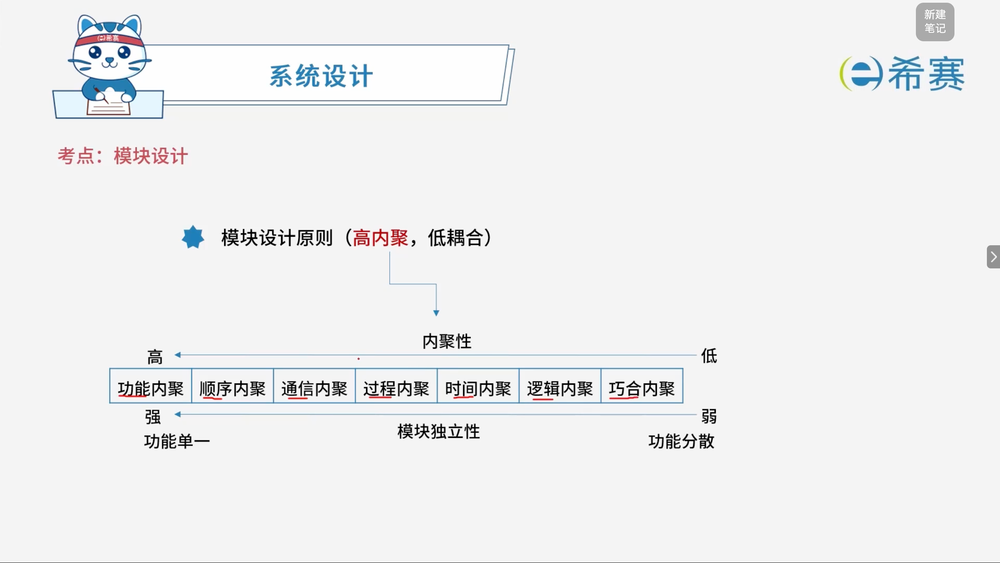
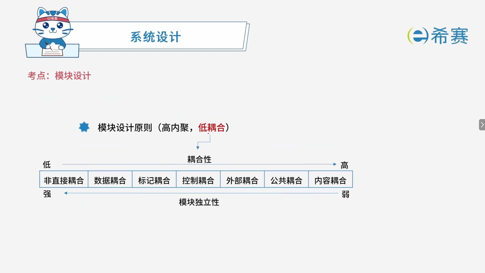

# 模块设计

## 1. **考点：模块设计的基本要求**

- 保持模块的大小适中
- 深度、宽度适中
- 扇入、扇出系数要合理
- 模块的作用域应该在模块之内
- 功能应该是可预测的
- **高内聚、低耦合**
- **核心总结**：

  - 模块设计的目标是实现​**高内聚、低耦合**。
  - 设计时需注意：模块大小适中、深度宽度适中、扇入扇出合理、作用域在模块之内、功能可预测。

## 2. 考点：模块设计基本原则（高内聚，低耦合）

### 2.1 **耦合类型与描述**

|内聚类型|描述|
| ----------| ------------------------------------------|
|**功能内聚**|完成一个​**单一功能**，各个部分协同工作，缺一不可|
|**顺序内聚**|处理元素相关，而且必须**顺序执行**|
|**通信内聚**|所有处理元素集中在一个数据结构的区域上|
|**过程内聚**|处理元素相关，而且必须按**特定的次序执行**|
|**瞬时内聚（时间内聚）**|所包含的任务必须在**同一时间间隔内**执行|
|**逻辑内聚**|完成**逻辑上相关**的一组任务|
|**偶然内聚（巧合内聚）**|完成一组**没有关系或松散关系**的任务|

- **核心总结**：

  - 内聚性由高到低：​**功能内聚 &gt; 顺序内聚 &gt; 通信内聚 &gt; 过程内聚 &gt; 瞬时内聚 &gt; 逻辑内聚 &gt; 偶然内聚**。
  - **功能内聚**最高，模块独立性最强。
  - **偶然内聚**最低，模块独立性最弱。

### 2.2 **耦合类型与描述**

|耦合类型|描述|
| ----------| ----------------------------------------------------------------------|
|**非直接耦合**|两个模块之间​**没有直接关系**，它们之间的联系完全是通过主模块的控制和调用来实现的|
|**数据耦合**|一组模块借助参数表**传递简单数据**|
|**标记耦合**|一组模块通过参数表**传递记录信息（数据结构）**|
|**控制耦合**|模块之间传递的信息中包含用于**控制模块内部逻辑的信息**|
|**外部耦合**|一组模块都访问​**同一全局简单变量**，而且不是通过参数表传递该全局变量的信息|
|**公共耦合**|多个模块都访问**同一个公共数据环境**|
|**内容耦合**|一个模块​**直接访问另一个模块的内部数据**​；一个模块​**不通过正常入口转到另一个模块的内部**​；两个模块有​**一部分程序代码重叠**​；一个模块有**多个入口**|

- **核心总结**：

  - 耦合性由低到高：​**非直接耦合 &lt; 数据耦合 &lt; 标记耦合 &lt; 控制耦合 &lt; 外部耦合 &lt; 公共耦合 &lt; 内容耦合**。
  - **非直接耦合**最低，模块独立性最强。
  - **内容耦合**最高，模块独立性最弱，应尽量避免。

## 3. 经典例题

### 3.1 题目一

> **题目：**  以下关于模块化设计的叙述中，不正确的是（ ）。
>
> - A、尽量考虑高内聚、低耦合，保持模块的相对独立性
> - B、模块的控制范围在其作用范围内
> - C、模块的规模适中
> - D、模块的宽度、深度、扇入和扇出适中

 **【解析】**

- **正确答案：B**
- **解析说明：**

  - **关于选项 B（模块的控制范围在其作用范围内）** ​：说法反了。模块化设计的原则是​**模块的作用范围应该在其控制范围之内**，而不是“控制范围在作用范围内”。

    - **作用范围**：指受该模块内部判定影响的所有模块的集合。
    - **控制范围**：指该模块及其所有下属模块的集合。
    - 正确关系：​**作用范围应该在控制范围之内**，这样才能保证判定影响到的模块都在该模块的掌控之下，便于维护和理解。
  - **其他选项说明**：

    - **A、尽量考虑高内聚、低耦合，保持模块的相对独立性**：正确，这是模块化设计的核心原则。
    - **C、模块的规模适中**：正确，模块过大或过小都不利于开发和维护。
    - **D、模块的宽度、深度、扇入和扇出适中**：正确，这些结构参数应合理，避免过深、过宽、扇入扇出过大或过小。

**正确答案：B（模块的控制范围在其作用范围内）。** 

### 3.2 题目二

> **题目：**  某模块中各个处理元素都密切相关于同一功能且必须顺序执行，前一处理元素的输出就是下一处理元素的输入，则该模块的内聚类型为（ ）内聚。
>
> - A、过程
> - B、时间
> - C、顺序
> - D、逻辑

 **【解析】**

- **正确答案：C**
- **解析说明：**

  - **关于选项 C（顺序内聚）** ​：顺序内聚是指模块中各个处理元素​**密切相关于同一功能**​，且​**必须顺序执行**​，前一处理元素的​**输出就是下一处理元素的输入**。题干描述完全符合顺序内聚的定义。
  - **其他选项说明**：

    - **A、过程内聚**：处理元素相关，且必须按特定的次序执行，但元素之间不一定有数据传递（不像顺序内聚那样强调前一元素的输出是后一元素的输入）。
    - **B、时间内聚**：所包含的任务必须在同一时间间隔内执行，与执行顺序和数据传递无关。
    - **D、逻辑内聚**：完成逻辑上相关的一组任务，任务之间无固定的执行顺序和数据依赖。

**正确答案：C（顺序内聚）。** 

### 3.3 题目三

> **题目：**  模块A将学生信息，即学生姓名、学号、手机号等放到一个结构体中，传递给模块B。模块A和B之间的耦合类型为（ ）耦合。
>
> - A、数据
> - B、标记
> - C、控制
> - D、内容

 **【解析】**

- **正确答案：B**
- **解析说明：**

  - **关于选项 B（标记耦合）** ​：标记耦合是指一组模块通过参数表​**传递记录信息（数据结构）** ​。题干中模块A将学生信息（姓名、学号、手机号等）放到一个**结构体**中传递给模块B，传递的是数据结构而非简单数据，因此属于标记耦合。
  - **其他选项说明**：

    - **A、数据耦合**​：模块之间传递的是​**简单数据**（如单个变量、数值），而题干传递的是结构体，属于复杂数据结构。
    - **C、控制耦合**​：模块之间传递的信息中包含用于​**控制模块内部逻辑的信息**（如标志位、开关量），题干中传递的是业务数据，不是控制信息。
    - **D、内容耦合**：一个模块直接访问另一个模块的内部数据，或代码重叠、多入口等，题干中模块之间是通过参数传递，不属于内容耦合。

**正确答案：B（标记耦合）。** 

‍
