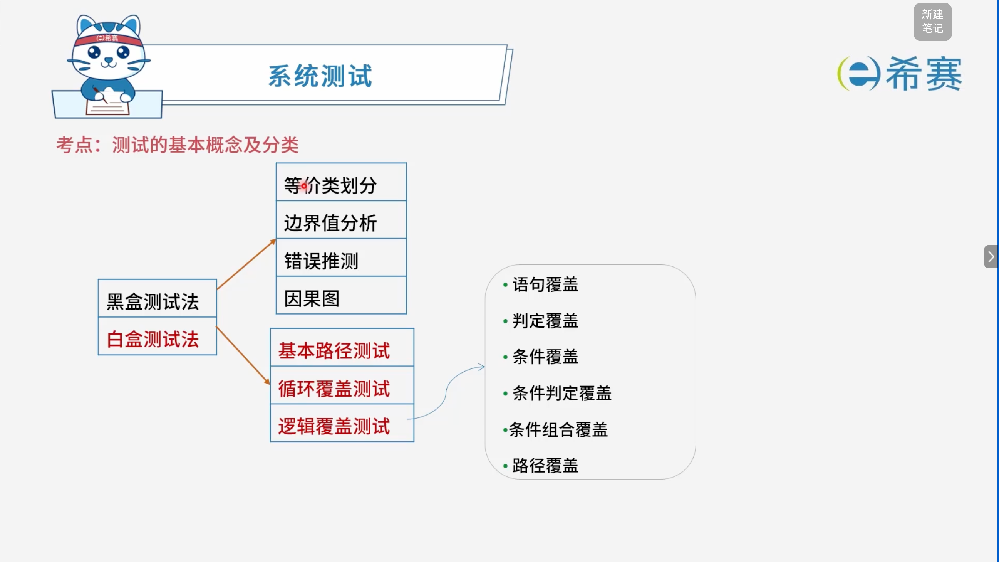
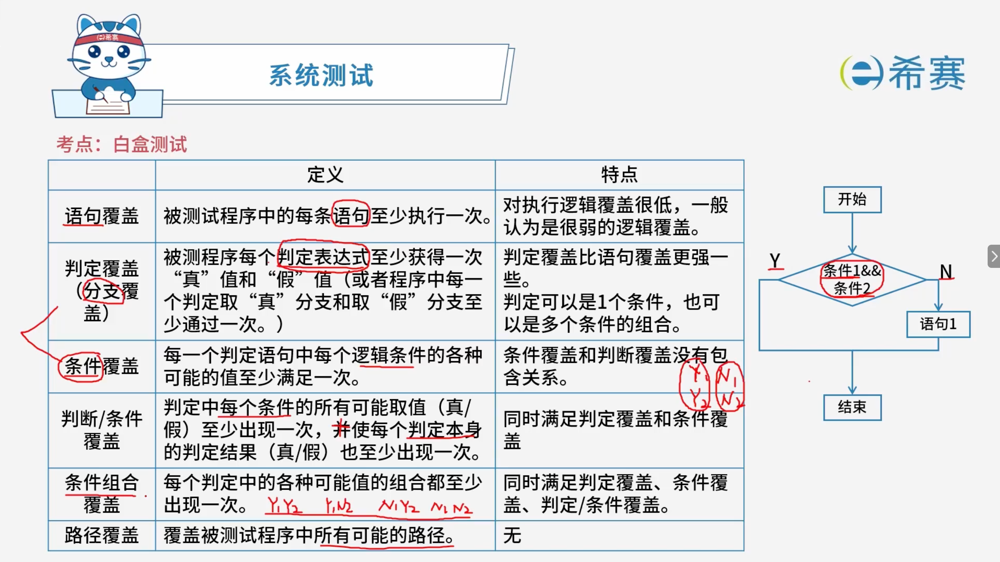
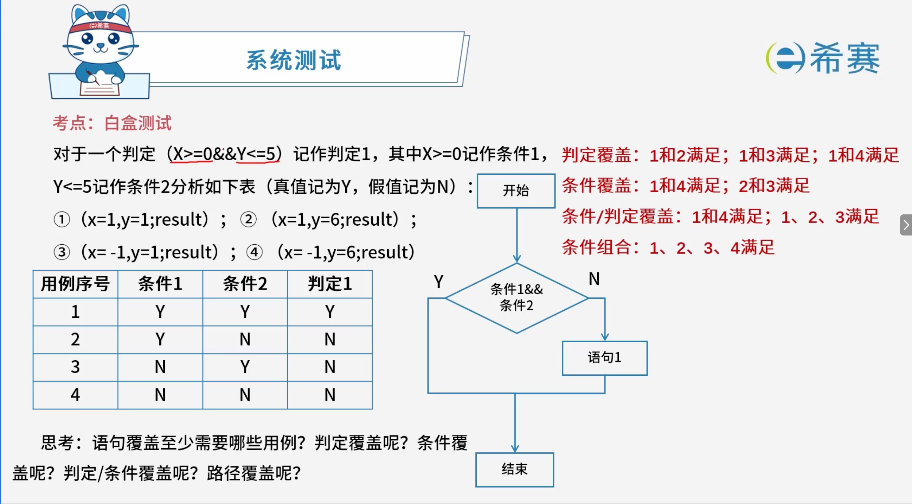
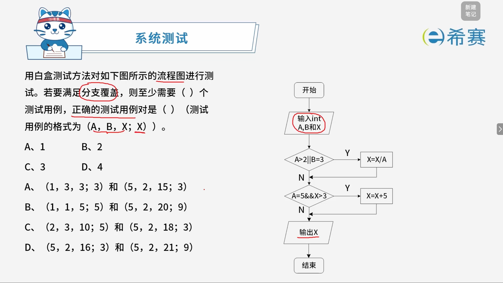

# 测试的分类

## 1. **考点：测试的基本概念及分类**

- **动态测试（机器运行）** ：

  1. 黑盒测试法（测试功能）
  2. 白盒测试法（测试结构）
  3. 灰盒测试法（黑白结合）
- **静态测试（纯人工）** ：

  1. 桌前检查（现场检查）
  2. 代码审查（SVN服务器）
  3. 代码走查（边走代码边检查）
- **核心总结**：

  1. **动态测试** \= 机器运行，包含**黑盒、白盒、灰盒**测试法。
  2. **静态测试** \= 纯人工，包含​**桌前检查、代码审查、代码走查**。
  3. **黑盒测试**测功能，**白盒测试**测结构，**灰盒测试**是黑白结合。

### 1.1 **黑盒测试法与白盒测试法**

- **黑盒测试法**：

  - 等价类划分
  - 边界值分析
  - 错误推测
  - 因果图
- **白盒测试法**：

  - 基本路径测试
  - 循环覆盖测试
  - 逻辑覆盖测试

    - 语句覆盖
    - 判定覆盖
    - 条件覆盖
    - 条件判定覆盖
    - 条件组合覆盖
    - 路径覆盖
- **核心总结**：

  - **黑盒测试法**：等价类划分、边界值分析、错误推测、因果图。
  - **白盒测试法**：基本路径测试、循环覆盖测试、逻辑覆盖测试。
  - **逻辑覆盖**由弱到强：语句覆盖 \< 判定覆盖 \< 条件覆盖 \< 条件判定覆盖 \< 条件组合覆盖 \< 路径覆盖。

## 2. **考点：黑盒测试**

|方法|说明|
| ------| ------------------------------------------------------------------------------|
|**等价类划分**|确定无效与有效等价类 设计用例尽可能多的覆盖有效类 设计用例只覆盖一个无效类|
|**边界值分析**|处理边界情况时最容易出错 选取的测试数据应该恰好等于、稍小于或稍大于边界值|

### 2.1 **示例**：

> 小张帮朋友开发一个成绩分级程序，功能是这样的：  
> 90-100分：优；80-89分：良；70-79分：中；60-69分：及格；0-59分：不及格。  
> 对此，我们若采用等价类划分以及边界值分析，应该如何设计测试用例？

**答案：** 

- **等价类划分**：

  - **有效等价类**：0～59、60～69、70～79、80～89、90～100。
  - **无效等价类**：小于 0、大于 100。
  - 设计用例时，有效等价类尽可能多覆盖，无效等价类每次只覆盖一个。
- **边界值分析**：

  - 各分数段的边界值为：0、59、60、69、70、79、80、89、90、100。
  - 选取测试数据时应取：​**恰好等于边界值、稍小于边界值、稍大于边界值**。
  - 例如：-1、0、1、59、60、61、69、70、71、79、80、81、89、90、91、99、100、101。

### 2.2 **核心总结**：

- **等价类划分**：有效等价类尽可能多覆盖，无效等价类每次只覆盖一个。
- **边界值分析**：重点测试边界值，取恰好等于、稍小于、稍大于边界值的数据。

## 3. **考点：白盒测试**

|覆盖方法|定义|特点|
| ----------| ----------------------------------------------------------------------------------------------------------------------| -----------------------------------------------------------------------|
|**语句覆盖**|被测试程序中的每条语句至少执行一次。|对执行逻辑覆盖很低，一般认为是​**很弱的逻辑覆盖**。|
|**判定覆盖（分支覆盖）**|被测程序每个判定表达式至少获得一次“真”值和“假”值（或者程序中每一个判定取“真”分支和取“假”分支至少通过一次）。|判定覆盖比语句覆盖​**更强一些**。 判定可以是1个条件，也可以是多个条件的组合。|
|**条件覆盖**|每一个判定语句中每个逻辑条件的各种可能的值至少满足一次。|条件覆盖和判定覆盖​**没有包含关系**。|
|**判定/条件覆盖**|判定中每个条件的所有可能取值（真/假）至少出现一次，并使每个判定本身的判定结果（真/假）也至少出现一次。|同时满足**判定覆盖**和​**条件覆盖**。|
|**条件组合覆盖**|每个判定中的各种可能值的组合都至少出现一次。|同时满足​**判定覆盖、条件覆盖、判定/条件覆盖**。|
|**路径覆盖**|覆盖被测试程序中所有可能的路径。|无|

- **核心总结**：

  - **语句覆盖**最弱，只要求每条语句执行一次。
  - **判定覆盖**比语句覆盖强，要求每个判定的真假分支都通过一次。
  - **条件覆盖**关注每个逻辑条件的取值，和判定覆盖没有包含关系。
  - **判定/条件覆盖**同时满足判定覆盖和条件覆盖。
  - **条件组合覆盖**最强，覆盖各种条件取值的组合，同时满足前三种。
  - **路径覆盖**覆盖所有可能路径。

### 3.1 实例分析

> 对于一个判定（X\>\=0 && Y\<\=5）记作判定1，其中 X\>\=0 记作条件1，Y\<\=5 记作条件2。分析如下表（真值记为 Y，假值记为 N）：
>
> - ① （x\=1, y\=1; result）
> - ② （x\=1, y\=6; result）
> - ③ （x\=-1, y\=1; result）
> - ④ （x\=-1, y\=6; result）
>
> |用例序号|条件1|条件2|判定1|
> | ----------| -------| -------| -------|
> |1|Y|Y|Y|
> |2|Y|N|N|
> |3|N|Y|N|
> |4|N|N|N|

- **判定覆盖**：1和2满足；1和3满足；1和4满足。
- **条件覆盖**：1和4满足；2和3满足。
- **条件/判定覆盖**：1和4满足；1、2、3满足。
- **条件组合**：1、2、3、4满足。
- **思考**：

  - 语句覆盖至少需要哪些用例？
  - 判定覆盖呢？
  - 条件覆盖呢？
  - 判定/条件覆盖呢？
  - 路径覆盖呢？
- **答案参考**：

  - **语句覆盖**：最少需要 **1个**用例。任选一个使判定为“N”的用例（用例2，3，4中任选一个；如用例2），即可执行到“语句1”。但注意若判定为“真”时语句1才被执行，因此选用例1即可覆盖语句。
  - **判定覆盖**​：最少需要 **2个**用例。例如用例1（判定为真）和用例2（判定为假），使判定的真假分支都至少执行一次。
  - **条件覆盖**​：最少需要 **2个**用例。例如用例1（条件1\=Y，条件2\=Y）和用例4（条件1\=N，条件2\=N），使每个条件的真假取值都出现。也可用用例2和用例3组合。
  - **判定/条件覆盖**​：最少需要 **2个**用例。例如用例1和用例4，既满足判定真假分支各一次，又满足条件1和条件2的真假各一次。
  - **路径覆盖**​：最少需要 **2个**用例。路径为“判定为真”和“判定为假”两条路径，例如用例1和用例2，或用例1和用例4均可。
- **核心总结**：

  - **语句覆盖**：最强覆盖要求最低，1个用例即可。
  - **判定覆盖**：真假分支各一次，2个用例。
  - **条件覆盖**：每个条件真假各一次，2个用例。
  - **判定/条件覆盖**：同时满足判定覆盖和条件覆盖，2个用例。
  - **路径覆盖**：覆盖所有可能路径，2个用例。

## 4. 经典例题

### 4.1 题目一

> 

 **【解析】**

- **正确答案：第一空选 B，第二空选 B。**
- **解析说明：**

  - **第一空：满足分支覆盖，至少需要（ B ）个测试用例。**

    - 流程图中有两个判定节点：

      1. **判定1**​：​`A>2 || B=3`
      2. **判定2**​：​`A=5 && X>3`
    - 分支覆盖要求每个判定的**真、假分支**都至少执行一次。
    - 设计测试用例时，需要让判定1的真假分支、判定2的真假分支都覆盖到。至少需要 **2 个**测试用例。
  - **第二空：正确的测试用例对是（ B ）（1, 1, 5; 5）和（5, 2, 20; 9）。**

    - **用例1：（1, 1, 5; 5）**

      - A\=1, B\=1, X\=5
      - 判定1：​`A>2 || B=3`​ → ​`1>2 || 1=3`​ → **假（N）**
      - 判定2：​`A=5 && X>3`​ → ​`1=5 && 5>3`​ → **假（N）**
      - 执行路径：判定1假 → 判定2假 → 输出X\=5。覆盖了判定1的假分支和判定2的假分支。
    - **用例2：（5, 2, 20; 9）**

      - A\=5, B\=2, X\=20
      - 判定1：​`A>2 || B=3`​ → ​`5>2 || 2=3`​ → **真（Y）**

        - 执行 ​`X = X/A`​ → ​`X = 20/5 = 4`
      - 判定2：​`A=5 && X>3`​ → ​`5=5 && 4>3`​ → **真（Y）**

        - 执行 ​`X = X+5`​ → ​`X = 4+5 = 9`
      - 执行路径：判定1真 → 判定2真 → 输出X\=9。覆盖了判定1的真分支和判定2的真分支。
    - 两个用例组合起来，覆盖了判定1和判定2的真假分支，满足分支覆盖要求。
  - **其他选项说明**：

    - **A 选项**​：用例（1, 3, 3; 3）中，判定1为真（B\=3），判定2为假；用例（5, 2, 15; 3）中，判定1为真，判定2为假。两个用例都只覆盖了判定2的假分支，没有覆盖判定2的真分支。
    - **C 选项**​：用例（2, 3, 10; 5）中，判定1为真（B\=3），判定2为假；用例（5, 2, 18; 3）中，判定1为真，判定2为假。同样没有覆盖判定2的真分支。
    - **D 选项**：用例（5, 2, 16; 3）和（5, 2, 21; 9）中，判定1都为真，判定2都为真，没有覆盖判定1和判定2的假分支。

**正确答案：第一空 B（2），第二空 B（（1, 1, 5; 5）和（5, 2, 20; 9））。**
