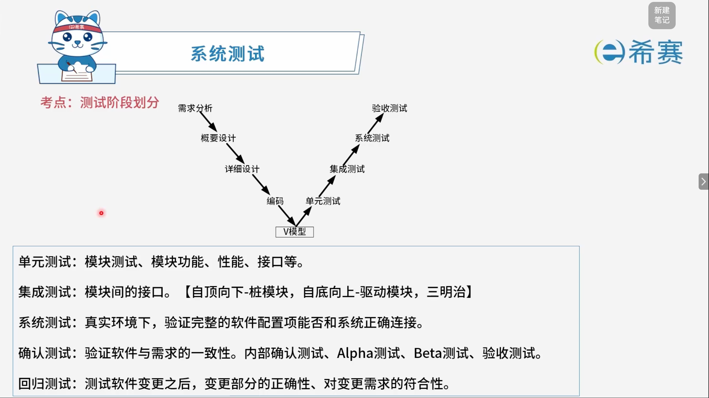
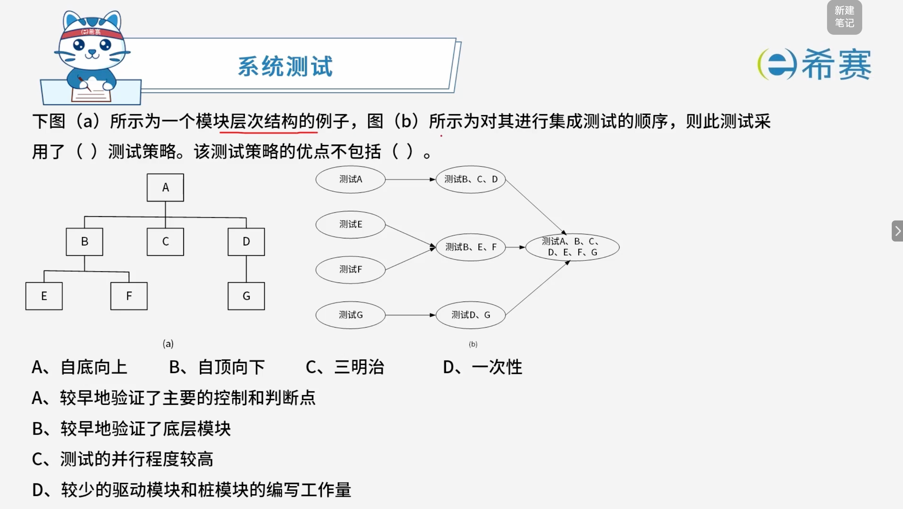

# 测试的阶段划分

## 1. **考点：测试阶段划分**

- **单元测试**：模块测试、模块功能、性能、接口等。
- **集成测试**：模块间的接口。【自顶向下-桩模块，自底向上-驱动模块，三明治】
- **系统测试**：真实环境下，验证完整的软件配置项能否和系统正确连接。
- **确认测试**：验证软件与需求的一致性。内部确认测试、Alpha测试、Beta测试、验收测试。
- **回归测试**：测试软件变更之后，变更部分的正确性、对变更需求的符合性。

## 2. 经典例题

### 2.1 题目一

> 

 **【解析】**

- **正确答案：第一空选 C，第二空选 D。**
- **解析说明：**

  - **第一空：此测试采用了（ C ）测试策略。**

    - 观察图（b）的测试顺序：

      - 先并行测试 ​**A**​（顶层）和 ​**E、F、G**（底层）；
      - 然后测试 ​**B、E、F**；
      - 再测试 ​**D、G**；
      - 最后测试 ​**A、B、C、D、E、F、G**。
    - 测试同时从**顶层**和**底层**两个方向推进，属于**自顶向下和自底向上结合**的测试策略，即**三明治**策略。
  - **第二空：该测试策略的优点不包括（ D ）。**

    - **三明治**策略结合了自顶向下和自底向上的特点，其优点包括：

      - 较早地验证了主要的控制和判断点（A正确）；
      - 较早地验证了底层模块（B正确）；
      - 测试的并行程度较高（C正确）。
    - **D 不正确**​：三明治策略既需要​**桩模块**​（自顶向下部分），又需要​**驱动模块**​（自底向上部分），因此​**驱动模块和桩模块的编写工作量都比较大**，而不是“较少的驱动模块和桩模块的编写工作量”。

**正确答案：第一空 C（三明治），第二空 D（较少的驱动模块和桩模块的编写工作量）。** 

‍
