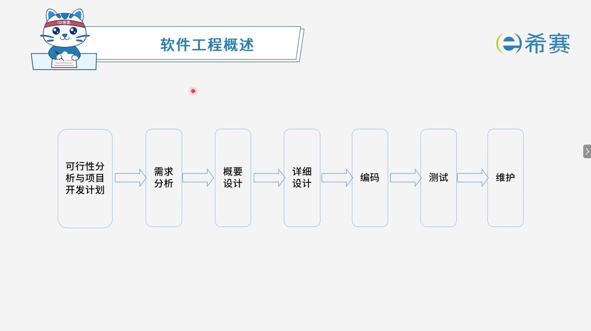
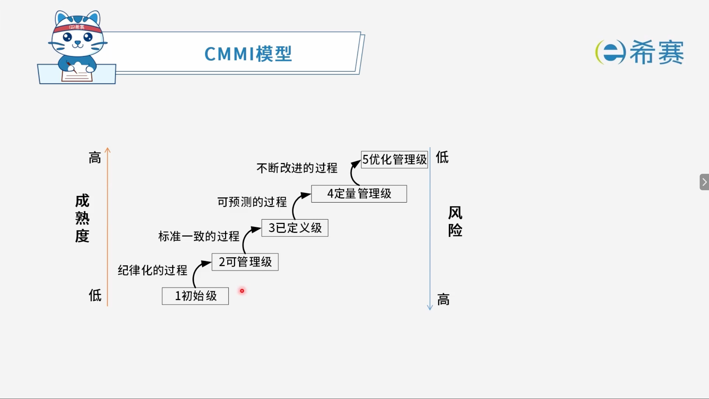

# 软件工程概述

## 1. 考点：软件工程的生命周期

## 2. 考点：CMM模型 (Capability Maturity Model **能力成熟度模型**)

- **1、初始级**：杂乱无章，甚至混乱，几乎没有明确定义的步骤，项目的成功完全依赖个人的努力和英雄式核心人物的作用；成熟度最低。
- **2、可重复级**：建立了基本的项目管理过程和实践来跟踪项目费用、进度和功能特性，有必要的过程准则来重复以前在同类项目中的成功。
- **3、已定义级**：管理和工程两方面的软件过程已经文档化、标准化，并综合成整个软件开发组织的标准过程。
- **4、已管理级**：制定了软件过程和产品质量的详细度量标准。
- **5、优化级**：加强了定量分析，通过来自过程质量反馈和来自新观念、新技术的反馈使过程能不断持续地改进；成熟度最高。

## 3. 考点：CMMI模型

### 3.1 CMMI阶段式模型

### 3.2 CMMI连续式模型：Capability Maturity Model Integration 能力成熟度模型集成

|**等级CL**|**说明**|
| --| ------------------------------------------------------------------------------------------------------------------------------------|
|**CL0（未完成的）**|过程域未执行或未得到CL1中定义的所有目标。|
|**CL1（已执行的）**|其共性目标是过程将可标识的输入工作产品转换成可标识的输出工作产品，以实现支持过程域的特定目标。|
|**CL2（已管理的）**|其共性目标是集中于已管理的过程的制度化。|
|**CL3（已定义的）**|其共性目标集中于已定义的过程的制度化。|
|**CL4（定量管理的）**|其共性目标集中于可定量管理的过程的制度化。|
|**CL5（优化的）**|使用量化（统计学）手段改变和优化过程域，以满足客户的改变和持续改进计划中的过程域的功效。|

## 4. 经典例题

### 4.1 题目一

> **题目：** 以下关于CMM的叙述中，不正确的是（**B**）。
>
> - A、CMM是指软件过程能力成熟度模型
> - B、CMM根据软件过程的不同成熟度划分了5个等级，其中，1级被认为成熟度最高，5级被认为成熟度最低
> - C、CMMI的任务是将已有的几个CMM模型结合在一起，使之构成“集成模型”
> - D、采用更成熟的CMM模型，一般来说可以提高最终产品的质量

 **【解析】**

- **A**：CMM 是指软件过程能力成熟度模型（Capability Maturity Model），此叙述正确。
- **B**​：CMM 根据软件过程的不同成熟度划分了 5 个等级，其中 ​**1 级（初始级）被认为成熟度最低**​，而 ​**5 级（优化级）被认为成熟度最高**​。选项中颠倒了成熟度的高低，因此是**不正确**的。
- **C**：CMMI（Capability Maturity Model Integration，能力成熟度模型集成）的任务是将已有的几个 CMM 模型结合在一起，使之构成“集成模型”，此叙述正确。
- **D**：采用更成熟的 CMM 模型，有助于规范软件过程，一般来说可以提高最终产品的质量，此叙述正确。

**正确答案：B。** 

### 4.2 题目二

> **题目：**  能力成熟度模型集成（CMMI）是若干过程模型的综合和改进。连续式模型和阶段式模型是CMMI提供的两种表示方法。连续式模型包括6个过程域能力等级（Capability Level, CL），其中（​**A**）的共性目标是过程将可标识的输入工作产品转换成可标识的输出工作产品，以实现支持过程域的特定目标。
>
> - A、CL1（已执行的）
> - B、CL2（已管理的）
> - C、CL3（已定义的）
> - D、CL4（定量管理的）

 **【解析】**

- **A**：CL1（已执行的）的共性目标是过程将可标识的输入工作产品转换成可标识的输出工作产品，以实现支持过程域的特定目标，此项正确。
- **B**：CL2（已管理的）的共性目标是集中于已管理的过程的制度化。
- **C**：CL3（已定义的）的共性目标集中于已定义的过程的制度化。
- **D**：CL4（定量管理的）的共性目标集中于可定量管理的过程的制度化。

**正确答案：A。** 

‍
