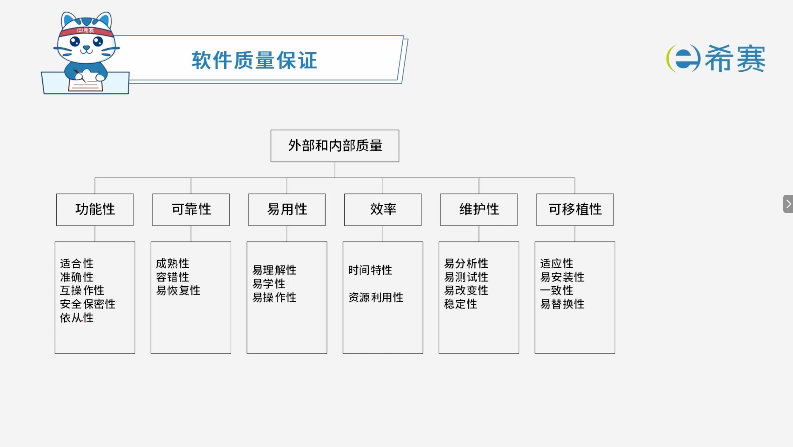

# 软件质量保证

## 1. 考点：软件质量保证的性质

### 1.1 记忆口诀

- 功能：适准互安从
- 可靠：成熟容复容
- 易用：理解学操作
- 效率：时间资源优
- 维护：分析稳测改
- 移植：安装应致换

## 2. 经典例题

### 2.1 题目一

> **题目：**  在ISO/IEC软件质量模型中，易使用性的子特性不包括（ ）。
>
> - A、易理解性
> - B、易学性
> - C、易操作性
> - D、易分析性

 **【解析】**

- **正确答案：D**
- **解析说明：**

  - **关于选项 D（易分析性）** ​：易分析性不属于易使用性的子特性，它属于**可维护性**的子特性之一。因此，易使用性的子特性不包括易分析性。
  - **其他选项说明**：

    - **A、易理解性**：属于易使用性的子特性。
    - **B、易学性**：属于易使用性的子特性。
    - **C、易操作性**：属于易使用性的子特性。

**正确答案：D（易分析性）。** 

### 2.2 题目二

> **题目：**  在ISO/IEC 9126软件质量模型中，可靠性质量特性是指在规定的一段时间内和规定的条件下，软件维持在其性能水平有关的能力，其质量子特性不包括（ ）。
>
> - A、安全性
> - B、成熟性
> - C、容错性
> - D、易恢复性

 **【解析】**

- **正确答案：A**
- **解析说明：**

  - **关于选项 A（安全性）** ​：在 ISO/IEC 9126 软件质量模型中，**安全性**属于**功能性**的子特性，不属于**可靠性**的子特性。因此，可靠性的质量子特性不包括安全性。
  - **其他选项说明**：

    - **B、成熟性**：属于可靠性的子特性，指软件避免由软件中错误而导致失效的能力。
    - **C、容错性**：属于可靠性的子特性，指软件在出现故障或违反指定接口的情况下维持规定的性能水平的能力。
    - **D、易恢复性**：属于可靠性的子特性，指软件在失效后重建其性能水平并恢复直接受影响数据的能力。

**正确答案：A（安全性）。** 

‍
