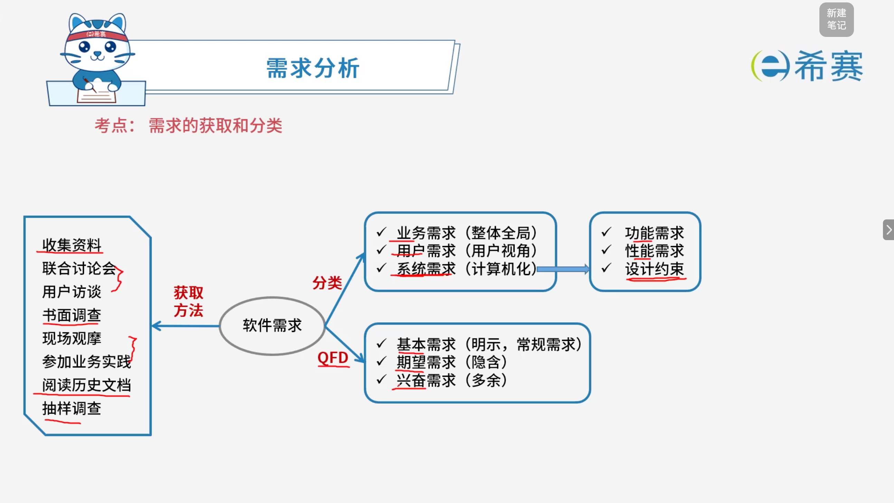
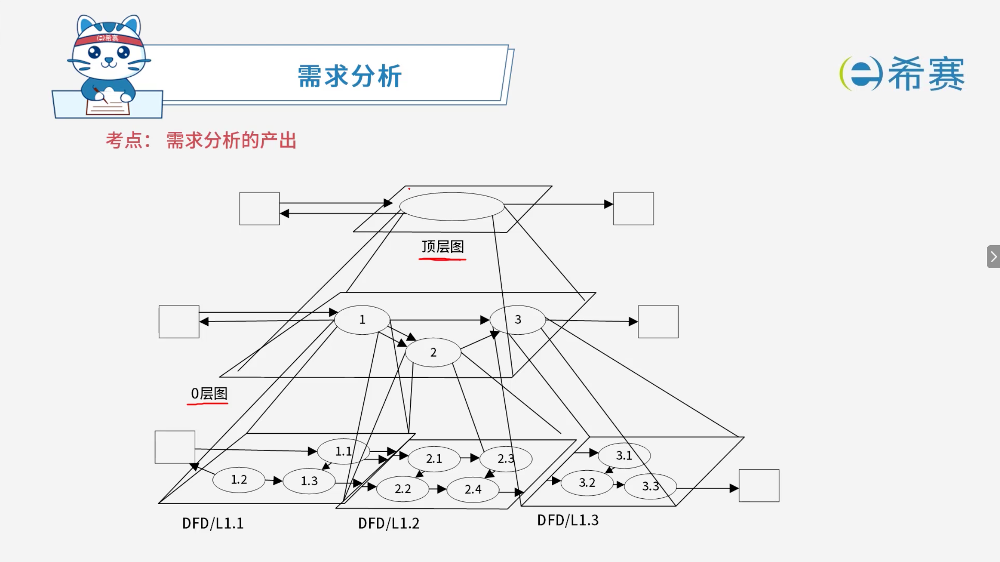
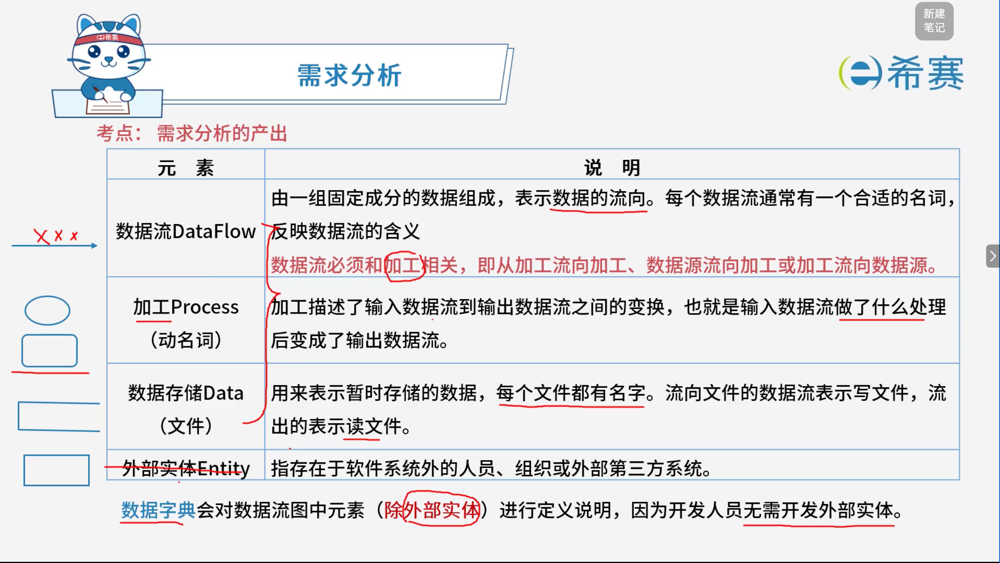
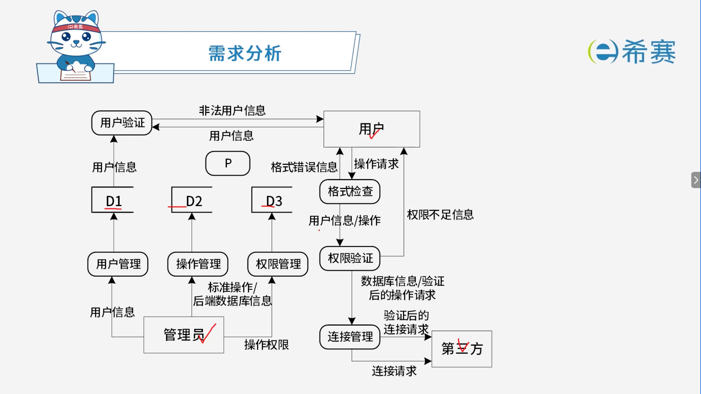

# 需求分析

## 1. **考点：需求分析相关概念**

- **需求分析的任务**：找出系统要实现什么功能。
- **需求的任务和需求的过程**：

  - 问题识别，定位当前问题
  - 分析与综合，确定大致解决方案、功能方案
  - 编制需求分析文档，把功能方案记下来
  - 需求分析与评审，确保功能方案的可行性
- **结构化分析的结果**：

  - 一套分层的​**数据流图**（功能建模）
  - 一本**数据词典**
  - 一组​**小说明**​（也称加工逻辑说明）
  - **补充材料**​（ER图）

## 2. **考点：需求的获取和分类**

- **需求的获取方法**：

  - 收集资料
  - 联合讨论会
  - 用户访谈
  - 书面调查
  - 现场观摩
  - 参加业务实践
  - 阅读历史文档
  - 抽样调查
- **软件需求的分类**：

  - **按层次分类**：

    - **业务需求**：整体全局
    - **用户需求**：用户视角
    - **系统需求**：计算机化
  - **系统需求进一步细分**：

    - 功能需求
    - 性能需求
    - 设计约束
  - **按 QFD（质量功能部署）分类**：

    - **基本需求**：明示，常规需求
    - **期望需求**：隐含
    - **兴奋需求**：多余
- **记忆总结**：

  - 获取方法：收集、讨论、访谈、调查、观摩、实践、文档、抽样。
  - 层次分类：业务 → 用户 → 系统，系统再分功能、性能、约束。
  - QFD 分类：基本（明示）、期望（隐含）、兴奋（多余）。

## 3. 考点：需求分析的产物

### 3.1 数据流图

#### 3.1.1 **数据流图各元素的含义**

|元素|说明|
| -------------------------------------| ----------------------------------------------------------------------------------------------------------------------------------------------------------------------------------|
|**数据流 DataFlow**|由一组固定成分的数据组成，表示数据的流向。每个数据流通常有一个合适的名词，反映数据流的含义。 **重点**：数据流必须和加工相关，即从加工流向加工、数据源流向加工或加工流向数据源。|
|**加工 Process（动名词）**|加工描述了输入数据流到输出数据流之间的变换，也就是输入数据流做了什么处理后变成了输出数据流。|
|**数据存储 Data（文件）**|用来表示暂时存储的数据，每个文件都有名字。流向文件的数据流表示写文件，流出的表示读文件。|
|**外部实体 Entity**|指存在于软件系统外的人员、组织或外部第三方系统。|

- **核心总结**：

  - 数据字典会对数据流图中元素（​**除外部实体**）进行定义说明，因为开发人员无需开发外部实体。

#### 3.1.2 数据流图的示例

## 4. 经典例题

### 4.1 题目一

> **题目：**  软件开发过程中，需求分析阶段的输出不包括（ ）。
>
> - A、数据流图
> - B、实体联系图
> - C、数据字典
> - D、软件体系结构图

 **【解析】**

- **正确答案：D**
- **解析说明：**

  - **关于选项 D（软件体系结构图）** ​：软件体系结构图属于 **软件设计阶段** 的产物，不属于需求分析阶段的输出。需求分析阶段解决“做什么”，软件设计阶段才解决“怎么做”，因此软件体系结构图应归入设计阶段。
  - **其他选项说明**：

    - **A、数据流图**：属于结构化分析的结果，用于功能建模，是需求分析阶段的输出。
    - **B、实体联系图（ER图）** ：属于需求分析阶段的补充材料，用于数据建模。
    - **C、数据字典**：属于结构化分析的结果，用于定义数据流图中各成分的含义，是需求分析阶段的输出。

**正确答案：D（软件体系结构图）。** 

### 4.2 题目二

> **题目：**  某企业财务系统的需求中，属于功能需求的是（ ）。
>
> - A、每个月特定的时间发放员工工资
> - B、系统的响应时间不超过3秒
> - C、系统的计算精度符合财务规则的要求
> - D、系统可以允许100个用户同时查询自己的工资

 **【解析】**

- **正确答案：A**
- **解析说明：**

  - **关于选项 A（每个月特定的时间发放员工工资）** ​：这描述的是系统“​**要做什么**​”，即系统需要具备“定时发放工资”这一业务功能，属于​**功能需求**。
  - **其他选项说明**：

    - **B、系统的响应时间不超过3秒**​：描述的是系统运行时的响应速度，属于​**性能需求**。
    - **C、系统的计算精度符合财务规则的要求**​：描述的是系统计算结果的精度要求，属于​**性能需求**（或可靠性/精度要求）。
    - **D、系统可以允许100个用户同时查询自己的工资**​：描述的是系统支持并发用户数的能力，属于​**性能需求**。

**正确答案：A（每个月特定的时间发放员工工资）。** 

### 4.3 题目三

> **题目：**  在结构化分析中，用数据流图描述（ ）。当采用数据流图对一个图书馆管理系统进行分析时，（ ）是一个外部实体。
>
> **第一组选项：**
>
> - A、数据对象之间的关系，用于对数据建模
> - B、数据在系统中如何被传送或变换，以及如何对数据流进行变换的功能或子功能，用于对功能建模
> - C、系统对外部事件如何响应，如何动作，用于对行为建模
> - D、数据流图中的各个组成部分
>
> **第二组选项：**
>
> - A、读者
> - B、图书
> - C、借书证
> - D、借阅

 **【解析】**

- **正确答案：第一空选 B，第二空选 A。**
- **解析说明：**

  - **第一空：在结构化分析中，用数据流图描述（ B ）** 。

    - 数据流图（DFD）用于描述​**数据在系统中如何被传送或变换**​，以及如何对数据流进行变换的功能或子功能，属于​**功能建模**。
    - **A 错误**：数据对象之间的关系用于对数据建模，这是 ER 图的作用。
    - **C 错误**：系统对外部事件如何响应、如何动作，用于对行为建模，这是状态转换图的作用。
    - **D 错误**：数据流图确实由各个组成部分构成，但这不是数据流图“描述什么”的准确表述，其核心是描述数据流动与功能变换。
  - **第二空：当采用数据流图对一个图书馆管理系统进行分析时，（ A ）是一个外部实体**。

    - **外部实体**指存在于软件系统外的人员、组织或外部第三方系统。
    - 在图书馆管理系统中，**读者**是系统之外的人员，属于外部实体。
    - **B、图书**：属于系统内部处理的数据对象，通常对应数据存储。
    - **C、借书证**：属于系统内部的数据对象或数据存储。
    - **D、借阅**：属于系统内部的加工（处理）动作。

**正确答案：第一空 B，第二空 A。** 

### 4.4 题目四

> **题目：**  数据字典是结构化分析的一个重要输出。数据字典的条目不包括（ ）。
>
> - A、外部实体
> - B、数据流
> - C、数据项
> - D、基本加工

 **【解析】**

- **正确答案：A**
- **解析说明：**

  - **关于选项 A（外部实体）** ​：数据字典是对数据流图中各元素（​**除外部实体外**​）进行定义说明，因为开发人员无需开发外部实体。所以数据字典的条目​**不包括外部实体**。
  - **其他选项说明**：

    - **B、数据流**：属于数据字典的条目之一。
    - **C、数据项**：属于数据字典的条目之一。
    - **D、基本加工**：属于数据字典的条目之一。

**正确答案：A（外部实体）。** 

‍
