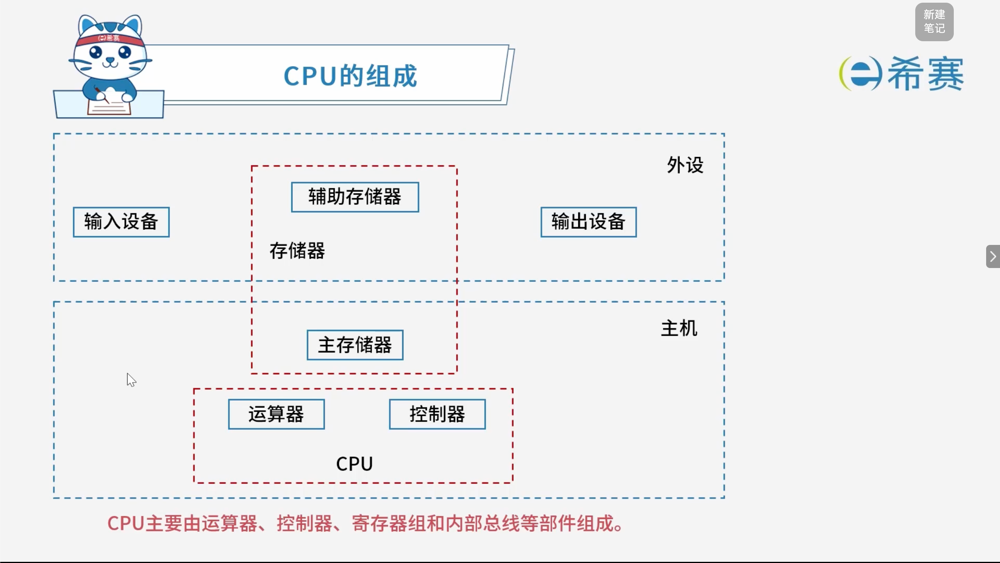

# CPU的组成

# 1. 考点一：CPU结构

## 1.1 运算器

1. **算术逻辑单元 ALU**：数据的算术运算和逻辑运算
2. **累加寄存器 AC**：通用寄存器，为 ALU 提供一个工作区，用来暂存数据
3. **数据缓冲寄存器 DR**：写内存时，暂存指令或数据
4. **状态条件寄存器 PSW**：存状态标志与控制标志  
    *(争议：也有将其归为控制器的)*

## 1.2 控制器

1. **程序计数器 PC**：存储下一条要执行指令的地址
2. **指令寄存器 IR**：存储即将执行的指令
3. **指令译码器 ID**：对指令中的操作码字段进行分析解释
4. **地址寄存器 AR**：保存当前 CPU 访问内存单元的地址
5. **时序部件**：提供时序控制信号

## 1.3 经典例题

### 1.3.1 题目一

> 计算机执行指令的过程中，需要由（**A**）产生每条指令的操作信号并将信号送往相应的部件进行处理，以完成指定的操作。
>
> A、CPU的控制器  
> B、CPU的运算器  
> C、DMA控制器  
> D、Cache控制器

解析：

- **控制器**的主要功能是解释指令、**产生控制信号（操作信号）** 并发送给相应的部件，从而控制整个计算机自动执行程序。
- **运算器**的主要功能是对数据进行算术运算和逻辑运算。

**正确答案**：**A。** 

‍
