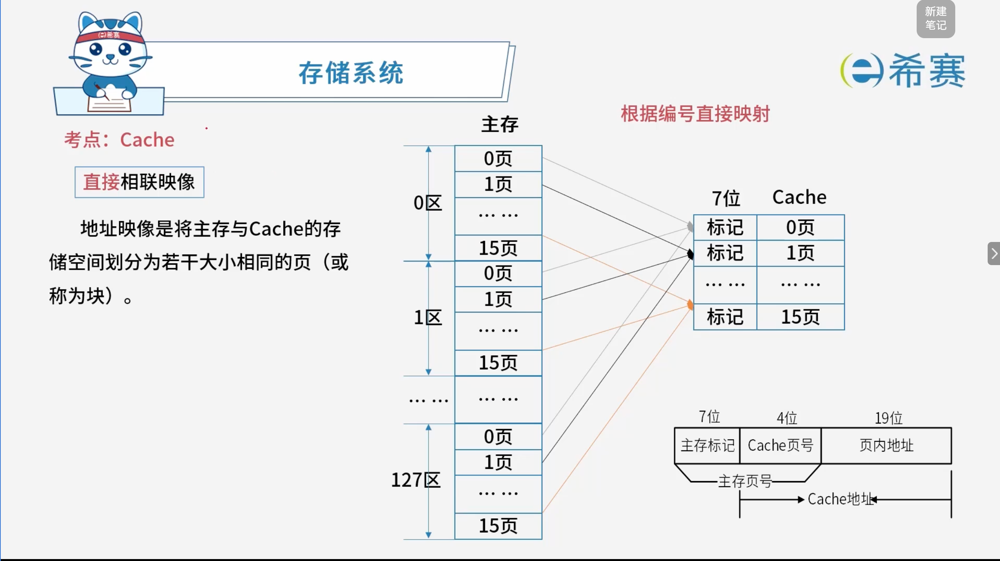
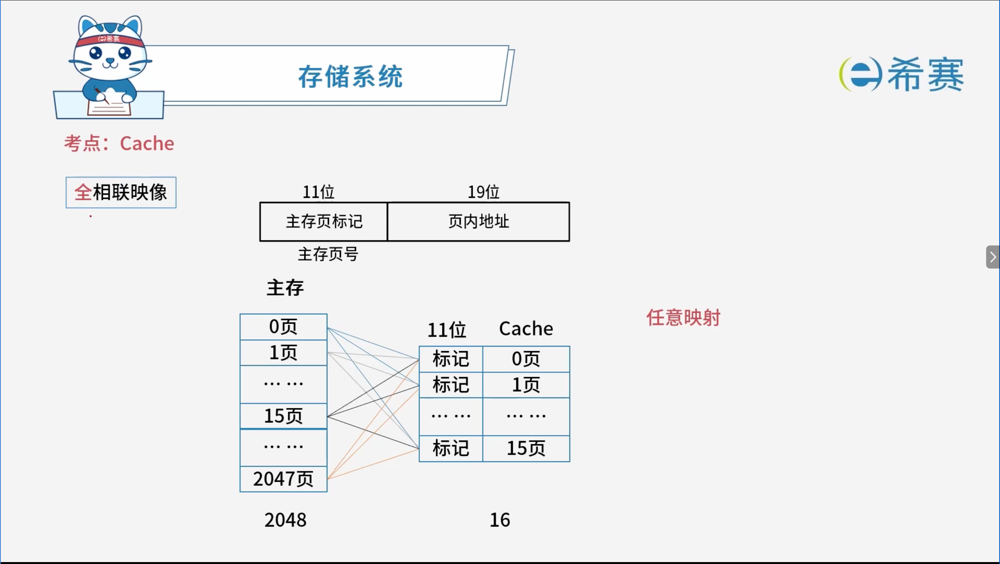
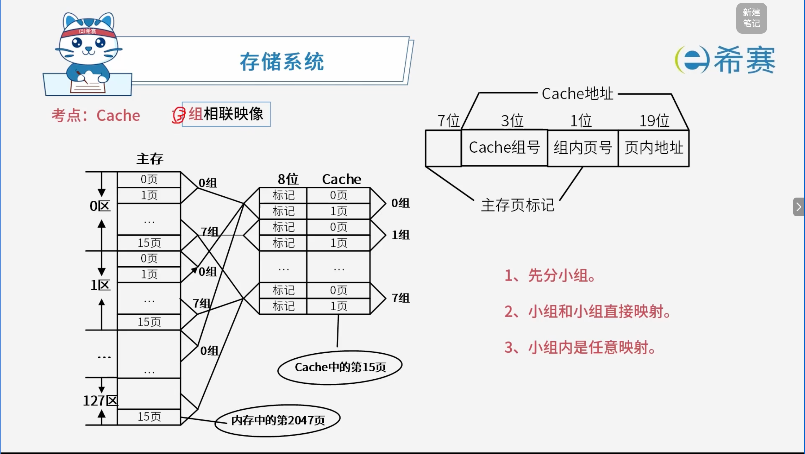

# Cache缓存

## 1. 考点：Cache 的访问命中率

- **存储层次关系**​：寄存器 \> Cache \> 主存 \> 外存（若无寄存器，则 Cache 最快）。

### 1.1 平均周期计算公式

以读操作为例，使用“Cache + 主存储器”系统的平均周期 $t_3$ 计算公式为：

$$
t_3 = h \times t_1 + (1 - h) \times t_2
$$

### 1.2 参数说明

- **$h$**：对 Cache 的访问命中率。
- **$(1-h)$**：失效率（又称未命中率）。
- **$t_1$**：Cache 的周期时间。
- **$t_2$**：主存储器的周期时间。
- **$t_3$**：系统平均周期。

## 2. 考点：Cache的地址映像：直接相联映像

- **优点：** 规则简单，电路设计简单
- **缺点：** 冲突率太高

## 3. 考点：Cache的地址映像：全相联映像

- **优点：** 冲突率低
- **缺点：** 电路设计复杂

## 4. 考点：Cache地址映像：组相联映像

特点：

- 冲突率比直接相联映像更低
- 电路设计比全相联映像更简单

## 5. 总结

|**映象方式**|**冲突率**|**电路复杂度**|**其他**|
| --| ----| ------| ----------------------|
|**直接相联映像**|高|简单|对应位置有数据即冲突|
|**全相联映像**|低|复杂|所有位置有数据即冲突|
|**组相联映像**|中|折中|—|

## 6. 真题实战

### 6.1 题目一

> **题目**：在程序执行过程中，高速缓存 (Cache) 与主存间的地址映射由（ **D** ）。
>
> - A、操作系统进行管理
> - B、存储管理软件进行管理
> - C、程序员自行安排
> - D、硬件自动完成

解析：

Cache 的工作原理（包括地址映射、替换算法等）对系统程序员和应用程序员都是透明的。它完全由​**硬件自动完成**，不需要软件或操作系统的干预，以保证极高的访问速度。

**正确答案：D。** 

### 6.2 题目二

> **题目**：主存与 Cache 的地址映射方式中，（ **A** ）方式可以实现主存任意一块装入 Cache 中任意位置，只有装满才需要替换。
>
> - A、全相联
> - B、直接映射
> - C、组相联
> - D、串并联

解析：

- **全相联映射**：主存中的任一块可以装入 Cache 的任意位置，只有当 Cache 空间全部装满时，才需要使用替换算法（如 LRU、FIFO 等）置换出旧块。
- **直接映射**：主存中的一块只能装入 Cache 的特定位置，对应位置有数据即发生冲突。
- **组相联映射**：结合了前两者的特点，主存块可以装入指定组内的任意位置。

**正确答案：A。** 

‍
