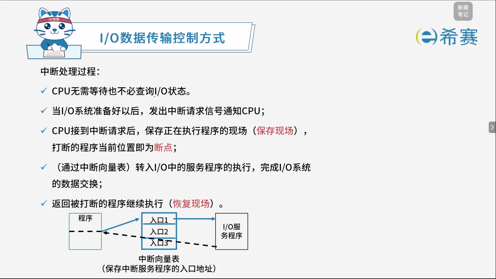

# I／O数据传输控制方法

## 1. 考点：I/O 数据传输控制方式

- **效率特点**​：从上到下，I/O 数据传输控制方式的效率​**越来越高**。

### 1.1 1. 程序控制（查询）方式

- **分类**​：分为**无条件传送**和**程序查询方式**两种。
- **特点**：方法简单，硬件开销小，但 I/O 能力不高，**严重影响 CPU 的利用率**。
- #### 3.2.1 程序控制（查询）方式的详细分类

  - **无条件传送（同步传送）** ：

    - **特点**：外设总是准备好的。接口电路认为外设随时可以接收或发送数据，CPU 无需查询外设状态，直接执行指令进行数据传输。
    - **适用场景**：极其简单、速度固定的低速外设（如按键、LED指示灯）。
  - **程序查询方式（条件传送）** ：

    - **特点**：外设的状态是随机的。CPU 必须通过执行查询程序，定期或持续读取外设的状态标志（如“准备就绪”位），直到外设准备好后才进行数据传输。
    - **适用场景**：一般慢速外设（如键盘输入、打印机输出）。
    - **缺点**：在等待外设就绪的过程中，CPU 往往处于“忙等待（Polling）”状态，长期占用 CPU 资源，导致系统效率低下。

### 1.2 2. 程序中断方式

- **特点**​：与程序控制方式相比，中断方式因为 CPU 无需等待而​**提高了传输请求的响应速度**。

### 1.3 3. DMA方式

- **特点**​：DMA 方式是为了在主存与外设之间实现**高速、批量数据交换**而设置的。
- **优势**：DMA 方式比程序控制方式与中断方式都高效。
- **工作过程**：DMAC 向总线裁决逻辑提出总线请求；CPU 执行完当前总线周期即可释放总线控制权。此时 DMA 响应，通过 DMAC 通知 I/O 接口开始 DMA 传输。

### 1.4 4. 通道方式（考试暂时不涉及）

- **特点**：引入专用通道处理机，进一步将 CPU 从繁重的 I/O 操作中解放出来，实现 CPU、通道和I/O设备的高效并行工作。

### 1.5 5. I/O 处理机（考试暂时不涉及）

- **特点**：又称外围处理机，拥有独立的指令系统，能实现更复杂、更大规模的 I/O 控制与数据处理。
- **补充概念（总线周期）** ：

  - CPU 对存储器和 I/O 接口的访问，是通过总线实现的。
  - 通常把 CPU 通过总线对微处理器外部（存储器或 I/O 接口）进行一次访问所需时间称为一个**总线周期**。

## 2. 考点：中断处理过程（程序中断方式）

- **无需等待/查询**：CPU 无需等待，也不必轮询查询 I/O 状态。
- **发出请求**：当 I/O 系统准备好以后，主动发出中断请求信号通知 CPU。
- **保存现场与断点**​：CPU 收到中断请求后，保存正在执行程序的现场（​**保存现场**​），此时被打断的程序当前位置即为​**断点**。
- **跳转服务程序**​：通过**中断向量表**找到对应的入口地址，转入 I/O 中服务程序的执行，完成 I/O 系统的数据交换。
- **恢复现场**​：服务程序执行完毕后，返回被打断的程序继续执行（​**恢复现场**）。
- **核心概念补充**：

  - **断点**：被中断程序暂停执行的下一条指令地址（或当前指令位置）。
  - **中断向量表**​：用来保存所有中断服务程序**入口地址**的表格，CPU 通过它快速寻址跳转。

## 3. 经典例题

### 3.1 题目一

> **题目**：计算机运行过程中，CPU需要与外设进行数据交换。采用（ **B** ）控制技术时，CPU与外设可并行工作。
>
> - A、程序查询方式和中断方式
> - B、中断方式和DMA方式
> - C、程序查询方式和DMA方式
> - D、程序查询方式、中断方式和DMA方式

**解析**：

- **程序查询方式**​：CPU 需要持续循环查询外设状态（忙等待），在此期间 CPU 无法处理其他任务，因此 CPU 与外设**不能**并行工作。
- **中断方式**：在 I/O 准备数据的过程中，CPU 可以继续执行自己的程序；只有当 I/O 准备就绪发送中断请求时，CPU 才暂停当前程序去处理。这使得 CPU 与外设在宏观上实现了并行工作。
- **DMA方式**：数据交换由硬件（DMAC）直接在主存和外设之间进行，完全不需要 CPU 执行程序来搬运数据，CPU 可以完全解放出来执行其他任务，实现了真正的硬件级并行。
- 综上所述，支持 CPU 与外设并行工作的控制技术是**中断方式**和​**DMA方式**。

**正确答案：B。** 

### 3.2 题目二

> **题目**​：计算机运行过程中，遇到突发事件，要求CPU暂时停止正在运行的程序，转去为突发事件服务，服务完毕，再自动返回原程序继续执行，这个过程称为（ **B** ），其处理过程中保存现场的目的是（ **C** ）。
>
> - **第一空选项**：
>
>   - A、阻塞
>   - **B、中断**
>   - C、动态绑定
>   - D、静态绑定
> - **第二空选项**：
>
>   - A、防止丢失数据
>   - B、防止对其他部件造成影响
>   - **C、返回去继续执行原程序**
>   - D、为中断处理程序提供数据

**解析**：

- **第一空**：这种“暂停当前程序 $\rightarrow$ 转去处理突发事件 $\rightarrow$ 返回原程序继续执行”的机制，正是计算机中典型的**中断**处理过程。
- **第二空**：保存现场（即保存当前程序的断点、寄存器状态等）的核心目的，是为了在中断服务程序执行结束后，能够准确无误地恢复原先的执行环境，从而**返回去继续执行原程序**。

**正确答案**：**B、C**。
