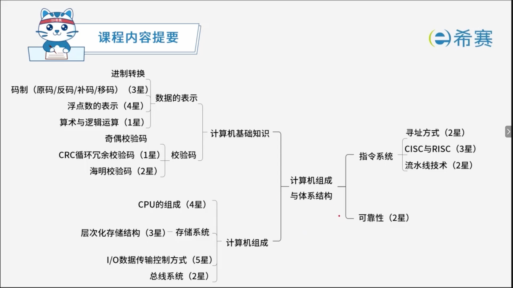
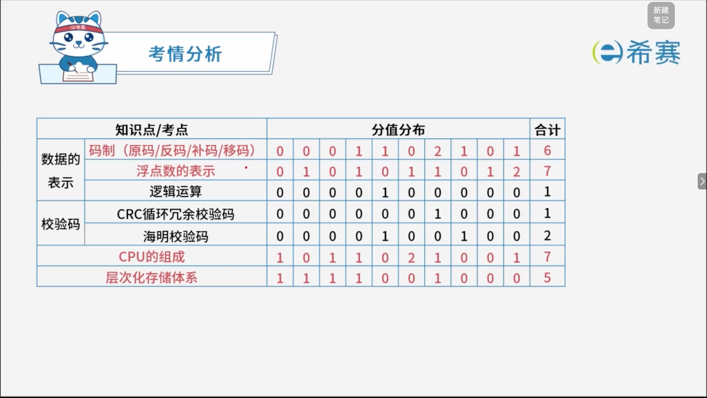

# 计算机组成与体系结构

## 学习目录

- [进制转换](./进制转换.md)
- [码制](./码制.md)
- [浮点数的表示](./浮点数的表示.md)
- [算数与逻辑运算](./算数与逻辑运算.md)
- [校验码](./校验码.md)
- [CPU的组成](./CPU的组成.md)
- [层次化存储体系](./层次化存储体系.md)
- [Cache缓存](./Cache缓存.md)
- [主存编址](./主存编址.md)
- [I/O数据传输控制方法](./I／O数据传输控制方法.md)
- [总线系统](./总线系统.md)
- [寻址方式](./寻址方式.md)
- [CISC与RISC](./CISC与RISC.md)
- [流水线技术](./流水线技术.md)
- [可靠性](./可靠性.md)
