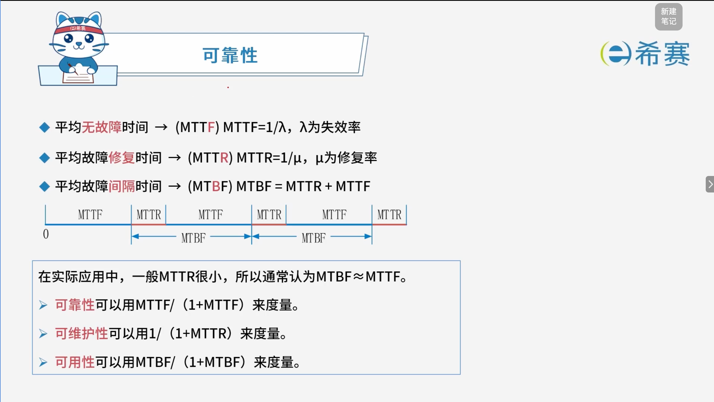
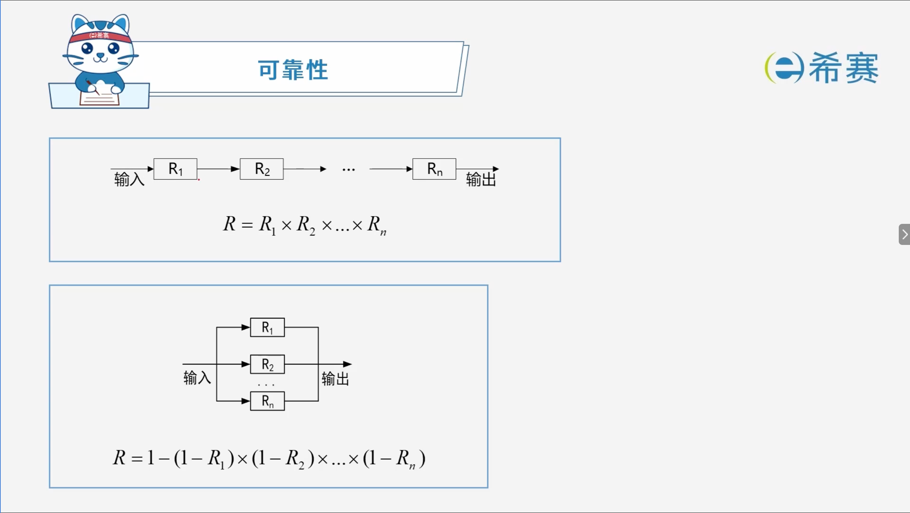
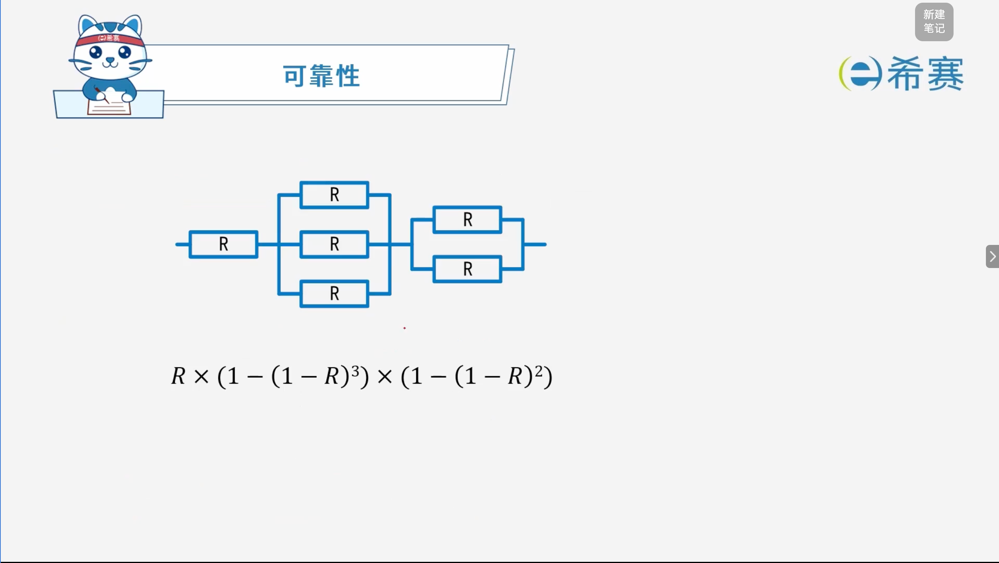
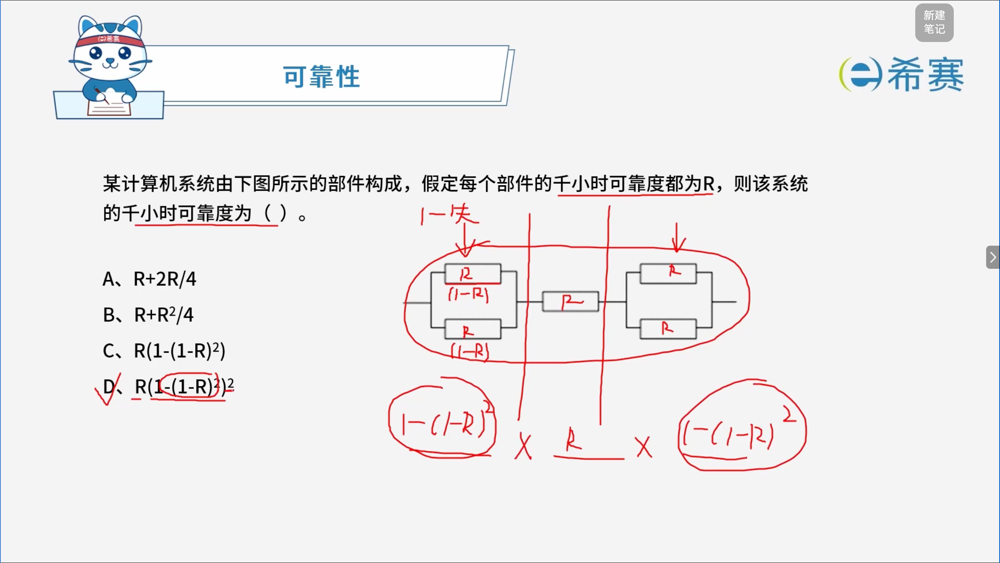

# 可靠性

## 1. 考点：基础概念

在可靠性工程中，这几个英文缩写的构成逻辑非常规律，通常由 **Mean（平均） + Time（时间） + 介词/修饰词 + 核心动作（Failure/Repair）**  组成：

1. **MTTF (Mean Time To Failure)**

   - **全称拆解**：Mean（平均） + Time To（到……的时间） + Failure（故障/失效）。
   - **关联逻辑**​：字面意思是“​**平均到故障发生的时间**”。指系统从正常运行开始，到第一次发生故障（或两次故障之间）的平均连续正常运行时间。
   - **中文对应**​：​**平均无故障时间**（通常用于不可修复的系统，或仅计算故障前的寿命）。
2. **MTTR (Mean Time To Repair)**

   - **全称拆解**：Mean（平均） + Time To（到……的时间） + Repair（修复/恢复）。
   - **关联逻辑**​：字面意思是“​**平均到修复完成的时间**”。指系统发生故障后，从开始排查到修复、恢复正常运行所需的平均时间。
   - **中文对应**​：​**平均故障修复时间**（时间越短，说明系统的可维护性越好）。
3. **MTBF (Mean Time Between Failures)**   *(注：即您提到的 MTTB 的正确缩写形式)*

   - **全称拆解**：Mean（平均） + Time Between（……之间的时间） + Failures（多次故障）。
   - **关联逻辑**​：字面意思是“​**多次故障之间的时间**”。指相邻两次故障发生时间点之间的平均间隔，它包含了“正常运行时间”和“故障修复时间”两个部分。
   - **中文对应**​：​**平均故障间隔时间**（适用于可修复系统）。
   - **核心关系公式**：

     $$
     \text{MTBF} = \text{MTTF} + \text{MTTR}
     $$

### 1.1 核心公式与计算模型

1. **失效率与修复率**：

   - **失效率 (**​**$\lambda$**​ **)** ：$\text{MTTF} = \frac{1}{\lambda}$
   - **修复率 (**​**$\mu$**​ **)** ：$\text{MTTR} = \frac{1}{\mu}$
2. **时间轴逻辑与工程近似**：

   - 周期循环：$\text{0} \xrightarrow{\text{ MTTF }} \text{故障发生} \xrightarrow{\text{ MTTR }} \text{修复完成} \xrightarrow{\text{ MTTF }} \dots$
   - 在实际应用中，由于修复时间通常极短（即 ​**MTTR 很小**），因此在工程计算中通常近似认为：

     $$
     \text{MTBF} \approx \text{MTTF}
     $$

### 1.2 三大核心度量指标

系统可以通过以下三个指标进行定量度量：

- **可靠性**（系统在规定时间内不出故障的能力）：

  $$
  \text{度量公式} = \frac{\text{MTTF}}{1 + \text{MTTF}}
  $$
- **可维护性**（系统发生故障后能被修复的容易程度）：

  $$
  \text{度量公式} = \frac{1}{1 + \text{MTTR}}
  $$
- **可用性**（系统在任意随机时间点处于正常运行状态的概率）：

  $$
  \text{度量公式} = \frac{\text{MTBF}}{1 + \text{MTBF}}
  $$

## 2. 考点：串并联线路

## 3. 经典例题

### 3.1 题目一

### 3.2 题目二

> **题目：** 
>
> 计算机系统的（ **B** ）可以用 MTBF / (1 + MTBF) 来度量，其中 MTBF 为平均失效间隔时间。
>
> A、可靠性
>
> B、可用性
>
> C、可维护性
>
> D、健壮性

【解析】

根据系统可靠性与可用性的度量指标公式：

- **可靠性**：通常用 $\frac{\text{MTTF}}{1 + \text{MTTF}}$ 来度量。
- **可维护性**：通常用 $\frac{1}{1 + \text{MTTR}}$ 来度量。
- **可用性**：通常用 $\frac{\text{MTBF}}{1 + \text{MTBF}}$ 来度量。

题目中给出的是 $\frac{\text{MTBF}}{1 + \text{MTBF}}$，对应的是**可用性**指标。

**正确答案：B。** 

### 3.3 题目三

‍
