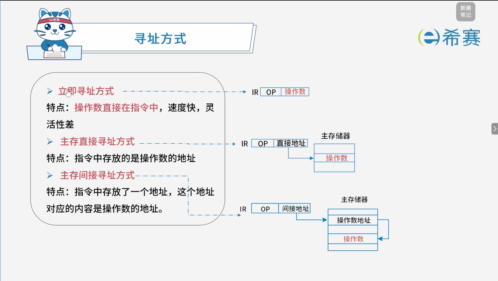
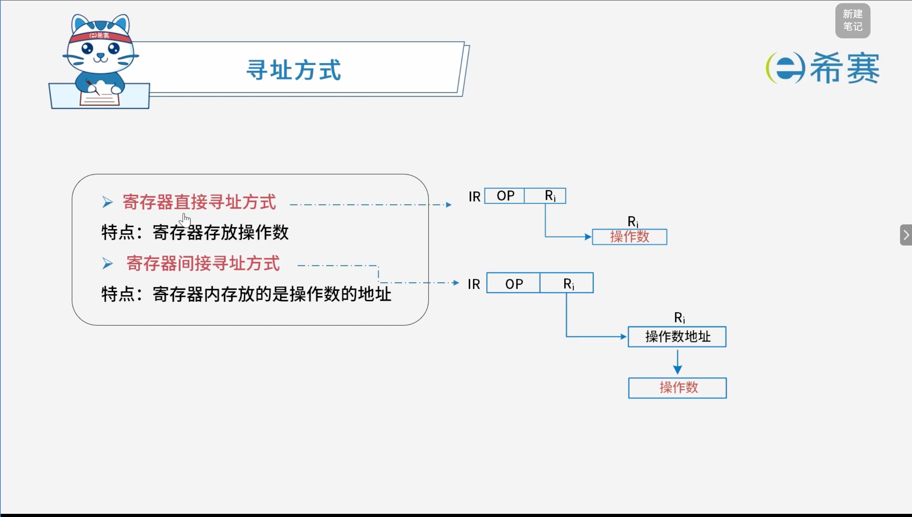

# 寻址方式

## 1. 考点：指令基础与生命周期

- **指令定义**：一条指令就是机器语言的一个语句，它是一组有意义的二进制代码。
- **指令基本格式**：由**操作码字段**和**地址码字段**组成。

  - <table>
    <colgroup><col style="min-width: 60px;" /><col style="min-width: 60px;" /></colgroup><thead><tr>
    <th colspan="2" style="text-align: center;">指令</th>
    </tr>
    </thead><tbody>
    <tr>
    <td style="text-align: center;">**操作码字段**</td>
    <td style="text-align: center;">**地址码字段**</td>
    </tr>
    </tbody>
    </table>

### 1.1 指令的生命周期

指令的生命周期主要分为三个阶段：

1. **取指阶段**​：读取的是​**指令**。
2. **分析阶段**：对指令进行译码与分析。
3. **执行阶段**​：执行对应操作；如果需要操作数，则在此时​**读取操作数**。

### 1.2 CPU 执行与区分类别机制

- **时钟信号**：CPU 执行指令的过程中，会根据时序部件发出的时钟信号进行协调操作。
- **区分指令与数据**​：CPU 正是依据​**所处的生命周期阶段**（取指阶段读取的是指令，分析/执行阶段读取的是操作数），来区分在主存中以二进制编码形式存放的到底指令还是数据。

## 2. 考点：寻址方式的类型

## 3. 实战真题

### 3.1 题目一

> 计算机指令系统采用多种寻址方式。立即寻址是指操作数包含在指令中，寄存器寻址是指操作数在寄存器中，直接寻址是指操作数的地址在指令中。这三种寻址方式操作数的速度（ **A** ）。
>
> - A、立即寻址最快，寄存器寻址次之，直接寻址最慢
> - B、寄存器寻址最快，立即寻址次之，直接寻址最慢
> - C、直接寻址最快，寄存器寻址次之，立即寻址最慢
> - D、寄存器寻址最快，直接寻址次之，立即寻址最慢

**解析：** 

- **立即寻址**​：操作数直接包含在指令中。指令取出时操作数便随之进入CPU，不需要额外的时间去寻址或读内存，因此速度​**最快**。
- **寄存器寻址**​：操作数存放在CPU的寄存器中，需要访问寄存器读取，速度​**次之**。
- **直接寻址**​：指令中给出的是操作数在主存（内存）中的地址，执行时必须访问一次主存才能取得操作数，速度​**最慢**。

因此，三种寻址方式的速度关系为：**立即寻址 > 寄存器寻址 > 直接寻址**。

**正确答案：A。**
