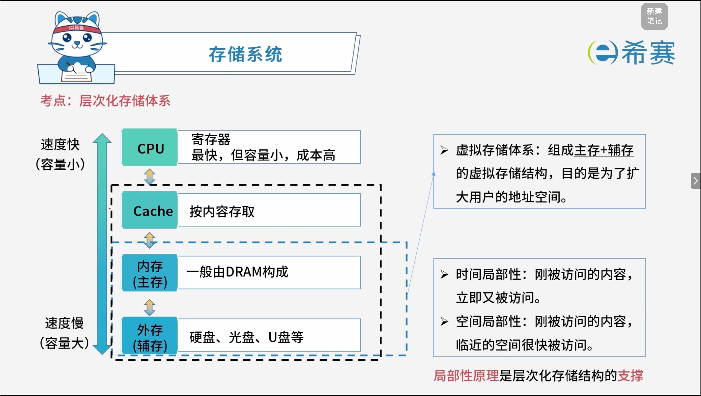

# 层次化存储体系

## 1. **考点一：层次化存储体系结构**

## 2. **考点二：层次化存储体系分类**

- **1、存储器位置**

  - 内存 & 外存
- **2、存取方式**

  - **按内容存取**：相联存储器（如 Cache）
  - **按地址存取**：

    - 随机存取存储器（如内存）
    - 顺序存取存储器（如磁带）
    - 直接存取存储器（如磁盘，介于随机和顺序之间的一种）
- **3、工作方式**

  - **随机存取存储器 RAM**（如内存 DRAM）
  - **只读存储器 ROM**（如 BIOS）
- **常用存储器特性：**

  - **DRAM**​：动态随机存取存储器，需要刷新保持数据稳定，集成度高，成本低。
  - **SRAM**：静态随机存取存储器，不需要刷新保持数据稳定，集成度低，成本高。
  - **EEPROM**：电可擦可编程只读存储器，以 bit 为单位，更灵活。
  - **Flash**：闪存，以块为单位，更快速。

## 3. 经典例题

### 3.1 题目一

> CPU 访问存储器时，被访问数据一般聚集在一个较小的连续存储区域中。若一个存储单元已被访问，则其邻近的存储单元有可能还要被访问，该特性被称为（**C**）。
>
> A、数据局部性
>
> B、指令局部性
>
> C、空间局部性
>
> D、时间局部性

**解析：**

- **空间局部性**​：指一旦某个存储单元被访问，其**邻近的存储单元**在不久的将来很可能也被访问（因为程序中大部分数据是连续存放的，如数组遍历）。
- **时间局部性**​：指如果某个存储单元被访问，那么在不久的将来它​**可能再次被访问**（例如循环体中的代码或变量）。
- **错误选项 A、B**：属于干扰项，在计算机组成原理中通常只讨论时间和空间局部性。

**正确答案：C。** 

### 3.2 题目二

> 计算机系统的**主存**主要是由（**A**）构成的。
>
> A、DRAM
>
> B、SRAM
>
> C、Cache
>
> D、EEPROM

**解析：**

- **DRAM（动态随机存取存储器）** ​：集成度高、价格便宜，主要用作计算机的​**主存（内存）** 。
- **SRAM（静态随机存取存储器）** ​：速度快但成本高、集成度低，通常用于构成 ​**Cache（高速缓存）** 。
- **EEPROM**：电可擦可编程只读存储器，常用于保存 BIOS 等固件或特殊存储设备。

**正确答案：A。**
