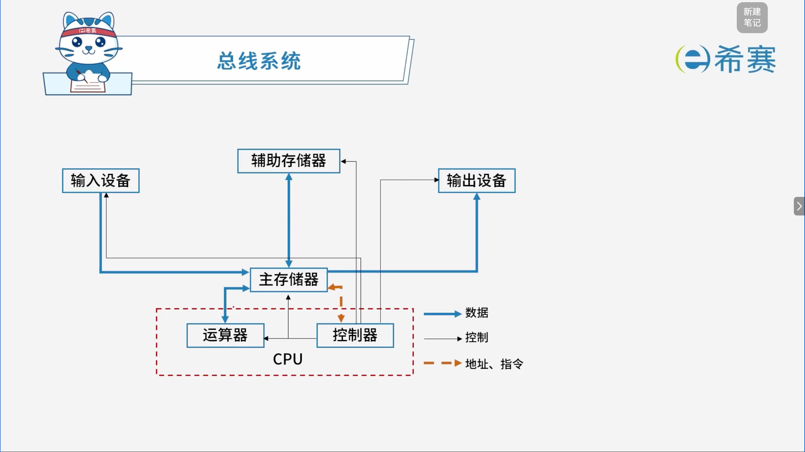

# 总线系统

## 1. 考点：定义

- **总线定义**：总线是连接多个设备的信息传送通道，实际上是一组信号线。广义地讲，任何连接两个以上电子元器件的导线都可以称为总线。

### 1.1 总线的分类

#### 1.1.1 按应用层次/位置分类

总线通常分为以下几类：

- **芯片内总线**：用于集成电路芯片内部各部分的连接元件级总线，或用于一块电路板内各元器件的连接。
- **系统总线**​（又称​**内总线**）：用于计算机各组成部分（CPU、内存和接口等）的连接。
- **外总线**​（又称​**通信总线**）：用于计算机与外设或计算机与计算机之间的连接或通信。
- **核心关键词**​：​`CPU`​（芯片内/系统总线范围）、​`主板`​（系统总线）、​`主板外`（外总线）。

#### 1.1.2 按通信方式分类

- **串行总线**：数据按位依次传输。
- **并行总线**：多位数据同时并行线传输。

#### 1.1.3 常见典型总线举例

- **PCI 总线**​：是目前微型机上广泛采用的​**内总线**​（系统总线），采用**并行传输**方式。
- **SCSI 总线**​：小型计算机系统接口，是一条​**并行外总线**，广泛用于连接软硬盘、光盘、扫描仪等。
- **核心英文缩写释义**：

  - **CI**：Component Interconnect（组件互连，常对应 PCI 中的 C）
  - **I**：Interface（接口，如 SCSI 中的 I）

#### 1.1.4 按传输内容分类

总线主要分为：**数据总线**、**地址总线**、**控制总线**。

- **数据总线（Data Bus, DB）** ：在 CPU 与 RAM 之间来回传送需要处理或是需要存储的数据。
- **地址总线（Address Bus, AB）** ：用来指定在 RAM（Random Access Memory）之中储存的数据的地址。
- **控制总线（Control Bus, CB）** ：将微处理器控制单元（Control Unit）的信号，传送到周边设备。

## 2. 经典例题

### 2.1 题目一

> **题目**：三总线结构的计算机总线系统由（ **B** ）组成。
>
> - A、CPU总线、内存总线和IO总线
> - B、数据总线、地址总线和控制总线
> - C、系统总线、内部总线和外部总线
> - D、串行总线、并行总线和PCI总线

**解析**：

- 计算机系统的经典“三总线结构”是指系统总线按传输信号类型分类的三大基本总线，即**数据总线（Data Bus）** 、**地址总线（Address Bus）和控制总线（Control Bus）** ，它们分别用来传输数据、数据地址和控制信号。

**正确答案**：**B**。
