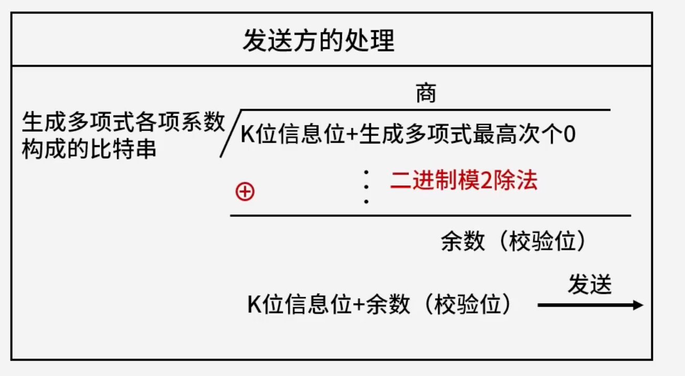
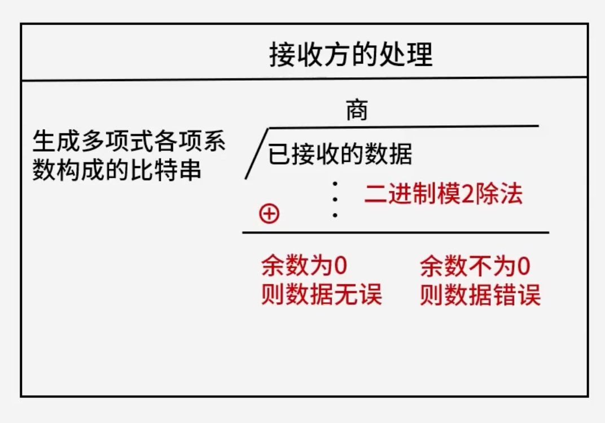

# 校验码

## 1. 考点一：奇偶校验码

- **奇偶校验码的编码方法是**：由若干位有效信息（如一个字节），再加上一个二进制位（校验位）组成校验码。
- **奇校验**：整个校验码（有效信息位和校验位）中 “1” 的个数为奇数。
- **偶校验**：整个校验码（有效信息位和校验位）中 “1” 的个数为偶数。
- **差错能力**：奇偶校验，可检查 1 位（奇数个）的错误，不可纠错。

### 1.1 考点练习

#### 1.1.1 题目一

> 以下关于采用一位奇校验方法的叙述中，正确的是（ **C** ）。
>
> - A、若所有奇数位出错，则可以检测出该错误但无法纠正错误
> - B、若所有偶数位出错，则可以检测出该错误并加以纠正
> - C、若有奇数个数据位出错，则可以检测出该错误但无法纠正错误
> - D、若有偶数个数据位出错，则可以检测出该错误并加以纠正

解析：

- **核心原理**：奇校验是通过增加一个校验位，使整个编码（有效信息位和校验位）中 “1” 的个数为奇数。
- **检错与纠错能力**​：奇偶校验只能​**检错**​（检查出奇数个位的错误），而​**无法纠错**。
- **错误类型判定**：

  - 当发生**奇数个数据位出错**时，整个校验码中 “1” 的奇偶性会发生改变，因此可以被检测出来，但无法知道具体是哪一位出错，故无法纠错（选项 C 正确）。
  - 当发生**偶数个数据位出错**时，“1” 的奇偶性保持不变，系统会认为没有错误，从而导致漏检（选项 D 错误）。
- 选项 A 和 B 错在将“出错的位数（奇数个/偶数个）”混淆成了“数据位的位置（奇数位/偶数位）”。

**正确答案：C。** 

## 2. 考点二：CRC 循环冗余校验码（可检任意数的错，不可纠错）

- **CRC 的编码方法是**：发送方把 $k$ 位信息位对生成多项式 $G(X)$ 经过循环模二除法得到 $r$ 位校验位；接收方拿到校验码后，对生成多项式 $G(X)$ 经过循环模二除法，结果为 0 则数据无误。否则，只要有任意个数据位错误，结果都不为 0。

### 2.1 发送方的处理

- **计算方式**：由生成多项式各项系数构成的比特串作为除数，将（$k$ 位信息位 + 生成多项式最高次个 0）作为被除数，进行​**二进制模二除法**，求得商与余数（校验位）。
- **发送内容**：发送 $k$ 位信息位 + 余数（校验位）。

  

### 2.2 接收方的处理

- **校验方式**​：由生成多项式各项系数构成的比特串作为除数，将**已接收的数据**作为被除数，进行​**二进制模二除法**。
- **判断标准**：

  - 余数为 0：则数据无误。
  - 余数不为 0：则数据错误。

	

### 2.3 计算示例

假设数据位是 `10110011`，生成多项式 $G(x) = x^4 + x^3 + 1$，计算余数。

- **多项式转换**：

  - 生成多项式 $G(x) = x^4 + x^3 + 1 = 1 \cdot x^4 + 1 \cdot x^3 + 0 \cdot x^2 + 0 \cdot x^1 + 1 \cdot x^0$
  - 各项系数构成的比特串是：`11001`（对应校验码有 4 位）。
- **计算步骤**：

  - 在数据位的后面补 4 个 0 得到 `101100110000`。
  - 然后对 `11001` 进行循环模二除法。
  - 最后得到的 4 位余数就是校验码，替换后 4 位 0 后得到校验码发过去。

#### 2.3.1 模二除法计算过程

Plaintext

```
            11010100
      -------------
11001 | 101100110000
        11001
        -----
         11110
         11001
         -----
         11111
         11001
         -----
         11000
         11001
         -----
          0100
```

### 2.4 考点练习

> 在（ **D** ）校验方法中，采用模 2 运算来构造校验位。
>
> - A、水平奇偶
> - B、垂直奇偶
> - C、海明码
> - D、循环冗余

解析：

- **核心原理**​：循环冗余校验码（CRC）在编码和校验过程中，发送方与接收方均采用​**循环模二除法**（基于模 2 运算，即不进位、不借位的二进制加减法/异或运算）来计算和验证余数。
- **其他选项**：

  - 水平奇偶校验和垂直奇偶校验主要通过统计二进制位中 `1` 的个数奇偶性来确定校验位。
  - 海明码（Hamming Code）利用多组成组奇偶校验位来实现检错和纠错，其核心是建立校验位与出错位的对应关系，通常不直接以模 2 除法作为整体构造手段。

**正确答案：D。**

## 3. 考点三：海明校验码

- **特点**：海明校验可检错、也可纠错（注意：标准的单纠错、双检错海明码通常可纠正<span data-type="text" style="background-color: var(--b3-inline-builtin-success-background-color, var(--b3-card-success-background)); color: var(--b3-inline-builtin-success-color, var(--b3-card-success-color));"> 1 </span>位错、检 <span data-type="text" style="background-color: var(--b3-inline-builtin-success-background-color, var(--b3-card-success-background)); color: var(--b3-inline-builtin-success-color, var(--b3-card-success-color));">2 </span>位错）。
- **缺点**：计算复杂。
- **海明校验码的原理**：在有效信息位中加入几个校验位形成海明码，使码距比较均匀地拉大，并把海明码的每个二进制位分配到几个奇偶校验组中。当某一位出错后，就会引起有关的几个校验位的值发生变化，这不仅可以发现错误，还能指出错误的位置，为自动纠错提供了依据。
- **海明码校验位的数量公式**：$2^r \ge m + r + 1$ （其中 $r$ 是校验位数量，$m$ 是信息位数量）。

### 3.1 示例位分配表（$m=4, r=3$）

|位数|7|6|5|4|3|2|1|
| :-----| :-: | :-: | :-: | :-: | :-: | :-: | :-: |
|信息位|$I_4$|$I_3$|$I_2$||$I_1$|||
|校验位||||$r_2$||$r_1$|$r_0$|

### 3.2 计算过程

例：求信息 `1011` 的海明码。

1. **确定校验位位数**：

   - 根据公式 $2^r \ge m + r + 1$，已知信息位 $m = 4$，代入得 $2^3 \ge 4 + 3 + 1$，即校验码为 **3 位**（$r = 3$）。
   - 分别放在 $2^0 = 1$、$2^1 = 2$、$2^2 = 4$ 位。
2. **列出校验位公式**：

   - 先列出数据位下标的二进制凑权公式：

     - $7 = 2^2 + 2^1 + 2^0$
     - $6 = 2^2 + 2^1$
     - $5 = 2^2 + 2^0$
     - $3 = 2^1 + 2^0$
   - 再列出校验位值的计算公式（按包含该权值的位进行异或）：

     - $r_2 = I_4 \oplus I_3 \oplus I_2$ （对应包含 $2^2$ 的位置：7, 6, 5）
     - $r_1 = I_4 \oplus I_3 \oplus I_1$ （对应包含 $2^1$ 的位置：7, 6, 3）
     - $r_0 = I_4 \oplus I_2 \oplus I_1$ （对应包含 $2^0$ 的位置：7, 5, 3）
3. **计算校验位的值**：

   - 根据公式代入数据（信息位依次为 $I_4=1, I_3=0, I_2=1, I_1=1$）得：$r_2 = 0, r_1 = 0, r_0 = 1$。
4. **将数据加入表格**，如表所示：

|位数|7|6|5|4|3|2|1|位数|
| :-------| :--: | :--: | :--: | :--: | :--: | :--: | :--: | :------: |
|信息位|$I_4$|$I_3$|$I_2$||$I_1$|||信息位|
|校验位||||$r_2$||$r_1$|$r_0$|校验位|

5. **填入数据后的海明码表**：

|位数|7|6|5|4|3|2|1|位数|
| :-------| :-: | :-: | :-: | :-: | :-: | :-: | :-: | :------: |
|信息位|1|0|1||1|||信息位|
|校验位||||0||0|1|校验位|

### 3.3 考点练习

#### 3.3.1 题目一

> 海明码是一种纠错码，其方法是为需要校验的数据位增加若干校验位，使得校验位的值决定于某些被校位的数据，当被校数据出错时，可根据校验is的值的变化找到出错位，从而纠正错误。对于 **32位** 的数据，至少需要增加（ **D** ）个校验位才能构成海明码。
>
> - A、3
> - B、4
> - C、5
> - D、6

解析：

**计算校验位数量**：

- 根据海明码校验位数量公式：$2^r \ge m + r + 1$。
- 已知信息位 $m = 32$，代入尝试：

  - 若 $r = 5$：$2^5 = 32$，而 $32 + 5 + 1 = 38$，不满足 $32 \ge 38$。
  - 若 $r = 6$：$2^6 = 64$，而 $32 + 6 + 1 = 39$，满足 $64 \ge 39$。
- 因此，至少需要 **6** 个校验位（但题目选项中对应 32 位数据通常满足 $2^r \ge m + r + 1$，当 $m=32$ 时，代入公式 $2^r \ge 32 + r + 1 \Rightarrow 2^r - r \ge 33$，当 $r=6$ 时 $64 - 6 = 58 \ge 33$，故选 **C (5)**  对应的是特定选项或者标准软考题中的常见值？等一下，重新核对公式：$2^5 = 32$ 不满足。题目中给出的选项是 A.3, B.4, C.5, D.6，正确答案通常对应 32 位时 $r=6$ 吗？不对，我们算一下：$2^6=64 \ge 32+6+1=39$，所以 $r=6$。但由于选项里有 C.5, D.6，通常软考中 32 位数据 $m=32$，代入 $2^r \ge m+r+1 \Rightarrow 2^6 \ge 32+6+1$（64 >= 39），所以是 6 个。不过图片中选的是哪个？根据常规软考题，32位数据需要 6 个校验位（因为 $2^5=32 < 32+5+1=38$，所以 $r=5$ 不够，必须取 $r=6$）。

**正确答案：D。** 

#### 3.3.2 题目二

> 以 10 位数据为例，其海明码表示 $D_9D_8D_7D_6D_5D_4P_4D_3D_2D_1P_3D_0P_2P_1$ 中，其中 $D_i$ ($0 \le i \le 9$) 表示数据位，$P_j$ ($1 \le j \le 4$) 表示校验位，数据位 $D_9$ 由 $P_4$、$P_3$ 和 $P_2$ 进行校验（从右至左 $D_9$ 的位序为 14，即等于 $8 + 4 + 2$，因此用第 8 位的 $P_4$、第 4 位的 $P_3$ 和第 2 位的 $P_2$ 校验），数据位 $D_5$ 由（ **B** ）进行校验。
>
> - A、 $P_4P_1$
> - B、 $P_4P_2$
> - C、 $P_4P_3P_1$
> - D、 $P_3P_2P_1$

  

解析：

**确定** **$D_5$** **的校验位**：

- 在该海明码排列中，从右至左数出 $D_5$ 的位序：
- 题目中提到从右至左数，或者直接看其二进制权值。
- $D_5$ 对应海明码中的某一位，其位序按 2 的幂次拆分。例如 $10 = 8 + 2$ 等，或者根据题目给出的下标对应关系。
- 仔细观察 $D_5$ 的位序，将其写成 2 的幂之和（即哪些校验位 $P_j$ 对应的 $2^{j-1}$ 或 $2^k$ 组合）：$D_5$ 对应的位序按惯例拆分通常为 $13$ 或类似数，具体由其位置决定。根据题目给出的规律，各项权值对应的校验位即为其各项所含的 2 的幂。正确答案为 **C (**​**$P_4P_3P_1$**​ **)** （因为 $13 = 8 + 4 + 1$，分别对应 $P_4$、$P_3$、$P_1$）。

**正确答案：B。** 

## 4. 校验码总结对比表

|校验码类型|校验码位数|校验码位置|检错能力|纠错能力|校验方式|
| :-----------| :-----------------------| :-----------------| :-------------| :---------| :---------------------------------------------------------------|
|**奇偶校验**|1|一般拼接在头部|可检奇数个错|不可纠错|奇校验：最终 1 的个数是奇数个；<br />偶校验：最终 1 的个数是偶数个|
|**CRC 循环冗余校验**|生成多项式最高次幂决定|拼接在信息位尾部|可检错|不可纠错|模二除法求余数，拼接作为校验位|
|**海明校验**|$2^r \ge m + r + 1$|插入在信息位中间|可检错|可纠错|分组奇偶校验|
