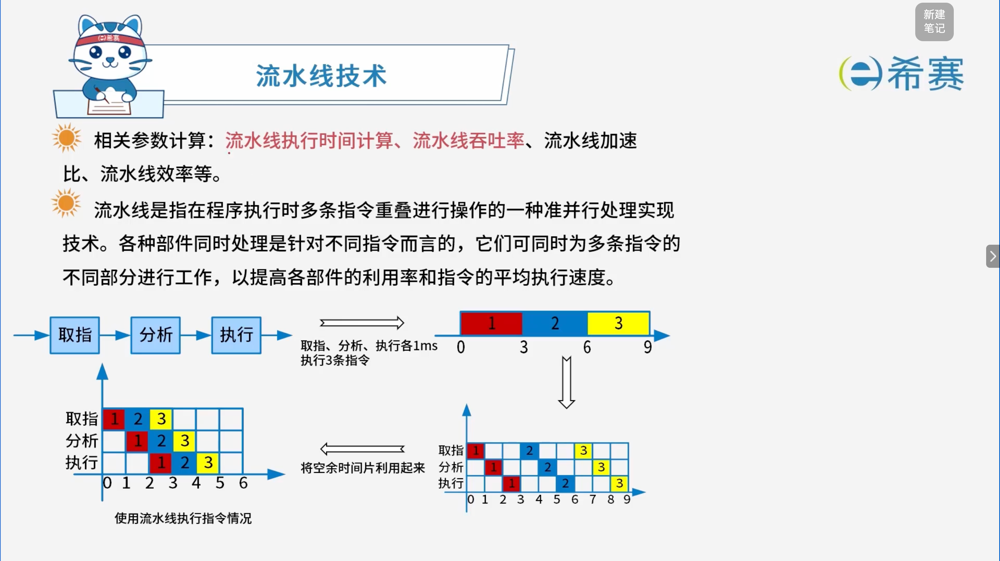
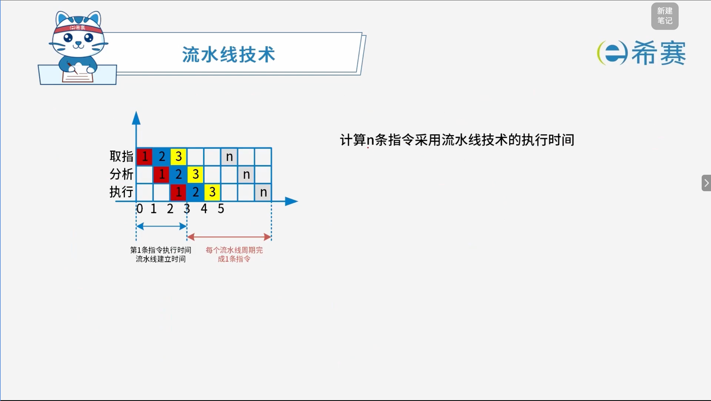

# 流水线技术

## 1. 考点：流水线定义

## 2. 考点：流水线执行时间计算

计算 $n$ 条指令采用流水线技术的总执行时间（通常记为 $T_k$），核心逻辑分为两部分：​**流水线建立时间**​（第一条指令执行完的时间）和​**后续指令陆续流出的时间**。

### 2.1 核心参数定义

- 设指令分为 $k$ 个阶段（即流水线的级数，如图中分为：取指、分析、执行，共 $3$ 级，即 $k = 3$）。
- 设每个阶段（或每个流水线周期）的执行时间为 $\Delta t$。
- 设需要执行的指令条数为 $n$。

### 2.2 推导过程

1. **第一条指令的执行时间（流水线建立时间）** ：

   - 第一条指令需要完整走完所有 $k$ 个阶段才能完成。
   - 因此，第一条指令耗时为：

     $$
     k \times \Delta t
     $$

   *. 从图中的坐标轴可以看出，第一条指令在时刻 $3$ 完成，即 $3 \times \Delta t$。

- **后续指令的执行时间**：

  - 当第一条指令完成后，流水线进入稳定状态。
  - 之后每隔一个流水线周期（$\Delta t$）就会紧接着流出并完成一条指令。
  - 除去第一条指令，剩下的指令还有 **$n - 1$** 条。
  - 这剩余的 $n - 1$ 条指令耗时为：

    $$
    (n - 1) \times \Delta t
    $$
- **总执行时间公式**：  
  将两部分加起来，就得到了流水线执行 $n$ 条指令的总时间 $T_k$：

  $$
  T_k = k \times \Delta t + (n - 1) \times \Delta t = (k + n - 1) \Delta t
  $$

### 2.3 对比：如果不使用流水线（串行执行）

如果不采用流水线，每条指令都需要串行独立执行完所有 $k$ 个阶段，那么执行 $n$ 条指令的总时间为：

$$
T_s = n \times k \times \Delta t
$$

## 3. 考点：非等长指令流水线执行时间计算

在计算机组成原理中，当指令的各个执行阶段（如取指、分析、执行）所需的时间**不相等**时，计算 $n$ 条指令采用流水线方式执行的总时间需要应用非等长流水线公式。

### 3.1 核心概念与参数

1. **流水线周期（**​**$\Delta t_{max}$**​ **）** ：

   - **木桶效应**​：因为各阶段耗时不等，整个流水线的运行节奏必须由**最耗时的那一个阶段**来决定。
   - 公式：$\Delta t_{max} = \max(t_1, t_2, \dots, t_k)$ （即所有阶段中时间最大者）。
2. **第一条指令执行时间（建立时间）** ：

   - 第 1 条指令没有前序指令辅助，必须完整走完所有的阶段。
   - 公式：$\sum_{i=1}^{k} t_i = t_{\text{取指}} + t_{\text{分析}} + t_{\text{执行}} + \dots$
3. **后续指令耗时**：

   - 当第 1 条指令执行完毕后，流水线进入稳定输出期。
   - 之后每经过一个“流水线周期（$\Delta t_{max}$）”就会完成一条指令。
   - 除去第 1 条指令，剩余的 $n - 1$ 条指令每条消耗一个周期：$(n - 1) \times \Delta t_{max}$。

### 3.2 核心计算公式

$$
\text{流水线总执行时间} = \sum_{i=1}^{k} t_i + (n - 1) \times \Delta t_{max}
$$

- 对比：如果不使用流水线（串行执行）的总时间为：$n \times \sum_{i=1}^{k} t_i$

### 3.3 经典例题演示

**题目**：

一条指令的执行过程可以分解为取指、分析和执行三步。在取指时间 $t_{\text{取指}} = 3\Delta t$、分析时间 $t_{\text{分析}} = 2\Delta t$、执行时间 $t_{\text{执行}} = 4\Delta t$ 的情况下：

1. 若按**串行**方式执行，则 10 条指令全部执行完需要多少 $\Delta t$？($9\Delta t$)
2. 若按**流水线**的方式执行，流水线周期为多少 $\Delta t$？($4\Delta t$)10 条指令全部执行完需要多少 $\Delta t$？($45\Delta t$)

**解析过程**：

1. **串行执行总时间**：

   - 单条指令耗时 $= 3 + 2 + 4 = 9\Delta t$
   - 10 条指令总耗时 $= 9 \times 10 = 90\Delta t$
2. **流水线周期（**​**$\Delta t_{max}$**​ **）** ：

   - 三个阶段耗时分别为 $3$、$2$、$4$，取最大值：
   - 流水线周期 $= 4\Delta t$
3. **流水线执行总时间**：

$$
\begin{aligned} \text{总时间} &= \text{第1条指令时间} + (n - 1) \times \text{流水线周期} \\ &= (3 + 2 + 4) + (10 - 1) \times 4 \\ &= 9 + 9 \times 4 \\ &= 9 + 36 \\ &= 45\Delta t \end{aligned}
$$

## 4. 考点：流水线吞吐率计算

流水线的吞吐率（Throughput rate, $TP$）是指在单位时间内流水线所完成的任务数量或输出的结果数量。

### 4.1 核心概念与基本公式

1. **基本吞吐率公式**：

   $$
   TP = \frac{\text{指令条数}}{\text{流水线执行时间}} = \frac{n}{T_k}
   $$

   - 其中 $n$ 为指令条数，$T_k$ 为 $n$ 条指令的流水线总执行时间。

- **最大吞吐率公式**：  
  当指令条数趋于无穷大（$n \to \infty$）时，流水线的吞吐率达到极限：

  $$
  TP_{\text{max}} = \lim_{n \to \infty} \frac{n}{(k + n - 1)\Delta t_{\text{max}}} = \frac{1}{\Delta t_{\text{max}}}
  $$
- 其中 $\Delta t_{\text{max}}$ 为流水线周期（即最耗时阶段的时间）。

### 4.2 经典例题与计算过程

**题目**：

一条指令的执行过程可以分解为取指、分析和执行三步，取指时间 $t_{\text{取指}} = 3\Delta t$，分析时间 $t_{\text{分析}} = 2\Delta t$，执行时间 $t_{\text{执行}} = 4\Delta t$。求：

1. 10 条指令的吞吐率 ($TP$) 是多少？
2. 最大吞吐率 ($TP_{\text{max}}$) 是多少？

**解析过程**：

1. **提取参数**：

   - 级数 $k = 3$
   - 指令条数 $n = 10$
   - 流水线周期 $\Delta t_{\text{max}} = \max(3, 2, 4) = 4\Delta t$
2. **计算 10 条指令的流水线总执行时间 (**​**$T_k$**​ **)** ：

   $$
   \begin{aligned}    T_k &= \sum_{i=1}^{k} t_i + (n - 1) \times \Delta t_{\text{max}} \\    &= (3 + 2 + 4) + (10 - 1) \times 4 \\    &= 9 + 9 \times 4 \\    &= 45\Delta t    \end{aligned}
   $$

- **计算 10 条指令的吞吐率 (**​**$TP$**​ **)** ：

  $$
  \begin{aligned}    TP &= \frac{n}{T_k} \\    &= \frac{10}{45\Delta t} \\    &= \frac{2}{9\Delta t} \text{ (条/单位时间)}    \end{aligned}
  $$
- **计算最大吞吐率 (**​**$TP_{\text{max}}$**​ **)** ：

  $$
  \begin{aligned}    TP_{\text{max}} &= \frac{1}{\Delta t_{\text{max}}} \\    &= \frac{1}{4\Delta t} \text{ (条/单位时间)}    \end{aligned}
  $$

## 5. 例题

### 5.1 题目一

> **题目：** 下列关于流水线方式执行指令的叙述中，不正确的是（ **A** ）。
>
> A、流水线方式可提高单条指令的执行速度
>
> B、流水线方式下可同时执行多条指令
>
> C、流水线方式提高了各部件的利用率
>
> D、流水线方式提高了系统的吞吐率

【解析】

- **选项 A**​：流水线技术的核心是通过多个部件并行工作来提高​**整个程序或多条指令的整体执行效率和吞吐率**​，但对**单条指令**而言，由于它依然需要走完所有的流水线阶段，其执行时间并没有缩短（甚至因为级与级之间的寄存器延迟可能会略微增加），因此它​**不能提高单条指令的执行速度**（错误，符合题意）。
- **选项 B**：流水线将指令执行过程分为多个阶段，不同的指令可以同时在不同的阶段中执行，因此可以“同时执行多条指令”（正确）。
- **选项 C**：各项部件在流水线中错开并行工作，减少了部件的闲置时间，从而提高了各硬件部件的利用率（正确）。
- **选项 D**：流水线技术由于提高了单位时间内完成的指令数量，从而显著提高了系统的吞吐率（正确）。

**正确答案：A。** 

### 5.2 题目二

> **题目**：将一条指令的执行过程分解为取指、分析和执行三步，若取指时间 $t_{\text{取指}} = 4\Delta t$、分析时间 $t_{\text{分析}} = 2\Delta t$、执行时间 $t_{\text{执行}} = 3\Delta t$，则执行完 $100$ 条指令，需要的时间为（ **D** ）$\Delta t$。
>
> A、200
>
> B、300
>
> C、400
>
> D、405

**解析：**

1. **提取已知参数**：

   - 级数 $k = 3$
   - 指令条数 $n = 100$
   - 各阶段时间：$t_{\text{取指}} = 4\Delta t$、$t_{\text{分析}} = 2\Delta t$、$t_{\text{执行}} = 3\Delta t$
   - 流水线周期（取最大值）：$\Delta t_{\text{max}} = \max(4, 2, 3) = 4\Delta t$
2. **代入公式计算总时间 (**​**$T_k$**​ **)** ：

   $$
   \begin{aligned}    T_k &= \sum_{i=1}^{k} t_i + (n - 1) \times \Delta t_{\text{max}} \\    &= (4 + 2 + 3) + (100 - 1) \times 4 \\    &= 9 + 99 \times 4 \\    &= 9 + 396 \\    &= 405\Delta t    \end{aligned}
   $$

**正确答案：D（405）。** 

‍
