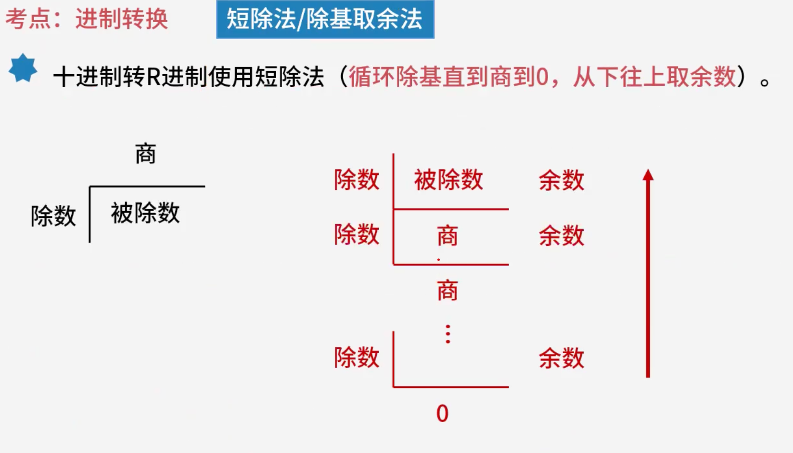
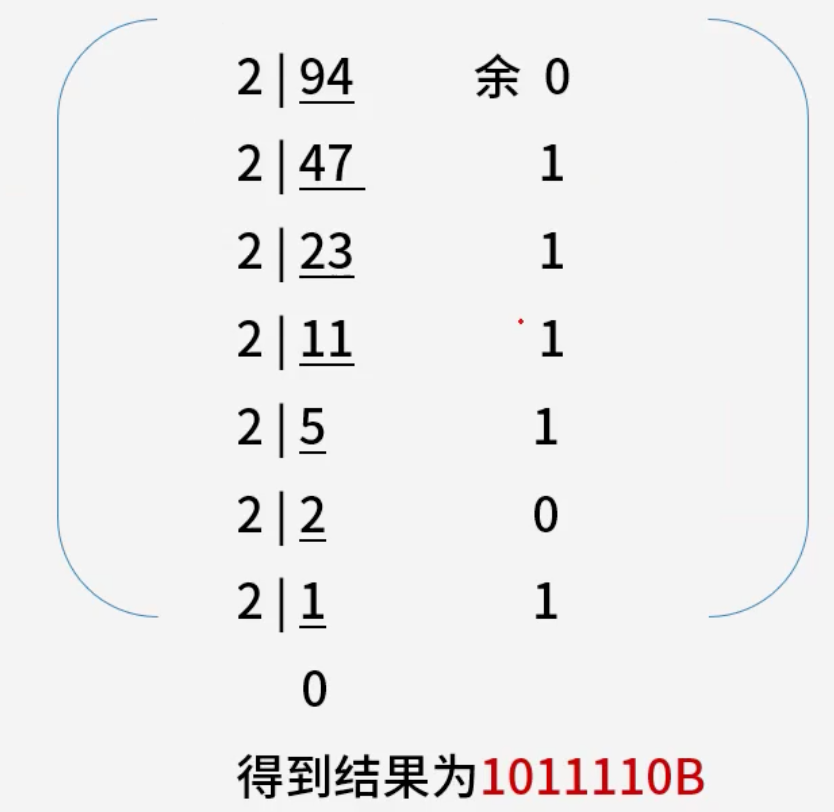
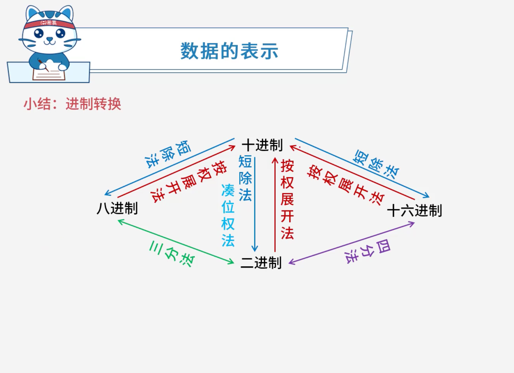

# 进制转换

## 1. **考点**：常见进制

|**进制**|**数码**|**基数**|**位权**|
| -------------| ------------------------------| ----| --|
|十进制(D)|0, 1, 2, 3, 4, 5, 6, 7, 8, 9|10|$10^k$|
|二进制(B)|0, 1|2|$2^k$|
|八进制(O)|0, 1, 2, 3, 4, 5, 6, 7|8|$8^k$|
|十六进制(H)|0\~9, A, B, C, D, E, F|16|$16^k$|

### 1.1 补充说明

- **十进制规则**：逢十进位，没有单独的字符表示十。
- **提示 1**：小数点左边的位权阶数 $k$ 从 0 开始，右边的位权阶数 $k$ 从 -1 开始。比如十进制数 $123.123D$。
- **提示 2**：只需记忆 $A=10$ 和 $F=15$。

## 2. 考点：R进制转十进制（加权法/按权展开法）

### 2.1 原理说明

- **R进制转十进制**​：使用​**按权展开法**。
- **具体操作**：将 R 进制数的每一位数乘以 $R^k$。

  - **底数**：即为进制数 R。
  - **指数** **$k$**：取决于该位与小数点之间的距离。

    - **小数点左边**：$k$ 值为该位与小数点之间数码的个数。
    - **小数点右边**：$k$ 值为负值，其绝对值为该位与小数点之间数码的个数加 1。
- **核心总结**：把每一位的数和当前位的权值相乘后的结果累加起来。

### 2.2 计算示例

#### 2.2.1 1. 二进制转十进制

- $$
  111(B) = 1 \times 2^2 + 1 \times 2^1 + 1 \times 2^0 = 4 + 2 + 1 = 7(D)
  $$
- $$
  10100.01(B) = 1 \times 2^4 + 1 \times 2^2 + 1 \times 2^{-2} = 16 + 4 + 0.25 = 20.25(D)
  $$

#### 2.2.2 2. 八进制转十进制

- $$
  604(O) = 6 \times 8^2 + 0 \times 8^1 + 4 \times 8^0 = 384 + 0 + 4 = 388(D)
  $$

## 3. 考点：十进制转R进制（短除法/除基取余法）

### 3.1 原理说明

- **适用场景**​：将**十进制**转换为 ​**R 进制**。
- **核心操作**​：​**短除法**（也称“除基取余法”）。
- **操作步骤**：

  1. 用十进制数不断除以基数 R。
  2. 循环此过程，直到商为 0。
  3. **取余顺序**：从下往上记录各次除法的余数，即为转换后的 R 进制数。

### 3.2 计算示意图

### 3.3 例题：将94D转化为二进制数。

## 4. 考点：十进制转二进制（凑位权法）

### 4.1 原理说明

- **凑位权法**：通过二进制的“权值表”，将十进制数拆解为若干个 2 的幂次之和。如果该位在拆解中被用到，则记为 1，否则记为 0。

### 4.2 二进制权值表

|**二进制权**|$2^7$|$2^6$|$2^5$|$2^4$|$2^3$|$2^2$|$2^1$|$2^0$|
| :-| :---: | :--: | :--: | :--: | :--: | :--: | :--: | :--: |
|**权值**|128|64|32|16|8|4|2|1|
|**7 的二进制**|0|0|0|0|0|1|1|1|
|**94 的二进制**|0|1|0|1|1|1|1|0|

### 4.3 计算过程解析

#### 4.3.1 1. 示例计算

- **7 的转换**：$4 + 2 + 1 = 1 \times 2^2 + 1 \times 2^1 + 1 \times 2^0$，结果为 `00000111(B)`。
- **94 的转换**：$64 + 16 + 8 + 4 + 2 = 1 \times 2^6 + 1 \times 2^4 + 1 \times 2^3 + 1 \times 2^2 + 1 \times 2^1$，结果为 `01011110(B)`。

#### 4.3.2 2. 思考题：IP 地址中 192(D) 转换为二进制是多少？

- **凑位步骤**：

  1. 192 大于 128，取 128（余 64）。
  2. 64 等于 64，取 64（余 0）。
  3. 其余位均不需要，记为 0。
- **计算式**：$128 + 64 = 1 \times 2^7 + 1 \times 2^6 + 0 + 0 + 0 + 0 + 0 + 0$
- **结果**​：**​`11000000(B)`​**

## 5. 考点：二进制与八进制、十六进制转换（分组法）

### 5.1 核心原理

通过​**分组法**，二进制可以快速转换成八进制或十六进制，反之亦然（逆分组法）。

- **二进制转八进制（三分法）** ​：将二进制数从右向左每 3 位分为一组，不足 3 位的补 0，每组对应一位八进制数。
- **二进制转十六进制（四分法）** ​：将二进制数从右向左每 4 位分为一组，不足 4 位的补 0，每组对应一位十六进制数。

### 5.2 转换示例

- **二进制转八进制 (三分法)** ：

  - `10 001 110(B)`​ → `010`​ `001`​ `110`​ → `2`​ `1`​ `6(O)`
- **二进制转十六进制 (四分法)** ：

  - `1000 1110(B)`​ → `1000`​ `1110`​ → `8`​ `E(H)`

### 5.3 思考题：内存地址中 31B5H 转换为二进制是多少？

**解题思路（逆分组法）** ：将十六进制的每一位拆解为对应的 4 位二进制。

- **3** → `0011`
- **1** → `0001`
- **B** (即 11) → `1011`
- **5** → `0101`

**结果**：将上述组合拼接起来，得到二进制：**​`0011000110110101(B)`​** 

## 6. 总结

