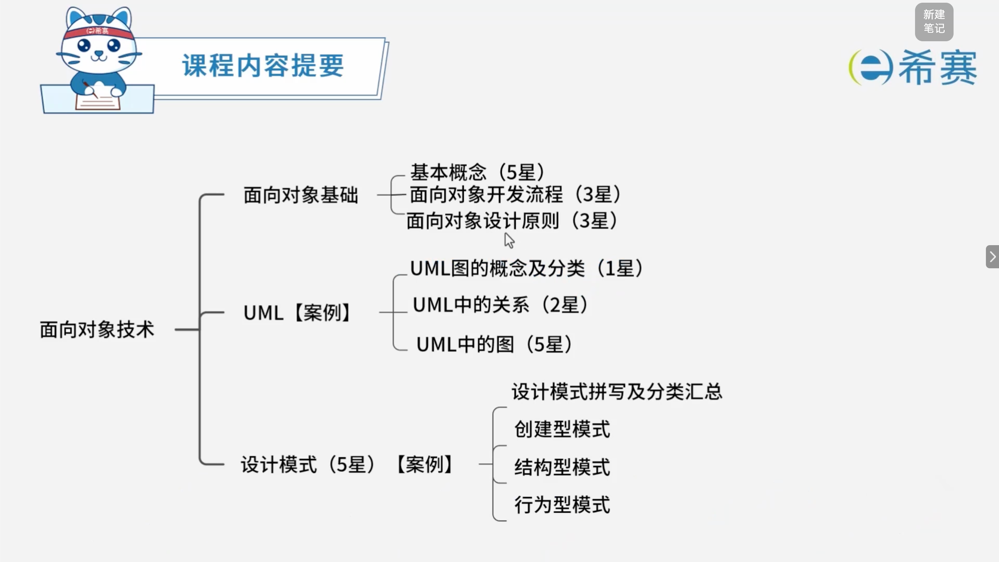
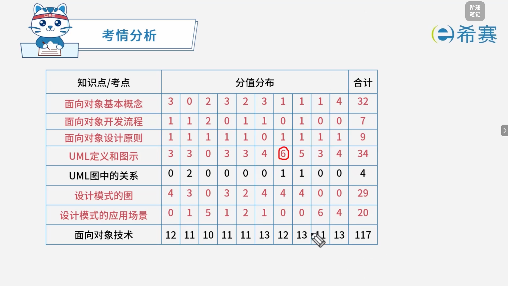

# 面向对象技术

## 1. 知识点分布

## 2. 历年考试分布

## 学习目录

- [面向对象基本概念](./面向对象基本概念.md)
- [面向对象开发流程](./面向对象开发流程.md)
- [面向对象设计原则](./面向对象设计原则.md)
- [UML图](./UML图.md)
- [设计模式-创建型](./设计模式-创建型.md)
- [设计模式-结构型](./设计模式-结构型.md)
- [设计模式-行为型](./设计模式-行为型.md)
