# UML图

> UML 的全称是 **Unified Modeling Language**，中文译为**统一建模语言**。

## 1. 考点：UML图的概念以及分类

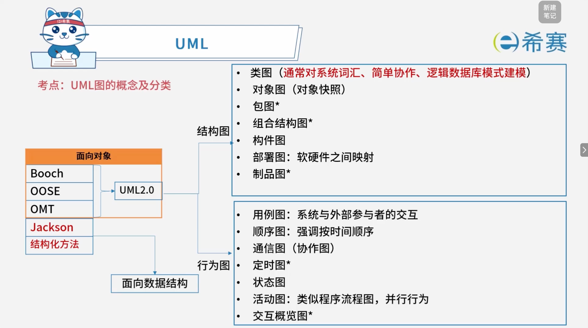

### 1.1 方法学演变背景

- **面向对象方法**：融合了 **Booch**、**OOSE**、**OMT** 等经典方法，最终演化为 **UML 2.0**。
- **面向数据结构与结构化方法**：如 **Jackson** 方法等。

---

### 1.2 UML 图的分类

#### 1.2.1 结构图 (Structural Diagrams)

表现系统的静态结构，展示系统中的物理和逻辑元素：

- **类图**  **(Class Diagram)**

  - **概念与作用**：一组对象、接口、协作和它们之间的关系。通常对系统词汇、简单协作、逻辑数据库模式建模。
- **对象图**  **(Object Diagram)**

  - **概念与作用**：一组对象以及它们之间的关系（对象快照）。
- **包图 (Package Diagram)**

  - **概念与作用**：描述类或其他 UML 如何组织成包，以及包之间的依赖关系。
- **组合结构图 (Composite Structure Diagram)**

  - **概念与作用**：分解类、组件或用例的内部结构。
- **组件图 / 构件图**  **(Component Diagram)**

  - **概念与作用**：一组构件之间的组织和依赖，专注于系统的静态实现视图。
- **部署图**  **(Deployment Diagram)**

  - **概念与作用**：运行处理节点以及构件的配置，给出体系结构的静态实施视图（软硬件之间映射）。
- **制品图 (Artifact Diagram)**

#### 1.2.2 行为图 (Behavioral Diagrams)

表现系统的动态行为，展示系统随时间变化的活动：

- **用例图**  **(Use Case Diagram)**

  - **概念与作用**：用例、参与者以及它们之间的关系；描述系统与外部参与者的交互。
- **顺序图 / 序列图**  **(Sequence Diagram)**

  - **概念与作用**：场景的图像化表示，以时间顺序组织的对象间的交互活动（强调按时间顺序）。
- **通信图 / 协作图**  **(Communication Diagram)**

  - **概念与作用**：强调收发消息的对象之间的组织结构。
- **状态图**  **(State Diagram)**

  - **概念与作用**：展现了一个状态机，由状态、转换、事件和活动组成。
- **活动图**  **(Activity Diagram)**

  - **概念与作用**：专注于系统的动态视图，一个活动到另一个活动的流程（类似程序流程图，支持并行行为）。
- **定时图 (Timing Diagram)**

  - **概念与作用**：关注对象在改变状态时的时间约束条件。
- **交互概览图 (Interaction Overview Diagram)**

  - **概念与作用**：组合了序列图和活动图的特征，显示用例活动中对象如何交互。

## 2. 考点：UML中的关系

### 2.1 类图中的关系

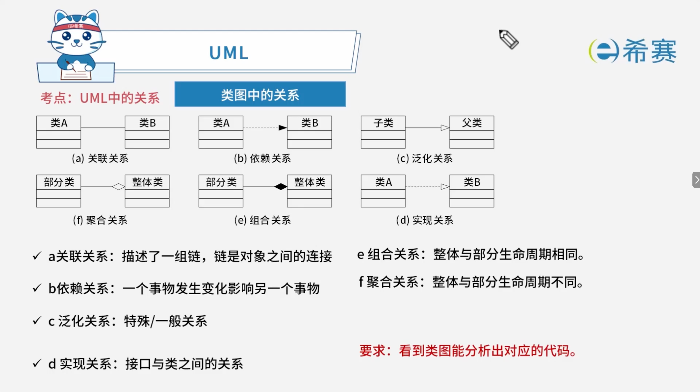

> **核心要求**：看到类图能够准确分析出对应的代码结构。

#### 2.1.1 关联关系 (Association, 图 a)

- **符号表示**：实线（可带箭头或不带箭头，类 A 与 类 B 互连）。
- **核心概念**：描述了一组“链”，链是对象之间的连接。表示类与类之间的一种长期、平等的结构化关系（如：学生与选修的课程）。
- **代码特征**：一个类的对象作为另一个类的成员变量。

#### 2.1.2 依赖关系 (Dependency, 图 b)

- **符号表示**​：虚线 + ​**箭头**（类 A 指向 类 B）。
- **核心概念**：一个事物发生变化会影响另一个事物。是一种临时性的、使用的关系。
- **代码特征**：通常表现为一个类的方法参数、局部变量、或者对静态方法的调用。

#### 2.1.3 泛化关系 (Generalization / 继承, 图 c)

- **符号表示**​：实线 + ​**空心三角形箭头**（子类 指向 父类）。
- **核心概念**​：特殊/一般关系（即通常所说的继承关系，如：​`Cat`​ 继承自 ​`Animal`）。
- **代码特征**​：Java/C++ 中的 ​`extends` 关键字。

#### 2.1.4 实现关系 (Realization, 图 d)

- **符号表示**​：虚线 + ​**空心三角形箭头**（类 指向 接口）。
- **核心概念**：接口与类之间的关系。
- **代码特征**：Java 中的 ​`implements` 关键字。

#### 2.1.5 组合关系 (Composition, 图 e)

- **符号表示**​：实线 + **实心菱形** + 指向整体（部分类 指向 整体类）。
- **生命周期**​：整体与部分**生命周期相同**（同生共死，例如：人与大脑）。
- **代码特征**：整体类中包含部分类的实例对象，且通常在整体类构造时创建、销毁时销毁。

#### 2.1.6 聚合关系 (Aggregation, 图 f)

- **符号表示**​：实线 + **空心菱形** + 指向整体（部分类 指向 整体类）。
- **生命周期**​：整体与部分**生命周期不同**（可以分离，例如：车与轮胎）。
- **代码特征**：整体类包含部分类的实例，但部分类可以独立存在（通常通过构造函数或 Setter 注入进来）。

### 2.2 用例图中的关系

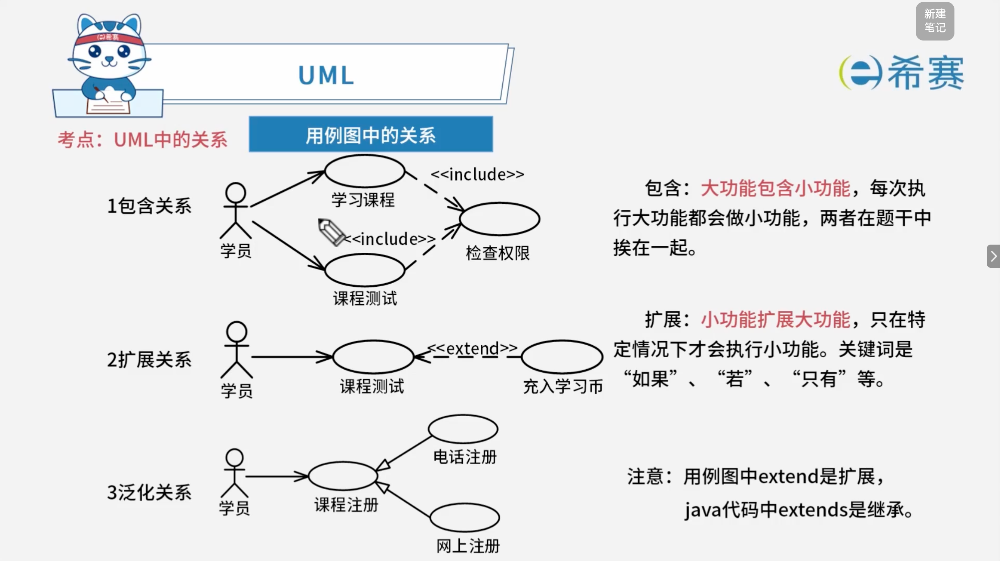

#### 2.2.1 包含关系 (Include)-必须

- **核心定义**：当可以从两个或两个以上的用例中提取公共行为时，应该使用包含关系来表示它们。
- **专业术语**：

  - **抽象用例**：提取出来的公共用例。
  - **基本用例 / 基础用例**：原始用例。
- **符号与方向**​：带 ​`<<include>>`​ 的虚线箭头，由​**基本用例指向抽象用例**。
- **特点**：基本用例的执行通常包含抽象用例的执行（类似于代码中的函数复用/调用）。

#### 2.2.2 扩展关系 (Extend)-不必须

- **核心定义**：如果一个用例明显地混合了两种或两种以上不同的场景，即根据情况可能发生多种分支，则可以将这个用例分为一个基本用例和一个或多个扩展用例，这样使描述可能更加清晰。
- **符号与方向**​：带 ​`<<extend>>`​ 的虚线箭头，由​**扩展用例指向基本用例**（注意：方向与包含关系相反！）。
- **特点**：扩展用例是在特定条件满足时，对基本用例功能的补充或增强。

#### 2.2.3 泛化关系 (Generalization / 继承)

- **核心定义**：当多个用例共同拥有一种类似的结构和行为的时候，可以将它们的共性抽象成为父用例，其他的用例作为泛化关系中的子用例。
- **核心要点**：在用例的泛化关系中，子用例是父用例的一种特殊形式，子用例继承了父用例所有的结构、行为和关系。
- **符号与方向**：实线 + 空心三角形箭头，由**子用例指向父用例**。

## 3. 考点：UML中的图

### 3.1 类图 (Class Diagram)

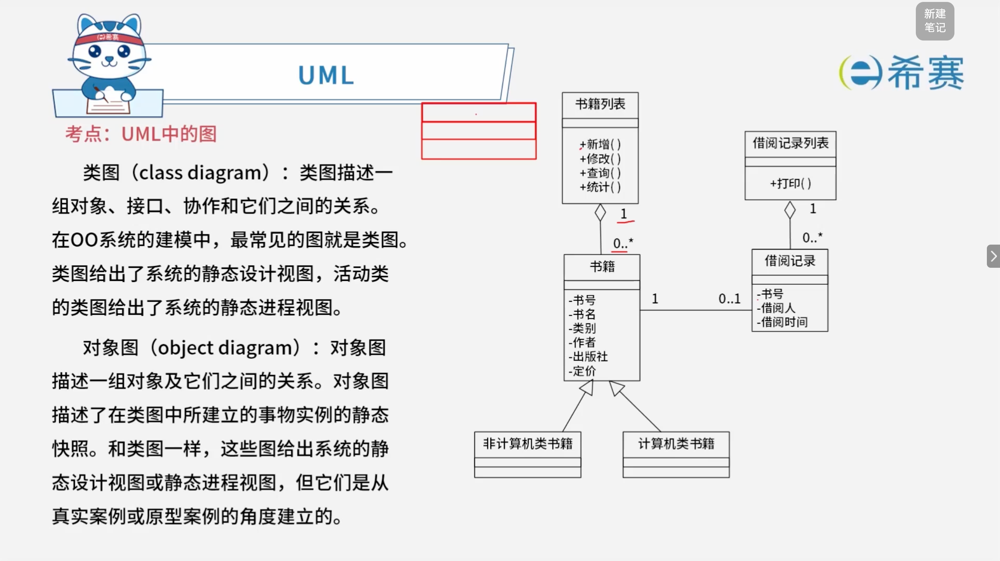

- **核心定义**：类图描述一组对象、接口、协作和它们之间的关系。
- **应用地位**：在面向对象 (OO) 系统的建模中，最常见的图就是类图。
- **视图归属**：类图给出了系统的**静态设计视图**，活动类的类图给出了系统的**静态进程视图**。

#### 3.1.1 可见性修饰符 (Visibility Modifiers)

在类图中，属性和方法名前的符号表示其在代码中的访问控制权限：

-  **​`+`​** ​  **(Public / 公共的)** ​：表示该属性或方法对所有类都是可见的（对应 Java 等语言中的 ​`public`关键字）。
-  **​`-`​** ​  **(Private / 私有的)** ​：表示该属性或方法仅在当前类内部可见，外部无法直接访问（对应 Java 中的 ​`private` 关键字）。
-  **​`#`​** ​  **(Protected / 受保护的)** ​：表示该属性或方法对当前类及其子类可见（对应 Java 中的 ​`protected` 关键字）。
-  **​`~`​** ​  **(Package / 包可见)** ：表示该属性或方法对同一个包内的其他类可见（对应 Java 的默认无修饰符包权限）。

> **结合实例理解（参考前文图书类图）** ：
>
> - 像 ​`书籍列表`​ 中的 ​`+新增()`​、​`+修改()`​ 以及 ​`借阅记录列表`​ 中的 ​`+打印()`​，前面带有 ​`+` 号，说明它们是公开的外部调用方法。
> - 而 ​`书籍`​ 类中的 ​`-书号`​、​`-书名`​、​`-类别`​ 等，前面带有 ​`-` 号，说明它们是私有属性，封装在类内部，通常需要通过 Getter/Setter 方法来访问。

#### 3.1.2 多重度 (Multiplicity)

- **核心定义**：多重度是指当两个类建立关联时，一个类的对象能够连接的另一个类的对象的数量范围。它用数字、区间或特定符号标注在关联直线的两端。
- **常见表示符号与含义**：

  - **​`1`​**：精确一个（有且仅有一个）。
  - **​`0..1`​**：零个或一个（可有可无，例如：一本书可能当前有一条借阅记录，也可能没有）。
  -  **​`*`​** ​ **或** ​**​`0..*`​** ：零个到多个（没有上限）。
  - **​`1..*`​** ：一个到多个（至少有一个）。
  - **具体数字**：如 ​`2`​（固定两个）、​`1..5`（一到五个）。

> **结合实例理解（参考前文图书类图）** ：
>
> - 在 ​`书籍列表`​ 与 ​`书籍`​ 的聚合关系中，​`书籍列表`​ 端为 ​`1`​，​`书籍`​ 端为 ​`0..*`​。这表示：​**一个书籍列表中可以包含 0 到多本书**。
> - 在 ​`书籍`​ 与 ​`借阅记录`​ 的关联关系中，​`书籍`​ 端为 ​`1`​，​`借阅记录`​ 端为 ​`0..1`​。这表示：**一本书在某一时刻最多对应一条借阅记录（或没有）** 。

### 3.2 用例图（Use Case Diagram）

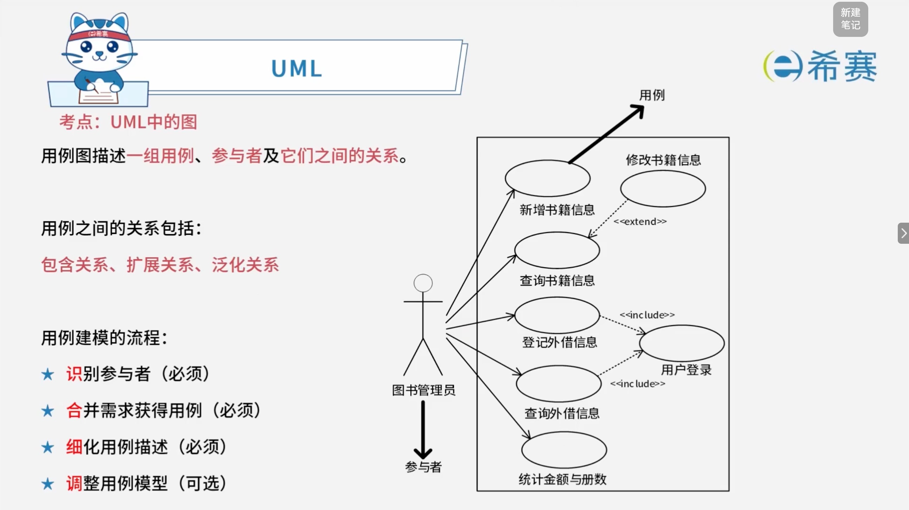

#### 3.2.1 用例图概述

- **基本定义**：用例图描述一组用例、参与者及它们之间的关系。
- **包含关系**：用例之间的关系包括包含关系、扩展关系、泛化关系。

#### 3.2.2 用例建模的流程

用例建模通常遵循以下步骤：

1. **识别参与者**（必须）：确定系统外部与系统交互的人或外部系统（如图中的“图书管理员”）。
2. **合并需求获得用例**（必须）：将用户的需求归纳并转化为系统提供的功能模块（即椭圆表示的用例，如新增书籍信息、查询书籍信息等）。
3. **细化用例描述**（必须）：编写每个用例的详细业务流程、前置条件和后置条件。
4. **调整用例模型**（可选）：优化和重构用例图，提取公共行为或增加扩展。

#### 3.2.3 用例图实例分析（如上图所示）

以上图的图书管理系统用例图为例：

- **参与者 (Actor)** ​：​`图书管理员`（使用 stickman 火柴人图标表示，位于系统边界外部）。
- **用例 (Use Case)** ​：如 ​`新增书籍信息`​、​`查询书籍信息`​、​`登记外借信息`​、​`查询外借信息`​、​`统计金额与册数`（用椭圆表示，位于系统内部）。
- **扩展关系 (Extend)** ​：​`修改书籍信息`​ 通过 ​`<<extend>>`​ 指向 ​`新增书籍信息`，表示在特定条件下对新增功能的扩展。
- **包含关系 (Include)** ：​`登记外借信息`​ 和 ​`查询外借信息`​ 分别通过 ​`<<include>>`​ 指向公共抽象用例 ​`用户登录`，表示执行这些操作前必须先完成用户登录。

### 3.3 顺序图（Sequence Diagram，又称序列图）

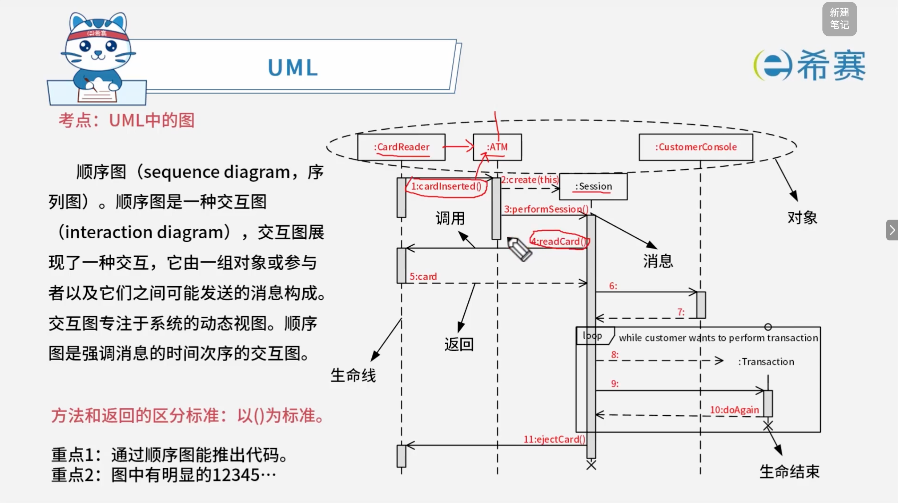

#### 3.3.1 顺序图概述

- **基本定义**：顺序图是一种交互图（interaction diagram）。
- **构成要素**：交互图展现了一种交互，它由一组对象或参与者以及它们之间可能发送的消息构成。
- **视图归属**：交互图专注于系统的动态视图。
- **核心特征**​：顺序图是强调消息的**时间次序**的交互图。

#### 3.3.2 顺序图的核心组成（结合右侧图示）

1. **对象 (Object)** ​：位于图的上方顶部（如 ​`:CardReader`​、​`:ATM`​、​`:CustomerConsole`​、​`:Session` 等）。
2. **生命线 (Lifeline)** ：从对象向下延伸的垂直虚线，表示对象存在的生命周期。
3. **激活期 / 控制焦点**：生命线上的矩形窄条，表示对象执行某项操作的时期。
4. **消息 (Message)** ​：对象之间传递的交互（如 ​`1:cardInserted()`​、​`3:performSession()` 等）。

#### 3.3.3 核心考点与分析技巧

- **方法和返回的区分标准**​：**以** ​ **​`()`​** ​ **为标准**。带括号的通常表示方法调用/操作，而不带括号或使用虚线返回的通常表示返回值或响应。
- **考试重点 1**​：能够**通过顺序图推出代码**结构。
- **考试重点 2**：图中有明显的执行序号（如 ​`1`​, ​`2`​, ​`3`​, ​`4`​, ​`5`……），做题时必须严格按照编号的先后顺序来还原业务逻辑的执行流。

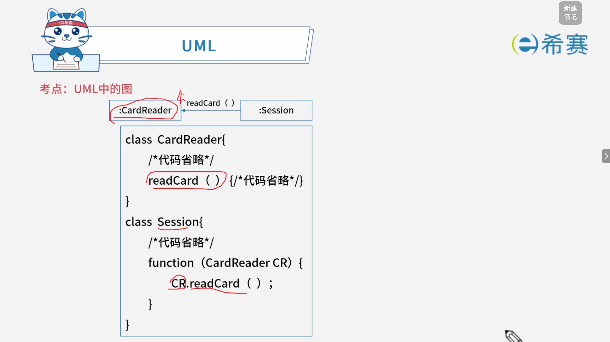

### 3.4 通信图（Communication Diagram，又称协作图）

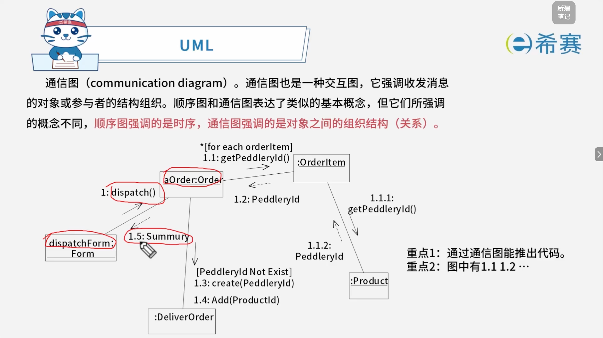

#### 3.4.1 通信图概述

- **基本定义**：通信图（communication diagram）也是一种交互图，它强调收发消息的对象或参与者的结构组织。
- **与顺序图的区别**：顺序图和通信图表达了类似的基本概念，但它们所强调的概念不同：

  - **顺序图**​：强调的是​**时序**（时间顺序）。
  - **通信图**​：强调的是**对象之间的组织结构（关系）** 。

#### 3.4.2 核心特点与图示分析

- **对象与连接**​：如图中所示，展示了各个对象（如 ​`dispatchForm:Form`​、​`aOrder:Order`​、​`:OrderItem`​、​`:DeliverOrder`​、​`:Product`）之间的网状连接关系。
- **嵌套序号**​：消息传递采用层级化编号（如 ​`1: dispatch()`​、​`1.1: getPeddleryId()`​、​`1.1.1`​、​`1.3: create(...)` 等），用来表达方法调用的嵌套关系和执行顺序。

#### 3.4.3 考试重点

- **重点 1**​：能够**通过通信图推导出对应的代码**结构。
- **重点 2**：注意识别图中带有点状层次的编号（如 ​`1.1`​, ​`1.2`……），这是分析对象间方法调用层级和业务逻辑的关键。

### 3.5 活动图（Activity Diagram）

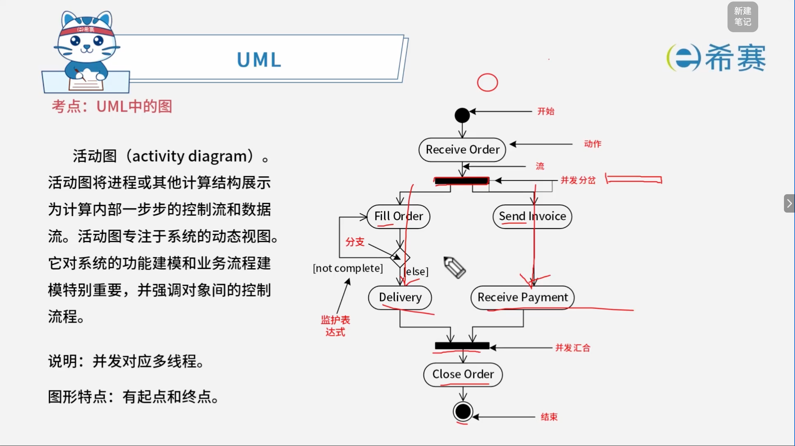

#### 3.5.1 活动图概述

- **基本定义**：活动图将进程或其他计算结构展示为计算内部一步步的控制流和数据流。
- **视图归属**：活动图专注于系统的动态视图。
- **核心价值**：它对系统的功能建模和业务流程建模特别重要，并强调对象间的控制流程。
- **图形特点**：有起点（实心圆）和终点（嵌套实心圆）。

#### 3.5.2 活动图核心元素与说明（结合上图示）

1. **动作 (Action)** ​：圆角矩形表示，如 ​`Receive Order`​、​`Fill Order`​、​`Send Invoice` 等，代表具体要执行的步骤。
2. **分支 (Branch) 与监护表达式 (Guard Expression)** ：

   - 用菱形或判断节点表示流向的分叉。
   - 括号中的条件（如 ​`[not complete]`​、​`[else]`​）即为​**监护表达式**，用于控制流程走向不同的分支。
3. **并发分叉 (Fork) 与并发汇合 (Join)** ：

   - 用粗黑条表示。
   - **并发对应多线程**，可以将一个流拆分为多个并行执行的分支（如同时执行 ​`Fill Order`​ 和 ​`Send Invoice`），随后再通过并发汇合合并流程。

### 3.6 泳道图

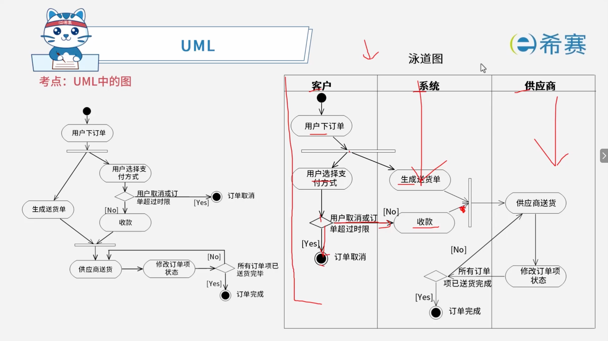

### 3.7 状态图（State Diagram）

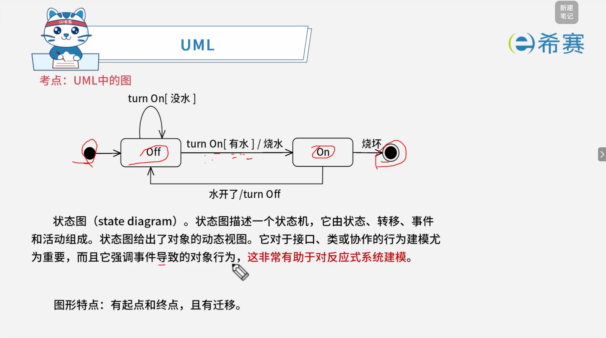

#### 3.7.1 状态图概述

- **基本定义**：状态图描述一个状态机，它由状态、转移、事件和活动组成。
- **视图归属**：状态图给出了对象的动态视图。
- **核心价值**​：它对于接口、类或协作的行为建模尤为重要，而且它强调事件导致的对象行为，**这非常有助于对反应式系统建模**。
- **图形特点**：有起点和终点，且有迁移。

#### 3.7.2 状态图核心元素与实例分析（结合图示）

1. **状态 (State)** ：圆角矩形表示（如 ​`Off`​ 关机/无水状态、​`On` 开机状态）。

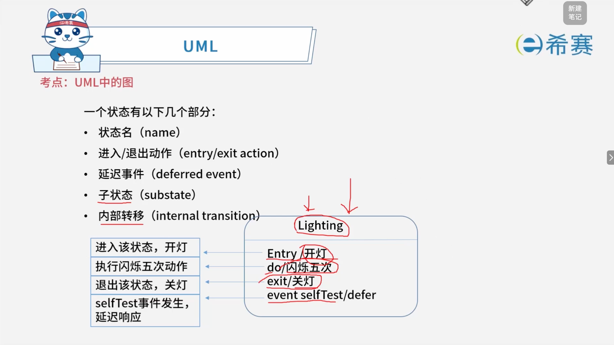

- 组合状态：顺序子状态、并发子状态（都是需要全部子状态完成才能完成）

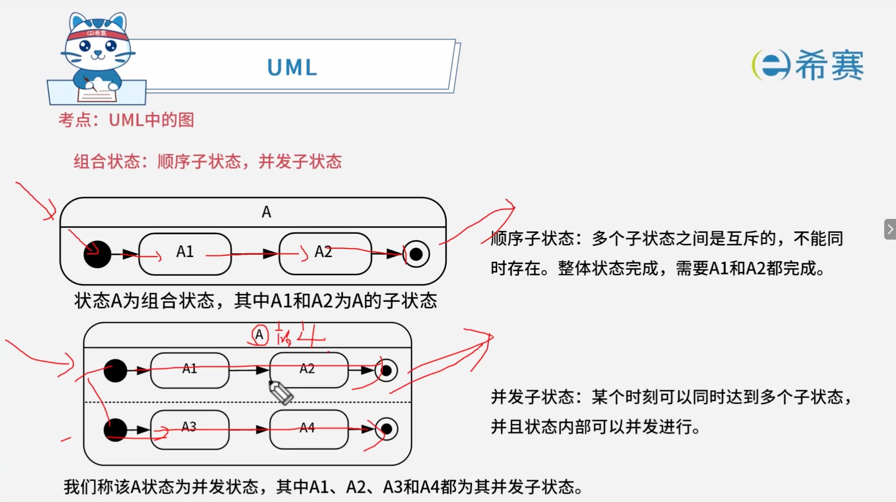

2. **起点与终点**：

- **起点**：黑色的实心圆，表示状态机的入口。
- **终点**：带有同心圆的黑点（如右侧被“烧坏”后的终点），表示生命周期的结束。

3. **转移与事件（结合图中的电热水壶/加热器逻辑示例）** ：

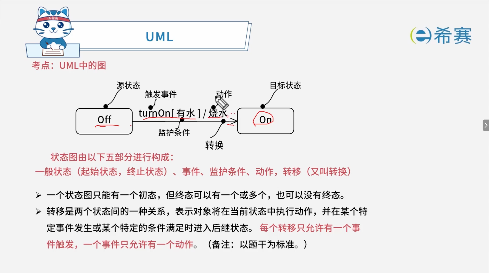

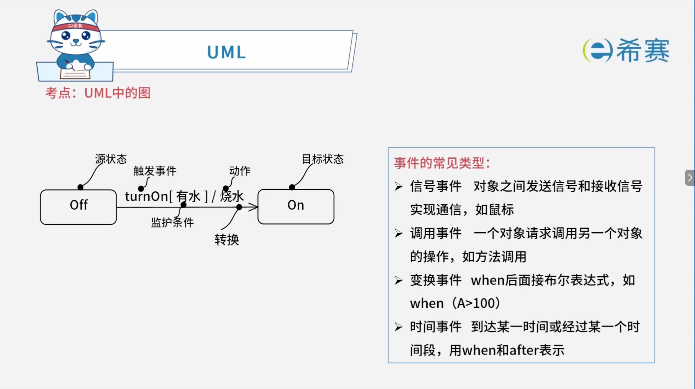

- **自转移**​：当处于 ​`Off`​ 状态时，如果触发 ​`turn On[没水]` 事件，状态保持不变或回到自身。
- **状态迁移**​：当处于 ​`Off`​ 状态时，若触发 ​`turn On[有水]/烧水`​ 事件，则状态迁移到 ​`On`​（其中 ​`[有水]`​ 为监护条件，​`/烧水` 表示触发的动作）。
- **异常终止**​：在 ​`On` 状态下若发生“烧坏”事件，直接进入终点。
- **正常结束**：在 ​`On`​ 状态下若满足 ​`水开了/turn Off`​，则迁移回 ​`Off` 状态。

### 3.8 **构件图（Component Diagram，又称组件图）**

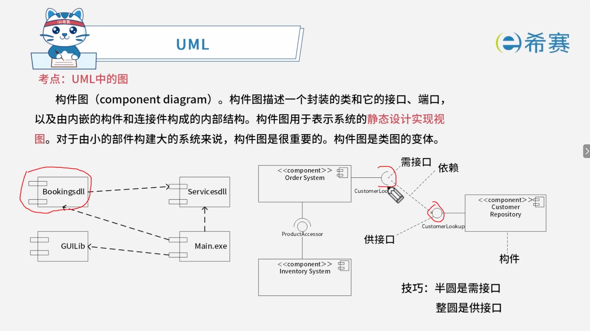

#### 3.8.1 构件图概述

- **基本定义**：构件图描述一个封装的类和它的接口、端口，以及由内嵌的构件和连接件构成的内部结构。
- **视图归属**​：构件图用于表示系统的**静态设计实现视图**。
- **核心价值**：对于由小的部件构建大的系统来说，构件图是很重要的。它是类图的变体。

#### 3.8.2 核心元素与特殊图标技巧（结合右侧图示）

1. **构件 (Component)** ​：使用带有小构件图标的矩形表示（如 ​`Order System`​、​`Inventory System`​、​`Customer Repository` 等）。
2. **接口的图形化技巧（非常重要的高频考点）** ：

   - **整圆（棒糖状实心/完整圆）是供接口 (Provided Interface)** ：表示该构件对外提供了什么服务或功能。
   - **半圆（凹槽状/套筒状半圆）是需接口 (Required Interface / 依赖)** ：表示该构件运行或工作时需要依赖外部的其他接口服务。
   - **依赖关系**：通常通过带箭头的虚线将需接口连接到对应的供接口上。

### 3.9 部署图（Deployment Diagram）

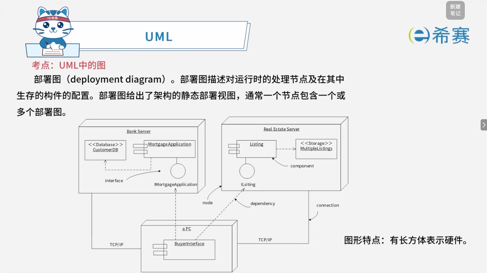

#### 3.9.1 部署图概述

- **基本定义**：部署图描述对运行时的处理节点及其中生存的构件的配置。
- **视图归属**​：部署图给出了架构的**静态部署视图**。
- **核心结构**：通常一个节点包含一个或多个部署图。
- **图形特点**​：**有长方体表示硬件**（即立体立方体，用来代表物理节点或设备）。

#### 3.9.2 核心元素与实例分析（结合图示）

1. **节点 (Node)** ​：如图中的 ​`Bank Server`​（银行服务器）、​`Real Estate Server`​（房产服务器）以及 ​`a PC`（客户端电脑），均用3D长方体表示物理硬件。
2. **构件 (Component)** ​：部署在硬件节点内部的软件模块（如 ​`MortgageApplication`​、​`Listing`​、​`CustomerDB` 等）。
3. **连接 (Connection)** ​：硬件节点之间通过物理或网络链路连接（如底层标注的 ​`TCP/IP` 协议通信链路）。

## 4. 经典例题

### 4.1 题目一

> **题目：**  在 UML 图中，（ ）图用于展示所交付系统中软件组件和硬件之间的物理关系。
>
> - A、类
> - B、组件
> - C、通信
> - D、部署

 **【解析】**

- **正确答案：D**
- **解析说明：**

  - **关于选项 D（部署图）** ​：部署图（Deployment Diagram）用于展示所交付系统中​**软件组件和硬件之间的物理关系**，描述系统在运行时的物理架构。
  - **其他选项说明**：

    - **A、类图**：描述系统中类的静态结构及类之间的关系。
    - **B、组件图**：描述软件组件之间的组织和依赖关系。
    - **C、通信图**：描述对象之间的交互关系，强调对象之间的消息传递。

**正确答案：D（部署图）。** 

### 4.2 题目二

> 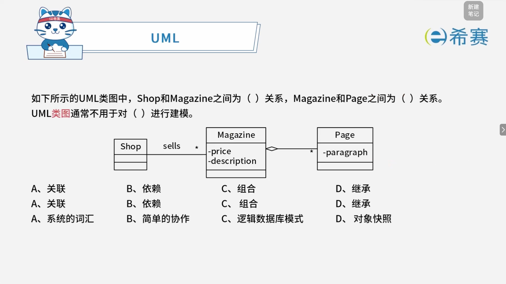

 **【解析】**

- **正确答案：第一空选 A，第二空选 C，第三空选 D。**
- **解析说明：**

  - **第一空：Shop 和 Magazine 之间为（ A ）关系。**

    - 图中 Shop 和 Magazine 之间是一条普通实线，带有“sells”标签，且两端有重数（\*），表示两者之间存在​**关联关系**。
    - **关联**表示类与类之间的连接，是一种静态关系。
  - **第二空：Magazine 和 Page 之间为（ C ）关系。**

    - 图中 Magazine 和 Page 之间是**实心菱形**连线，表示​**组合关系**。
    - **组合**是强的“整体-部分”关系，部分不能脱离整体而独立存在。Magazine 由 Page 组成，Page 不能脱离 Magazine 独立存在。
  - **第三空：UML 类图通常不用于对（ D ）进行建模。**

    - 类图用于描述系统的静态结构，可以对​**系统的词汇**​、​**简单的协作**​、**逻辑数据库模式**进行建模。
    - **对象快照**描述的是系统在某一时刻的对象状态，属于**对象图**的用途，不是类图的建模对象。

**正确答案：第一空 A（关联），第二空 C（组合），第三空 D（对象快照）。** 

### 4.3 题目三

> 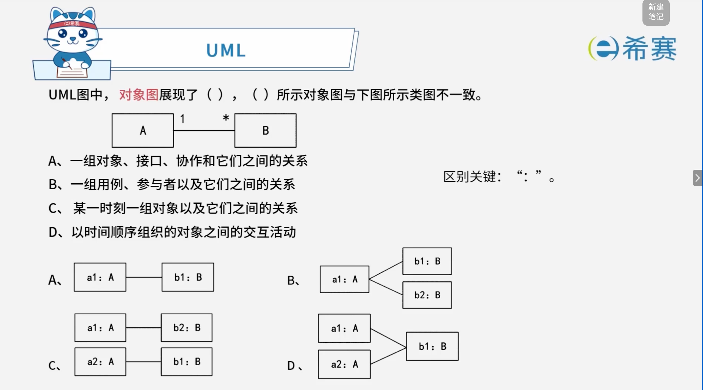

**解析】**

- **正确答案：第一空选 C，第二空选 D。**
- **解析说明：**

  - **第一空：对象图展现了（ C ）。**

    - **对象图**展现的是​**某一时刻一组对象以及它们之间的关系**。
    - **A、一组对象、接口、协作和它们之间的关系**​：这是**类图/协作图**的范畴。
    - **B、一组用例、参与者以及它们之间的关系**​：这是​**用例图**。
    - **D、以时间顺序组织的对象之间的交互活动**​：这是​**序列图/顺序图**。
  - **第二空：与类图不一致的对象图是（ D ）。**

    - 类图中 A 端重数为 1，B 端重数为 \*，表示​**一个 A 对象可以对应多个 B 对象，但一个 B 对象只能对应一个 A 对象**。
    - **A 选项**：一个 a1 对应一个 b1，符合。
    - **B 选项**​：一个 a1 对应 b1、b2 两个 B 对象，符合 A 端为 1、B 端为 \* 的关系。
    - **C 选项**：a1 对应 b2，a2 对应 b1，每个 A 对应一个 B，每个 B 也只对应一个 A，符合。
    - **D 选项**：a1 和 a2 两个 A 对象同时对应 b1 一个 B 对象，这违反了“一个 B 对象只能对应一个 A 对象”的约束，因此与类图不一致。

**正确答案：第一空 C（某一时刻一组对象以及它们之间的关系），第二空 D（a1：A 与 b1：B 相连，a2：A 与 b1：B 相连）。** 

### 4.4 题目四

> **题目：**  UML用例图展现了一组用例、参与者以及它们之间的关系。其中，（ ）关系既可以存在于用例和用例之间，又可以存在于参与者与参与者之间。
>
> - A、扩展
> - B、泛化
> - C、关联
> - D、包含

 **【解析】**

- **正确答案：B**
- **解析说明：**

  - **关于选项 B（泛化）** ​：泛化关系（继承关系）既可以存在于​**用例和用例之间**​，也可以存在于​**参与者与参与者之间**。

    - 参与者之间的泛化：一个参与者可以继承另一个参与者的行为。
    - 用例之间的泛化：一个用例可以继承另一个用例的行为。
  - **其他选项说明**：

    - **A、扩展**​：扩展关系只存在于​**用例和用例之间**，表示一个用例扩展另一个用例的功能。
    - **C、关联**​：关联关系主要存在于​**参与者和用例之间**，表示参与者与用例之间的通信。
    - **D、包含**​：包含关系只存在于​**用例和用例之间**，表示一个用例包含另一个用例的行为。

**正确答案：B（泛化）。** 

### 4.5 题目五

> 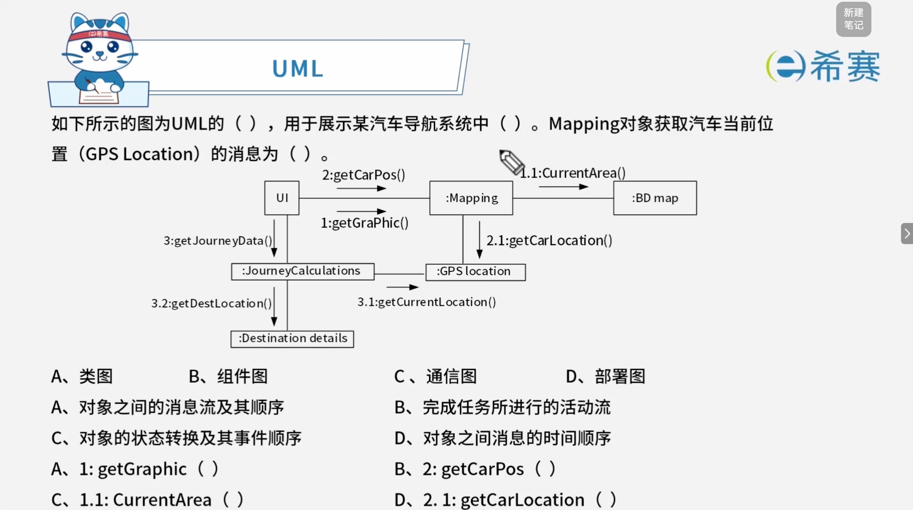

**解析】**

- **正确答案：第一空选 C，第二空选 A，第三空选 D。**
- **解析说明：**

  - **第一空：图为 UML 的（ C ）**

    - 图中对象之间通过带编号的箭头连接，表示对象之间的消息传递及顺序，这是​**通信图**（Communication Diagram）的典型特征。
    - **A、类图**：描述类的静态结构。
    - **B、组件图**：描述软件组件的组织和依赖。
    - **D、部署图**：描述软件组件和硬件的物理关系。
  - **第二空：用于展示某汽车导航系统中（ A ）**

    - 通信图用于展示​**对象之间的消息流及其顺序**。
    - **B、完成任务所进行的活动流**​：属于​**活动图**。
    - **C、对象的状态转换及其事件顺序**​：属于​**状态图**。
    - **D、对象之间消息的时间顺序**​：属于​**序列图**。
  - **第三空：Mapping 对象获取汽车当前位置（GPS Location）的消息为（ D ）**

    - 观察图中，Mapping 对象向 GPS location 对象发送的消息是 ​**2.1: getCarLocation()** 。
    - 因此，Mapping 对象获取汽车当前位置的消息为 ​**2.1: getCarLocation ( )** 。

**正确答案：第一空 C（通信图），第二空 A（对象之间的消息流及其顺序），第三空 D（2.1: getCarLocation ( )）。**

### 4.6 题目六

> 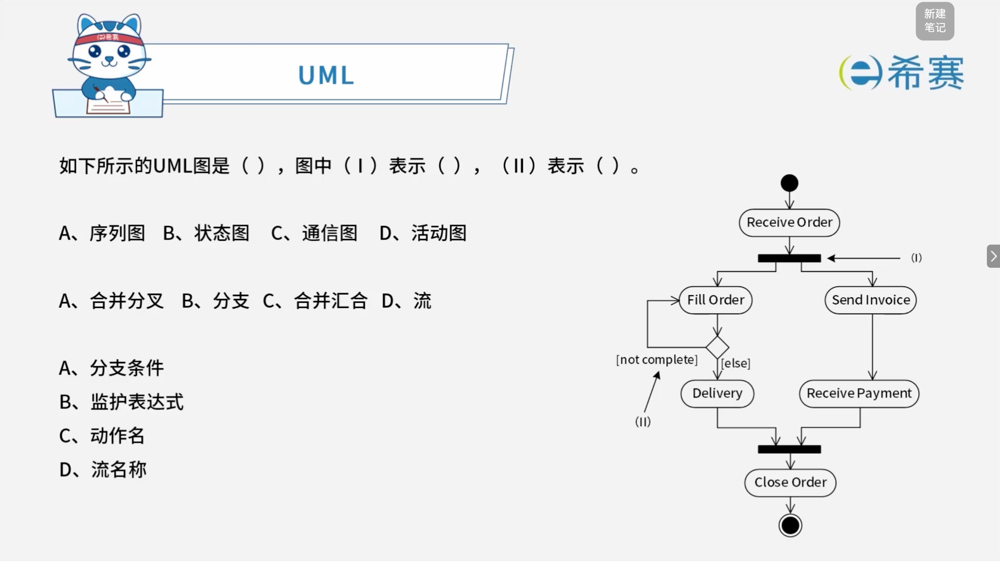

 **【解析】**

- **正确答案：第一空选 D，第二空选 A，第三空选 B。**
- **解析说明：**

  - **第一空：如下所示的UML图是（ D ）**

    - 图中有​**开始节点（实心圆）** ​、​**活动节点（圆角矩形）** ​、​**分支/合并节点（菱形）** ​、​**分叉/汇合节点（粗黑线）** ​、​**结束节点（实心圆外套圆圈）** ​，这是**活动图**的典型特征。
    - 活动图用于展示完成任务所进行的活动流。
  - **第二空：图中（I）表示（ A ）**

    - （I）指向的是一条​**粗黑线**​，表示​**合并分叉**（Fork/Join）。
    - 在活动图中，粗黑线用于表示​**分叉**​（将控制流分成多个并发分支）或​**汇合**（将多个并发分支合并）。
    - 图中（I）位于 Receive Order 之后，引出 Fill Order 和 Send Invoice 两条并发分支，因此表示​**合并分叉**。
  - **第三空：图中（II）表示（ B ）**

    - （II）指向的是 ​`[not complete]`​，这是​**监护表达式**（Guard Expression）。
    - 监护表达式用于条件分支，表示只有当条件满足时才沿该分支执行。
    - 图中 ​`[not complete]`​ 表示“未完成”条件，​`[else]` 表示“其他情况”。

**正确答案：第一空 D（活动图），第二空 A（合并分叉），第三空 B（监护表达式）。** 

### 4.7 题目七

> 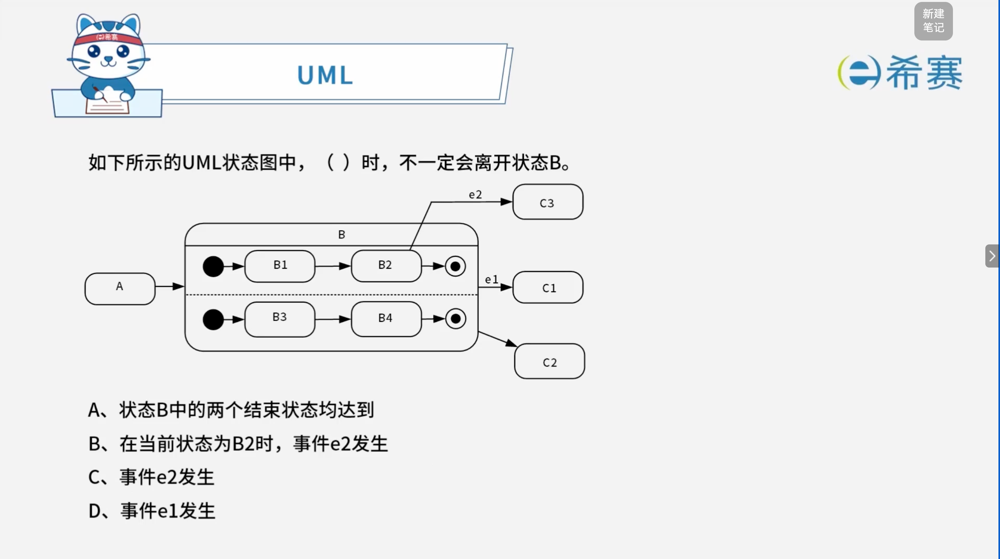

 **【解析】**

- **正确答案：C**
- **解析说明：**

  - **关于选项 C（事件 e2 发生）** ​：观察状态图，事件 e2 是从**状态 B2** 引出的转移。如果当前系统不在状态 B2（比如在状态 B1、B3 或 B4），即使事件 e2 发生了，状态 B 也不会离开。因此，仅说“事件 e2 发生”，**不一定**会离开状态 B。
  - **其他选项说明**：

    - **A、状态B中的两个结束状态均达到**：状态 B 是一个复合状态，内部包含两条并行子状态（B1→B2 和 B3→B4）。只有当两个并行分支都到达各自的结束状态时，复合状态 B 才会结束，从而离开状态 B。所以这个条件一定会导致离开状态 B。
    - **B、在当前状态为B2时，事件e2发生**：此时满足转移条件，一定会离开状态 B。
    - **D、事件e1发生**​：e1 是从状态 B 的**整体**引出的转移（不受内部子状态限制），只要事件 e1 发生，就一定会离开状态 B。

**正确答案：C（事件 e2 发生）。** 

### 4.8 题目八

> 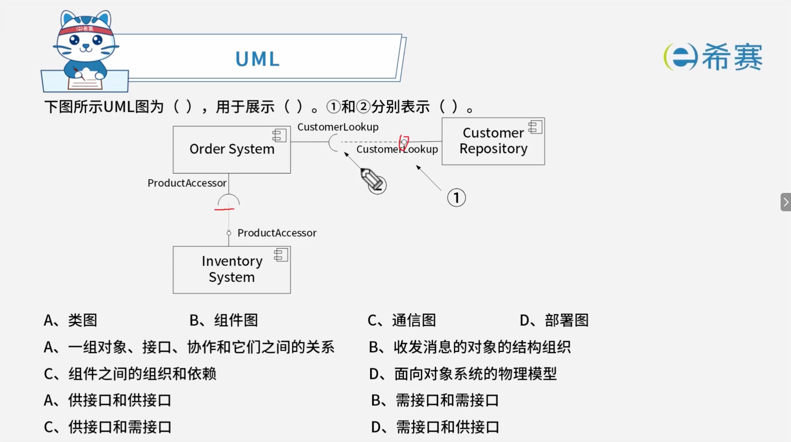

 **【解析】**

- **正确答案：第一空选 B，第二空选 C，第三空选 C。**
- **解析说明：**

  - **第一空：下图所示UML图为（ B ）**

    - 图中有​**组件符号**​（矩形左上角带组件图标），组件之间通过**接口**连接，这是**组件图**的典型特征。
    - **A、类图**：描述类的静态结构。
    - **C、通信图**：展示对象之间的消息流及其顺序。
    - **D、部署图**：描述软件组件和硬件的物理关系。
  - **第二空：用于展示（ C ）**

    - 组件图用于展示​**组件之间的组织和依赖**。
    - **A、一组对象、接口、协作和它们之间的关系**​：属于**类图/协作图**的范畴。
    - **B、收发消息的对象的结构组织**​：属于**通信图**的范畴。
    - **D、面向对象系统的物理模型**​：属于**部署图**的范畴。
  - **第三空：①和②分别表示（ C ）**

    - **①** 表示​**供接口**（Provided Interface），即 Order System 提供 CustomerLookup 接口。
    - **②** 表示​**需接口**（Required Interface），即 Customer Repository 需要 CustomerLookup 接口。
    - 因此，①表示​**供接口**​，②表示​**需接口**​，选 ​**C（供接口和需接口）** 。

**正确答案：第一空 B（组件图），第二空 C（组件之间的组织和依赖），第三空 C（供接口和需接口）。** 

‍
