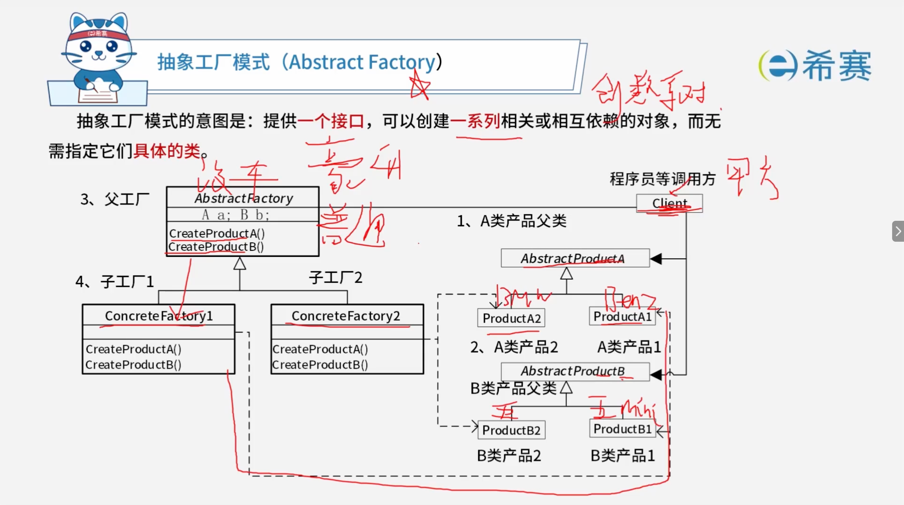
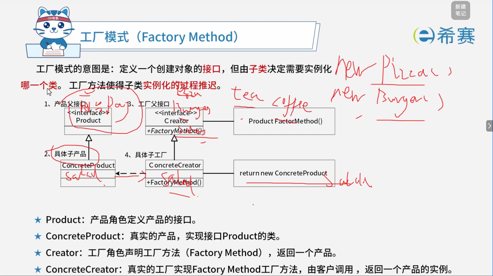
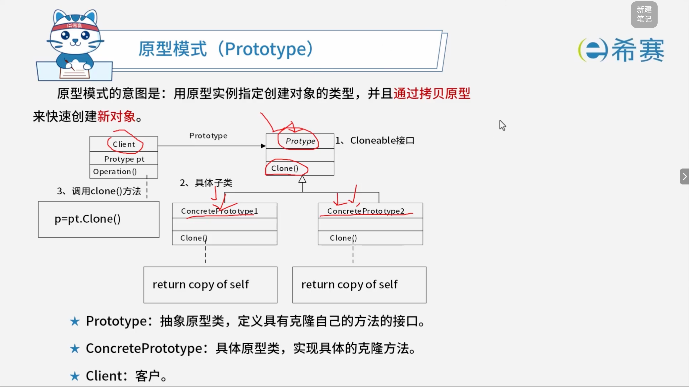
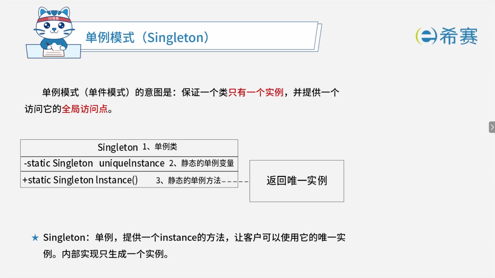
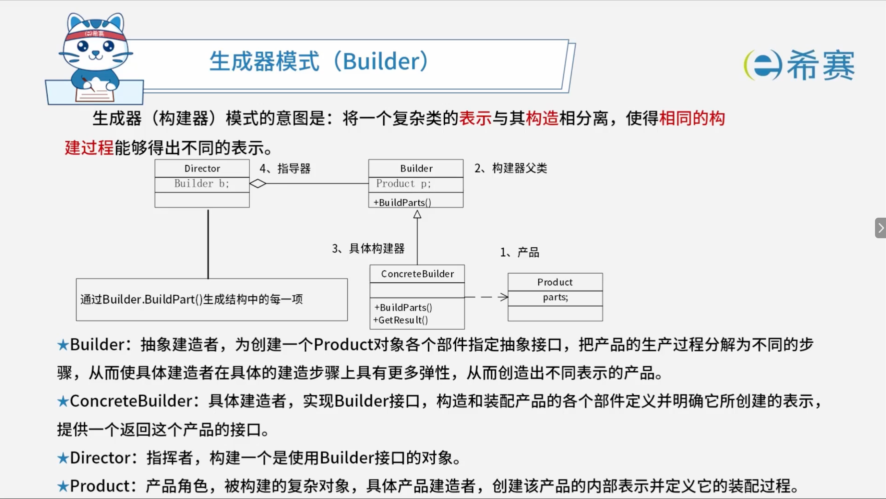
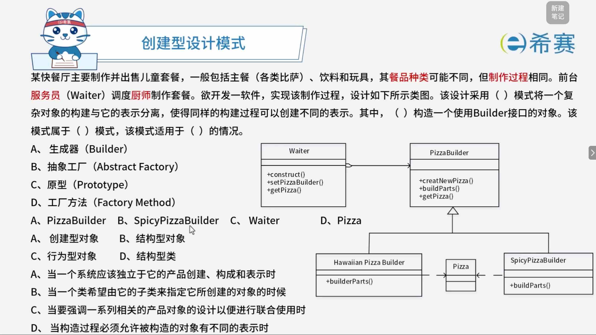

# 设计模式-创建型

## 1. 考点：设计模式的考法

- **考法 1：识别设计模式（应用场景 - 文本）**

  - **考查形式**：给出一段业务场景的文字描述（如“希望动态地给一个对象添加一些额外的职责，而又不能改变其结构”），要求判断或选择对应的是哪种设计模式。
  - **复习重点**​：熟记 23 种设计模式的​**核心意图（Intent）和典型应用场景**。
- **考法 2：识别设计模式（图示）**

  - **考查形式**：给出类图（Class Diagram），要求辨别出这是哪一种设计模式的结构。
  - **复习重点**：熟悉常见设计模式的标准类图结构（如工厂方法、抽象工厂、单例、适配器、观察者等）。
- **考法 3：设计模式分类**

  - **考查形式**：考查某个设计模式属于创建型、结构型还是行为型。
  - **复习重点**：牢记 23 种设计模式的三大分类：

    - **创建型（Creational）** ：单例、工厂方法、抽象工厂、建造者、原型。
    - **结构型（Structural）** ：适配器、桥接、组合、装饰器、外观、享元、代理。
    - **行为型（Behavioral）** ：责任链、命令、解释器、迭代器、中介者、备忘录、观察者、状态、策略、模板方法、访问者。
- **考法 4：设计模式类图组成部分分析**

  - **考查形式**：结合案例填空或选择，分析类图中各个类、接口、方法或属性的具体角色（如哪个是抽象工厂、哪个是具体产品、哪个是客户端等）。

## 2. 考点：设计模式的分类

### 2.1 设计模式三大分类概览

- **创建型（5种）** ：用于处理对象的创建。
- **结构型（7种）** ：用于处理类或对象的组合与结构。
- **行为型（11种）** ：用于描述类或对象怎样交互和分配职责。

### 2.2 详细分类表（按“类”与“对象”划分）

|**分类机制**|**创建型 (5)   JPG**|**结构型 (7)   JPG**|**行为型 (11)   JPG**|
| --| --------------------------------------------------------------------------------------------| ---------------------------------------------------------------------------------------------------------------------------------------------------------------| ----------------------------------------------------------------------------------------------------------------------------------------------------------------------------------------------------------------|
|**类 (Class)**|• 工厂方法模式 (​`factory method`)|• 适配器模式-类 (​`adapter`)|• 模板方法模式 (​`template method`)  • 解释器模式 (​`interpreter`)|
|**对象 (Object)**|• 抽象工厂模式 (​`abstract factory`)  • 原型模式 (​`prototype`)  • 单例模式 (​`singleton`)  • 构建器模式 (​`builder`)|• 适配器模式-对象 (​`adapter`)  • 桥接模式 (​`bridge`)  • 组合模式 (​`composite`)  • 装饰模式 (​`decorator`)  • 外观模式 (​`facade`)  • 享元模式 (​`flyweight`)  • 代理模式 (​`proxy`)|• 职责链模式 (​`chain of responsibility`)  • 命令模式 (​`command`)  • 迭代器模式 (​`iterator`)  • 中介者模式 (​`mediator`)  • 备忘录模式 (​`memento`)  • 观察者模式 (​`observer`)  • 状态模式 (​`state`)  • 策略模式 (​`strategy`)  • 访问者模式 (​`visitor`)|

### 2.3 高频记忆口诀

- **横向（按类划分）** ​：​**公司模姐**（工厂方法、适配器-类、模板方法、解释器）。
- **纵向（按对象划分的特殊模式/助记）** ​：​**四桥组装外箱带**（四：抽象工厂/单例/原型/构建器等；桥：桥接；组：组合；装：装饰；外：外观；箱：享元；带：代理/状态/策略等）。

## 3. 考点：抽象工厂模式

## 4. 考点：工厂模式

## 5. 考点：原型模式

## 6. 考点：单例模式

## 7. 考点：生成器模式

## 8. 总结：创建型设计模式

创建型模式主要用于处理对象的创建，隐藏创建逻辑，使程序更加灵活。

|**设计模式名称**|**简要说明**|**速记关键字**|
| ------------| ----------------------------------------------------------------------------------------------| ------------------|
|**抽象工厂模式**  (​`Abstract Factory`)|提供一个接口，可以创建一系列相关或相互依赖的对象，而无需指定它们具体的类。|生成系列对象|
|**构建器模式 / 生成器**  (​`Builder`)|将一个复杂类的表示与其构造相分离，使得相同的构建过程能够得出不同的表示。|复杂对象构造|
|**工厂方法模式**  (​`Factory Method`)|定义一个创建对象的接口，但由其子类决定需要实例化哪一个类。工厂方法使得子类实例化的过程推迟。|动态生产一个对象|
|**原型模式**  (​`Prototype`)|用原型实例指定创建对象的种类，并且通过拷贝这个原型来创建新的对象。|克隆对象|
|**单例模式**  (​`Singleton`)|保证一个类只有一个实例，并提供一个访问它的全局访问点。|单实例|

## 9. 经典例题

### 9.1 题目一

> 

**解析】**

- **正确答案：第一空选 A，第二空选 C，第三空选 A，第四空选 D。**
- **解析说明：**

  - **第一空：该设计采用（ A ）模式将一个复杂对象的构建与它的表示分离。**

    - 题干描述“将一个复杂对象的构建与它的表示分离，使得同样的构建过程可以创建不同的表示”，这是**生成器（Builder）模式**的典型定义。
    - **B、抽象工厂**：提供一个创建一系列相关或相互依赖对象的接口。
    - **C、原型**：用原型实例指定创建对象的种类，并通过拷贝这些原型创建新对象。
    - **D、工厂方法**：定义一个用于创建对象的接口，让子类决定实例化哪一个类。
  - **第二空：（ C ）构造一个使用 Builder 接口的对象。**

    - 在生成器模式中，**导演者（Director）**  负责构造一个使用 Builder 接口的对象。本题中 **Waiter** 就是导演者，它调用 PizzaBuilder 来构建 Pizza。
    - **A、PizzaBuilder**：是抽象生成器接口。
    - **B、SpicyPizzaBuilder**：是具体生成器。
    - **D、Pizza**：是产品。
  - **第三空：该模式属于（ A ）模式。**

    - 生成器模式属于**创建型对象**模式。
    - **B、结构型对象**：如适配器、桥接、组合等。
    - **C、行为型对象**：如观察者、策略、命令等。
    - **D、结构型类**：如类适配器。
  - **第四空：该模式适用于（ D ）的情况。**

    - 生成器模式适用于“当构造过程必须允许被构造的对象有不同的表示时”。
    - **A、当一个系统应该独立于它的产品创建、构成和表示时**​：属于**抽象工厂**的适用情况。
    - **B、当一个类希望由它的子类来指定它所创建的对象的时候**​：属于**工厂方法**的适用情况。
    - **C、当要强调一系列相关的产品对象的设计以便进行联合使用时**​：属于**抽象工厂**的适用情况。

**正确答案：第一空 A（生成器 Builder），第二空 C（Waiter），第三空 A（创建型对象），第四空 D（当构造过程必须允许被构造的对象有不同的表示时）。**
