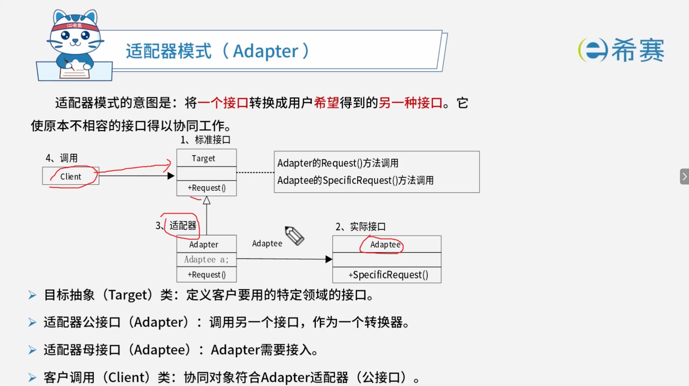
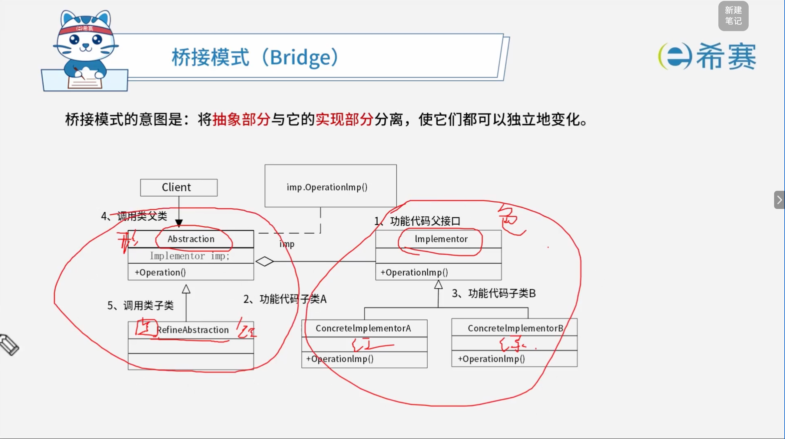
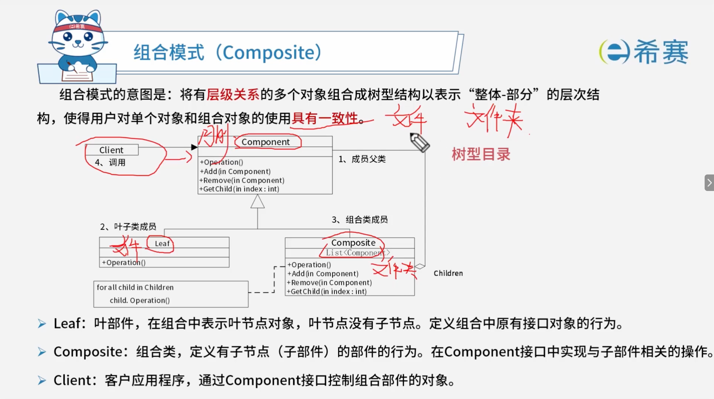
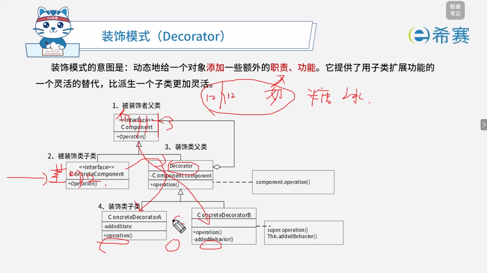
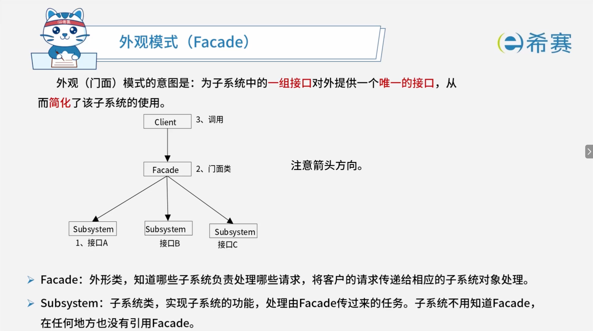
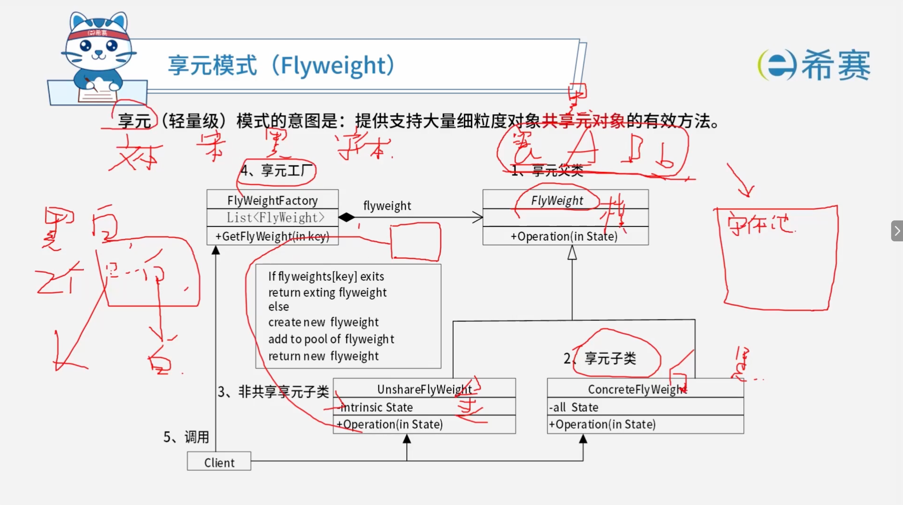
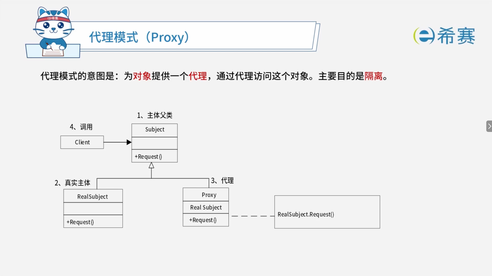
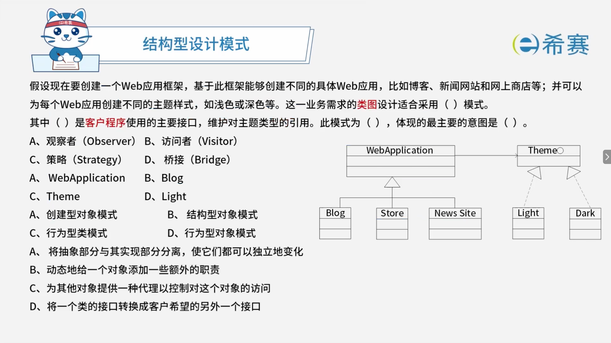

# 设计模式-结构型

## 1. 考点：适配器模式

## 2. 考点：桥接模式

## 3. 考点：组合模式

## 4. 考点：装饰器模式

## 5. 考点：外观/门面模式

## 6. 考点：享元模式

## 7. 考点：代理模式

## 8. 总结：结构型设计模式

结构型模式关注如何将类和对象组合成更大的结构，以简化设计并保持结构的高效与灵活。

|**设计模式名称**|**简要说明**|**速记关键字**|
| ------------| ----------------------------------------------------------------------------------------------------------------------------------------| ------------------|
|**适配器模式**  (​`Adapter`)|将一个类的接口转换成用户希望得到的另一种接口。它使原本不相容的接口得以相容后协同工作。|转换接口|
|**桥接模式**  (​`Bridge`)|将类的抽象部分和它的实现部分分离开来，使它们可以独立地变化。抽象部分通过实现部分的接口与实现部分联系起来。此时的接口就像一座桥梁一样。|继承树拆分|
|**组合模式**  (​`Composite`)|将具有层级关系的多个对象组合成树形结构以表示“整体-部分”的层次结构，使得用户对单个对象和组合对象的使用具有一致性。|树型目录结构|
|**装饰模式**  (​`Decorator`)|动态地给一个对象添加一些额外的职责、功能。就像是添加了一些装饰。它提供了用子类扩展功能的一个灵活的替代，比派生一个子类更加灵活。|附加职责|
|**外观模式**  (​`Facade`)|为子系统中的一组接口提供一个接口，从而简化了该系统的使用。在外界看来，系统只有1个样子（外观）。|对外统一接口|
|**享元模式**  (​`Flyweight`)|支持大量细粒度对象共享元对象的有效方法。|文章共享文字对象|
|**代理模式**  (​`Proxy`)|为其他对象提供一个代理用以控制这个对象的访问。|快捷方式|

## 9. 经典例题

### 9.1 题目一

> 

 **【解析】**

- **正确答案：第一空选 D，第二空选 A，第三空选 B，第四空选 A。**
- **解析说明：**

  - **第一空：适合采用（ D ）模式。**

    - 从类图可以看出，​`WebApplication`​ 是抽象部分，​`Theme`​ 是实现部分，两者通过**聚合关系**连接，可以独立扩展（Web应用有 Blog、Store、News Site；主题有 Light、Dark）。这正是**桥接（Bridge）模式**的典型结构。
    - **A、观察者**：定义对象间的一对多依赖。
    - **B、访问者**：表示一个作用于某对象结构中的各元素的操作。
    - **C、策略**：定义一系列算法，使它们可互相替换。
  - **第二空：（ A ）是客户程序使用的主要接口，维护对主题类型的引用。**

    - 图中 ​`WebApplication`​ 是客户程序使用的主要接口，它维护对 ​`Theme` 类型的引用（通过聚合关系）。
    - **B、Blog**：是具体的 Web 应用。
    - **C、Theme**：是主题接口，是被引用的实现部分。
    - **D、Light**：是具体的主题实现。
  - **第三空：此模式为（ B ）。**

    - 桥接模式属于​**结构型对象模式**。
    - **A、创建型对象模式**：如生成器、抽象工厂等。
    - **C、行为型类模式**：如模板方法、解释器等。
    - **D、行为型对象模式**：如观察者、策略等。
  - **第四空：体现的最主要的意图是（ A ）。**

    - 桥接模式的意图是：​**将抽象部分与其实现部分分离，使它们都可以独立地变化**。
    - **B、动态地给一个对象添加一些额外的职责**​：属于**装饰器**模式。
    - **C、为其他对象提供一种代理以控制对这个对象的访问**​：属于**代理**模式。
    - **D、将一个类的接口转换成客户希望的另外一个接口**​：属于**适配器**模式。

**正确答案：第一空 D（桥接 Bridge），第二空 A（WebApplication），第三空 B（结构型对象模式），第四空 A（将抽象部分与其实现部分分离，使它们都可以独立地变化）。**
