# 设计模式-行为型

## 1. 考点：观察者模式

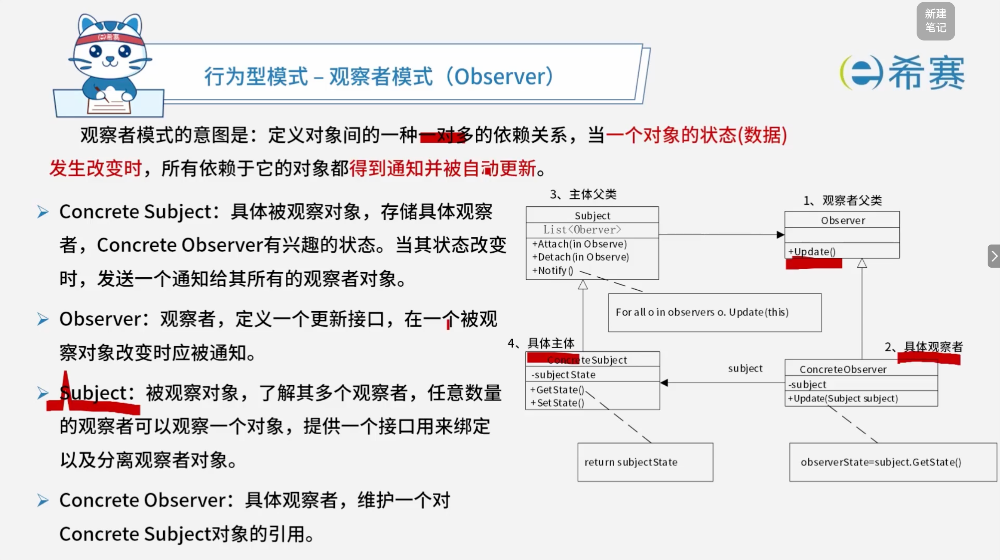

## 2. 考点：访问者模式

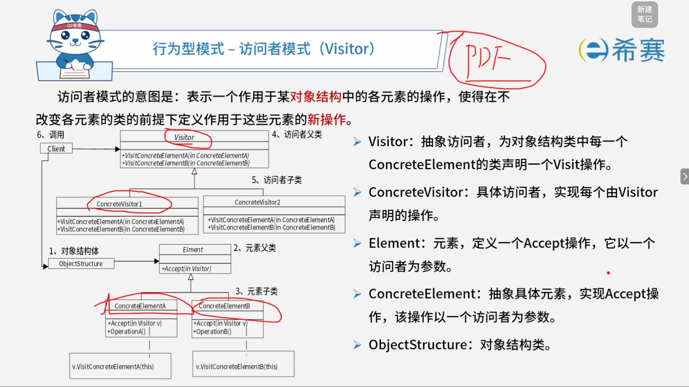

## 3. 考点：状态模式

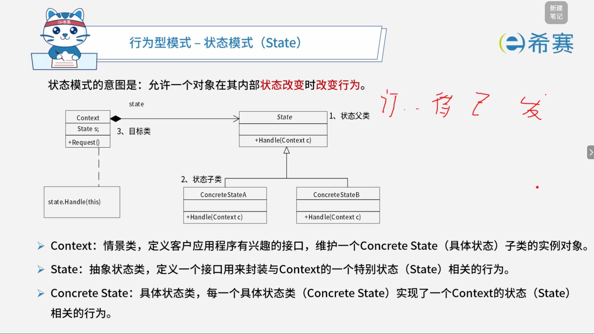

## 4. 考点：职责链模式

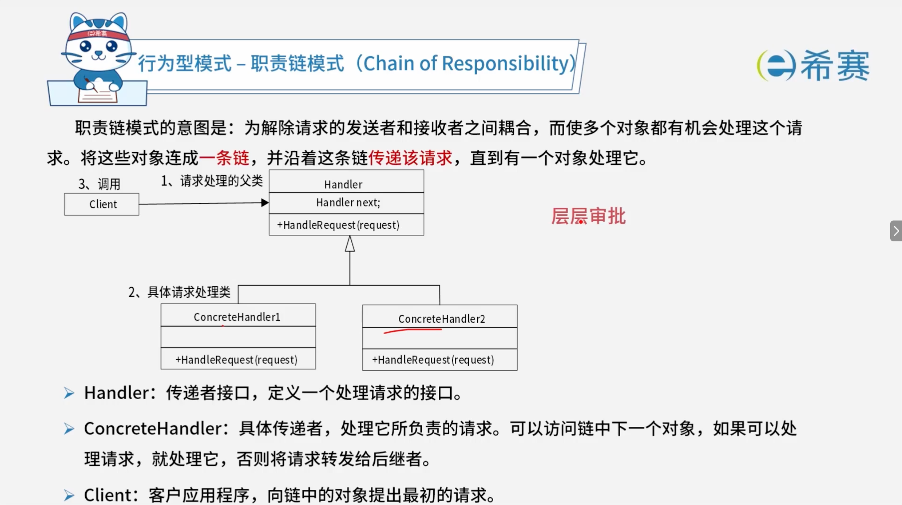

## 5. 考点：命令模式

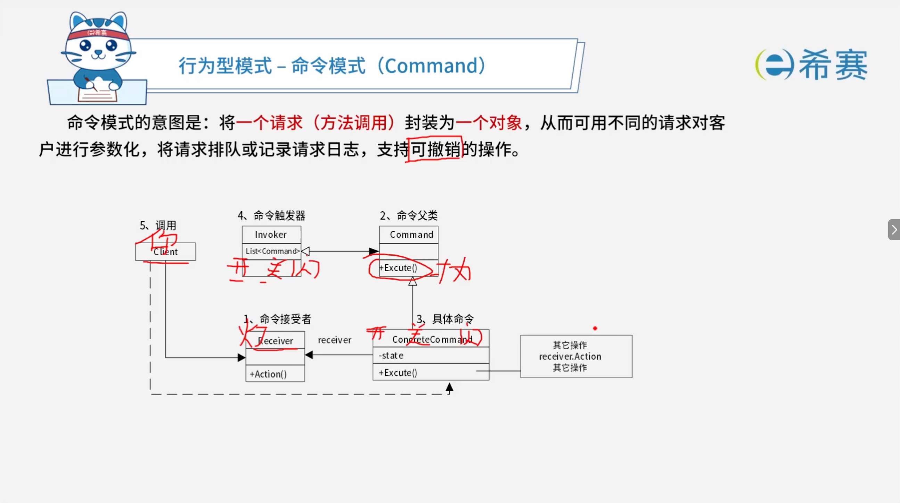

## 6. 考点：解释器模式

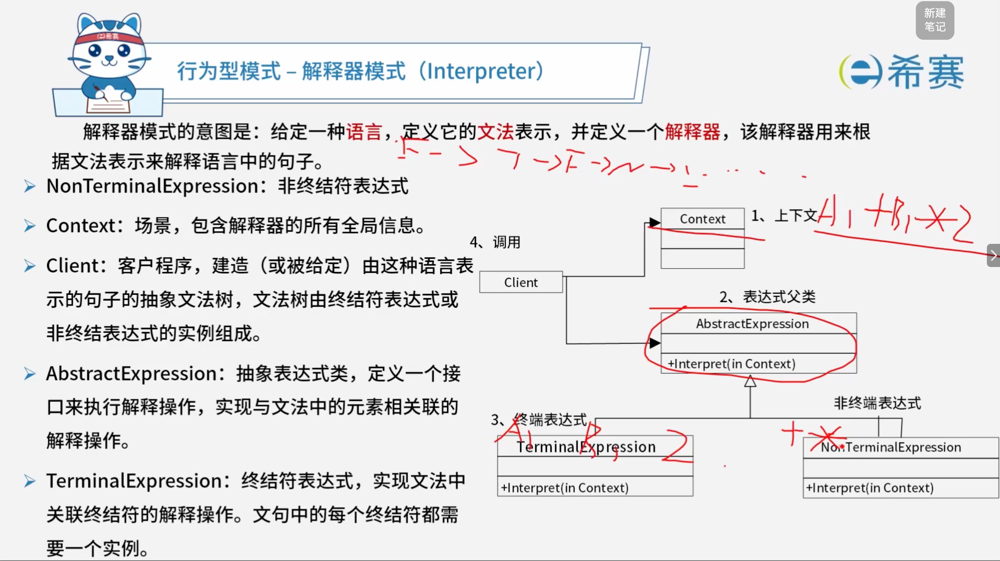

## 7. 考点：迭代器模式

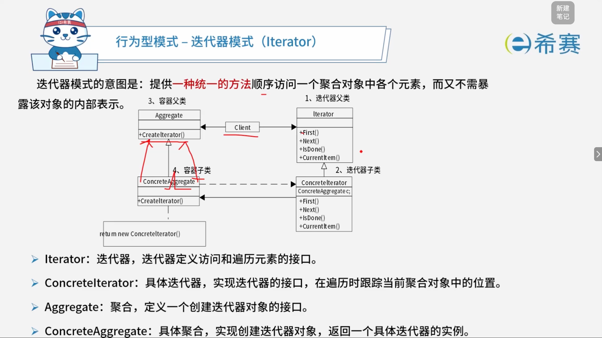

## 8. 考点：中介者模式

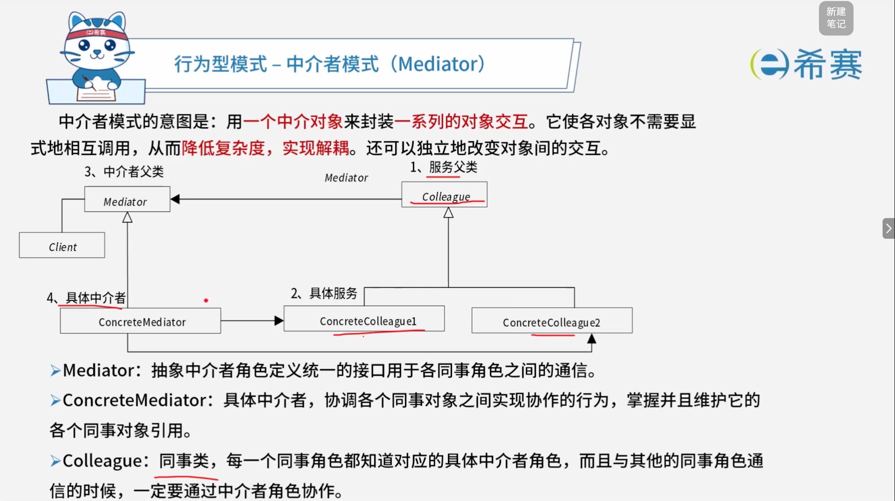

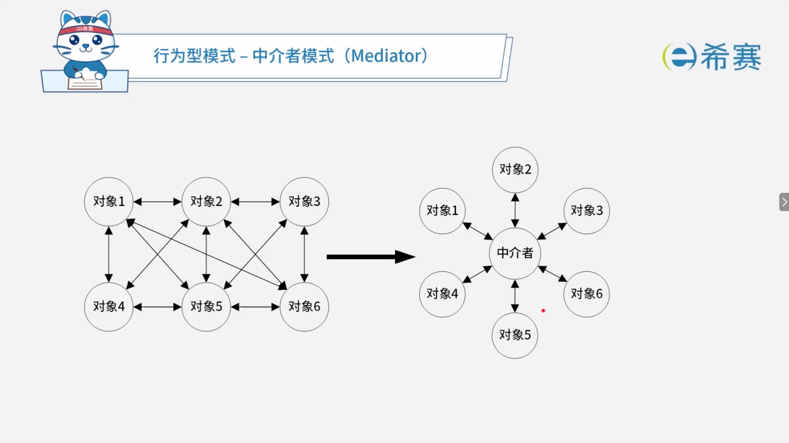

## 9. 考点：备忘录模式

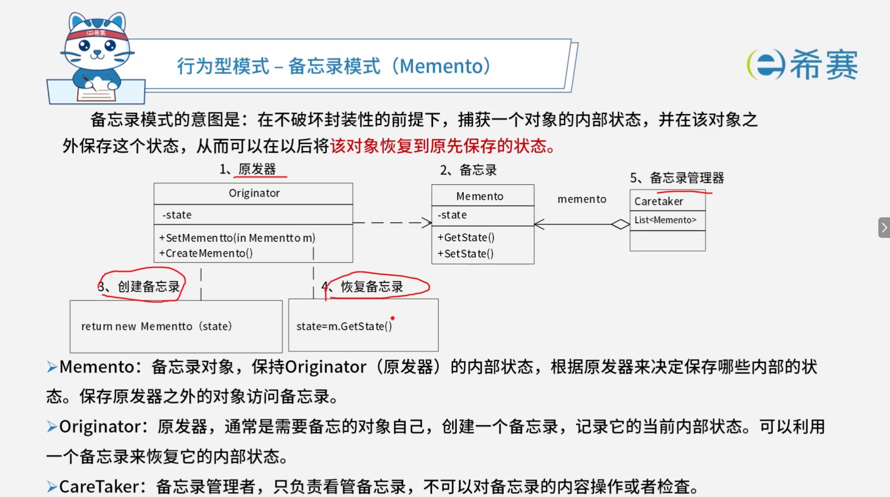

## 10. 考点：策略模式

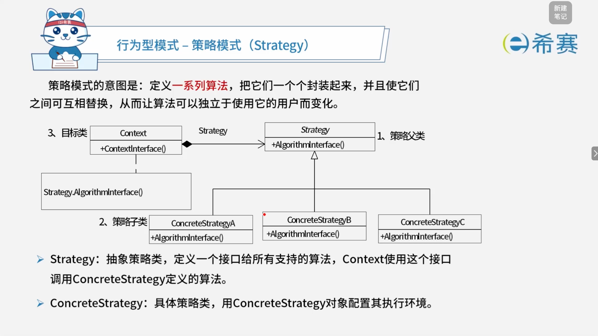

## 11. 考点：模版方法模式

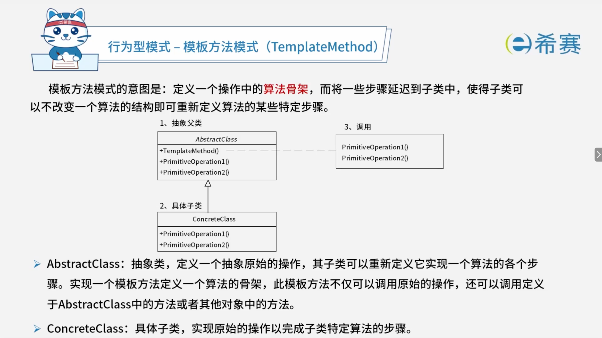

## 12. 总结：行为型设计模式

行为型模式关注对象之间的通信与职责分配，描述类或对象怎样交互以及如何分配职责。

|**设计模式名称**|**简要说明**|**速记关键字**|
| ------------| ------------------------------------------------------------------------------------------------------------------------------------| ------------------|
|**职责链模式**  (​`Chain of Responsibility`)|通过给多个对象处理请求的机会，减少请求的发送者与接收者之间的耦合。将接收对象链接起来，在链中传递请求，直到有一个对象处理这个请求。|传递职责|
|**命令模式**  (​`Command`)|将一个请求（方法调用）封装为一个对象，从而可用不同的请求对客户进行参数化，将请求排队或记录请求日志，支持可撤销的操作。|日志记录，可撤销|
|**解释器模式**  (​`Interpreter`)|给定一种语言，定义它的文法表示，并定义一个解释器，该解释器用来根据文法表示来解释语言中的句子。|虚拟机机制|
|**迭代器模式**  (​`Iterator`)|提供一种统一的方法来顺序访问一个聚合对象中的各个元素，而不需要暴露该对象的内部表示。|数据库数据集|
|**中介者模式**  (​`Mediator`)|用一个中介对象来封装一系列的对象交互。它使各对象不需要显式地相互调用，从而达到低耦合，还可以独立地改变对象间的交互。|不直接引用|
|**备忘录模式**  (​`Memento`)|在不破坏封装性的前提下，捕获一个对象的内部状态，并在该对象之外保存这个状态，从而可以在以后将该对象恢复到原先保存的状态。|可恢复|
|**观察者模式**  (​`Observer`)|定义对象间的一种一对多的依赖关系，当一个对象的状态发生改变时，所有依赖于它的对象都得到通知并自动更新。|联动|
|**状态模式**  (​`State`)|允许一个对象在其内部状态改变时改变行为。|状态变成类|
|**策略模式**  (​`Strategy`)|定义一系列算法，把它们一个个封装起来，并且使它们之间可以互相替换，从而让算法可以独立于使用它的用户而变化。|多方案切换|
|**模板方法模式**  (​`Template Method`)|定义一个操作中的算法骨架，而将一些步骤延迟到子类中，使得子类可以不改变一个算法的结构即可重新定义算法的某些特定步骤。|文档模板填空|
|**访问者模式**  (​`Visitor`)|表示一个作用于某对象结构中的各元素的操作，使得在不改变各元素的类的前提下定义作用于这些元素的新操作。|数据与操作分离|

## 13. 经典例题

### 13.1 题目一

> 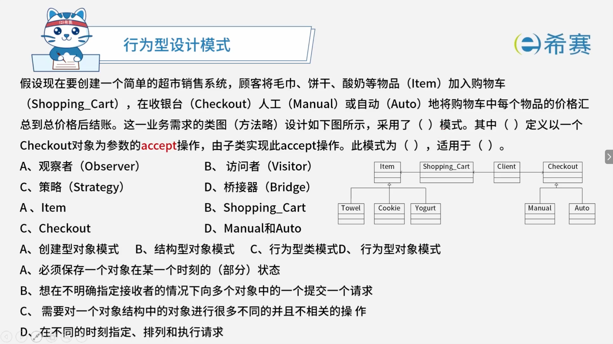

 **【解析】**

- **正确答案：第一空选 B，第二空选 A，第三空选 D，第四空选 C。**
- **解析说明：**

  - **第一空：采用了（ B ）模式。**

    - 观察类图，​`Item`​ 是抽象元素，​`Towel`​、​`Cookie`​、​`Yogurt`​ 是具体元素；​`Checkout`​ 是抽象访问者，​`Manual`​、​`Auto`​ 是具体访问者。这是**访问者（Visitor）模式**的典型结构。
    - **A、观察者**：定义对象间的一对多依赖。
    - **C、策略**：定义一系列算法，使它们可互相替换。
    - **D、桥接器**：将抽象部分与实现部分分离。
  - **第二空：（ A ）定义以一个 Checkout 对象为参数的 accept 操作，由子类实现此 accept 操作。**

    - 在访问者模式中，**抽象元素（Item）**  定义以一个访问者为参数的 ​`accept`​ 操作，由​**具体元素**​（Towel、Cookie、Yogurt）实现此 ​`accept` 操作。
    - **B、Shopping_Cart**：是对象结构，用于存储元素。
    - **C、Checkout**：是抽象访问者。
    - **D、Manual和Auto**：是具体访问者。
  - **第三空：此模式为（ D ）。**

    - 访问者模式属于​**行为型对象模式**。
    - **A、创建型对象模式**：如生成器、抽象工厂等。
    - **B、结构型对象模式**：如桥接、适配器等。
    - **C、行为型类模式**：如模板方法、解释器等。
  - **第四空：适用于（ C ）。**

    - 访问者模式适用于“​**需要对一个对象结构中的对象进行很多不同的并且不相关的操作**”的情况。
    - **A、必须保存一个对象在某一个时刻的（部分）状态**​：属于**备忘录**模式的适用情况。
    - **B、想在不明确指定接收者的情况下向多个对象中的一个提交一个请求**​：属于**职责链**模式的适用情况。
    - **D、在不同的时刻指定、排列和执行请求**​：属于**命令**模式的适用情况。

**正确答案：第一空 B（访问者 Visitor），第二空 A（Item），第三空 D（行为型对象模式），第四空 C（需要对一个对象结构中的对象进行很多不同的并且不相关的操作）。**
