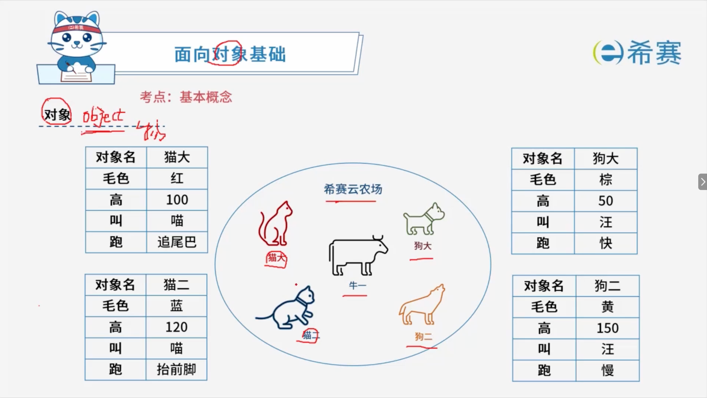
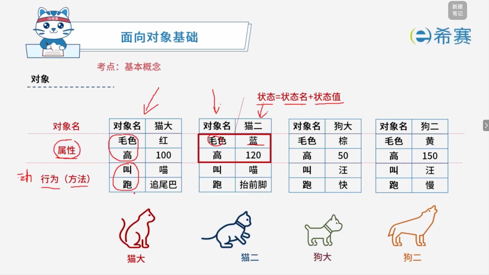
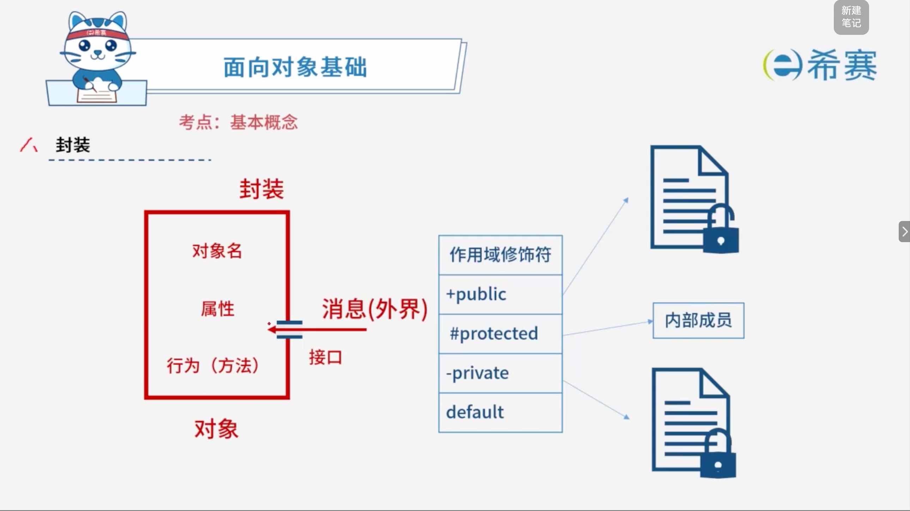
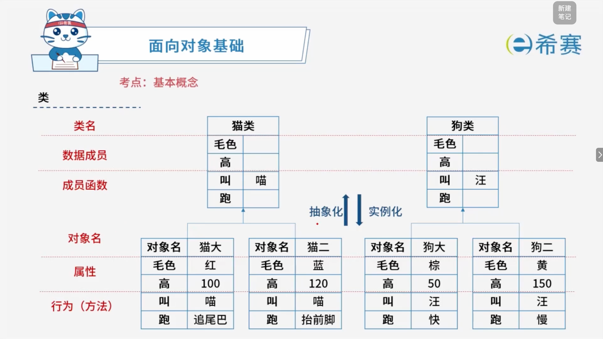
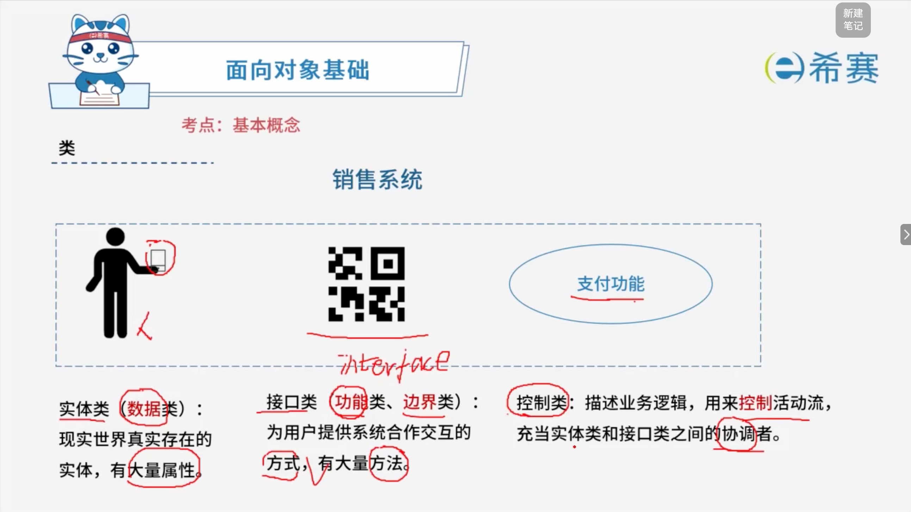
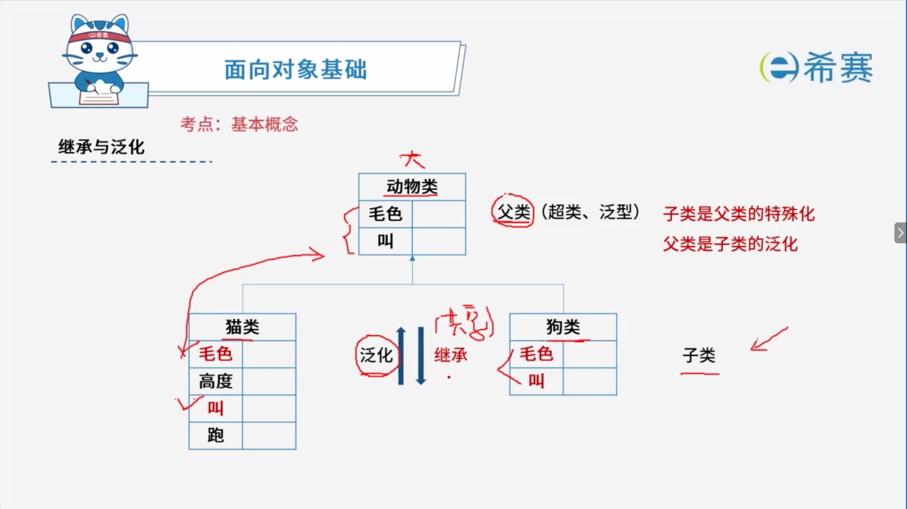
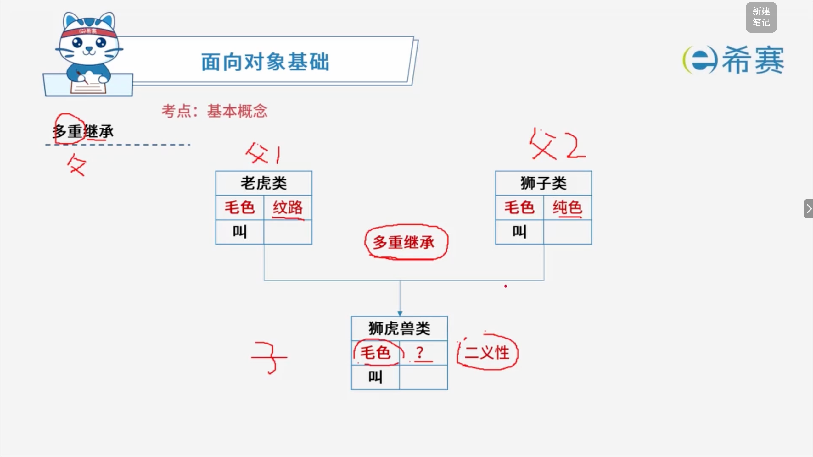
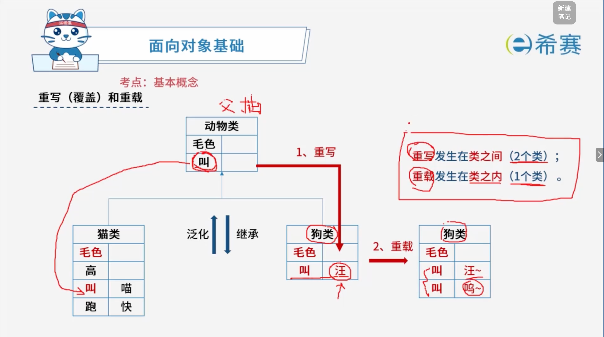
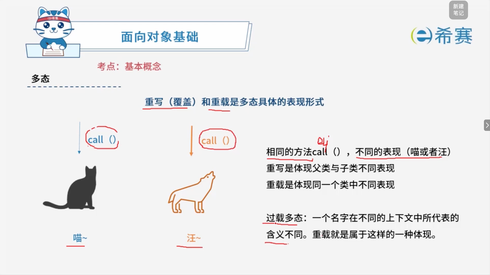
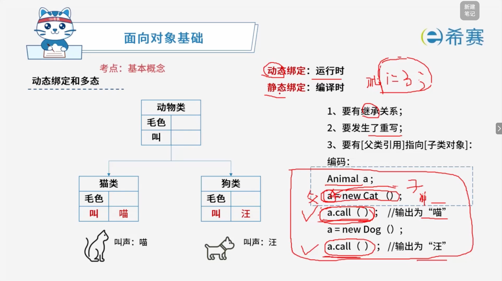

# 面向对象基本概念

## 1. 考点：对象基本概念

### 1.1 封装

- **对象**：

  - **对象名**
  - **属性（状态）**
  - **行为（方法）**
- **消息（外界）**  通过 **接口** 访问对象。
- **作用域修饰符**：

  - `+public`：公开，任何类均可访问。
  - `#protected`：受保护，本类及子类可访问。
  - `-private`：私有，仅本类可访问。
  - `default`：默认（包访问），同一包内可访问。
- **核心总结**：

  - **封装**​：将对象的**属性**和**行为（方法）**  包装在一起，对外隐藏内部实现细节。
  - 外界通过​**接口**​，以**消息**的形式访问对象。
  - 作用域修饰符决定成员的可访问范围：

    - `+public`：公开
    - `#protected`：受保护
    - `-private`：私有
    - `default`：默认（包访问）

## 2. 考点：类的基本概念

- **核心总结**：

  - **类**​：一组具有相同**数据成员**和**成员函数**的对象的抽象描述。
  - **对象**​：类的一个具体实例，具有自己的**属性值**和​**行为实现**。
  - **抽象化**：对象 → 类（提取共性）。
  - **实例化**：类 → 对象（创建具体实例）。

### 2.1 类的分类方法

以**销售系统**为例：

- **实体类（数据类）** ：现实世界真实存在的实体，有大量属性，侧重**属性**。
- **接口类（功能类、边界类）** ：为用户提供系统合作交互的方式，有大量方法，侧重**方法**。
- **控制类**：描述业务逻辑，用来控制活动流，充当实体类和接口类之间的协调者，协调实体类和接口类，控制业务逻辑和活动流。

## 3. 考点：继承与泛化

### 3.1 什么是泛化（Generalization）与继承（Inheritance）？

- **泛化（Generalization）** ​：是一种**从个别到一般**的抽象关系。它是指多个具有共同特征的类（如猫类、狗类）抽象出一个共同的父类（动物类）的过程。在UML类图中，泛化关系用**带空心三角箭头的实线**表示，箭头指向父类。
- **继承（Inheritance）** ：是面向对象语言中实现泛化关系的代码复用机制。子类可以直接获得父类的非私有属性和方法，并在此基础上进行扩展或重写（Override）。

### 3.2 面向对象的四大核心特性

继承是面向对象的三大/四大核心特征之一，完整体系通常包含：

1. **封装（Encapsulation）** ：将数据（属性）和操作数据的行为（方法）捆绑在一个单元中，隐藏对象的内部实现细节，仅对外提供公共访问方式。
2. **继承（Inheritance）** ：子类继承父类的特征和行为，提高代码的可复用性和可维护性。
3. **多态（Polymorphism）** ​：同一个行为具有多个不同表现形式或形态的能力。通过“父类引用指向子类对象”实现（如 ​`Animal a = new Cat(); a.makeSound();`）。
4. **抽象（Abstraction）** ：提取现实世界中某类对象的共同特征，忽略不关心的细节，形成类和接口。

### 3.3 继承的优缺点

- **优点**：

  - 提高代码的​**复用性**（减少重复代码）。
  - 提高代码的​**可维护性**（修改父类即可影响所有子类）。
  - 为多态机制提供基础。
- **缺点**：

  - **耦合度高**：子类与父类之间存在强耦合，父类的修改可能破坏子类的行为（俗称“脆弱的基类问题”）。
  - **破坏封装性**：子类对父类的内部实现细节往往是可见的。
  - **设计限制**：许多现代语言（如 Java）不支持多重继承（一个子类只能有一个直接父类），以避免复杂的菱形继承问题，通常需要通过“接口（Interface）”或“组合（Composition）”来替代。

### 3.4 多重继承

#### 3.4.1 什么是多重继承（Multiple Inheritance）？

- **定义**：多重继承是指一个子类可以有一个以上的直接父类。子类可以同时继承多个父类的属性和方法。
- **支持与否**：

  - **C++ 等语言**原生支持多重继承。
  - **Java、C# 等语言**为了避免多重继承带来的复杂性和二义性问题，**不支持**类的多重继承，但允许实现多个​**接口（Interface）** 。Python 则通过 C3 线性化算法（MRO，方法解析顺序）来优雅地支持多重继承。

#### 3.4.2 什么是二义性（Ambiguity）？

- **产生原因**​：在多重继承中，如果多个父类中含有**同名**的属性或方法（如图中的 ​`毛色`​ 和 ​`叫`​），当子类对象调用或访问该属性/方法时，编译器无法判断究竟该继承或使用哪一个父类的版本，从而导致​**二义性错误**。
- **典型问题——钻石继承/菱形继承（Diamond Problem）** ：

  - 当类 B 和类 C 继承自同一个类 A，而类 D 同时多重继承了类 B 和类 C 时，如果类 A 中有一个方法，类 B 和类 C 都没有重写它，类 D 在调用该方法时就会产生二义性（不知道是通过 B 的路径还是 C 的路径继承）。

#### 3.4.3 常见编程语言如何解决二义性与多重继承问题？

1. **作用域运算符显式指定（如 C++）** ：

   - 程序员可以通过类名和作用域限定符来明确指代，例如 ​`lion_tiger.Tiger::毛色`​ 或 ​`lion_tiger.Lion::毛色`。
   - C++ 还引入了虚继承（Virtual Inheritance）来解决钻石继承中的数据冗余和二义性问题。
2. **接口机制（如 Java）** ：

   - Java 彻底抛弃了类的多重继承。如果多个接口中存在同名默认方法（Default Methods），Java 编译器会强制要求子类必须重写（Override）该方法以消除歧义。
3. **方法解析顺序（MRO，如 Python）** ：

   - Python 采用 C3 线性化算法，按照严格的拓扑排序确定一个确定的查找顺序，避免了混乱的二义性。

## 4. 考点：重写和重载

### 4.1 重写（Override / 覆盖）

- **定义**​：子类继承了父类的方法后，发现父类的方法实现不满足子类的需求，于是在子类中**重新定义**一个与父类方法签名（方法名、参数列表、返回值类型）完全一致的方法。
- **核心规则（“两同两小一大”）** ：

  1. **方法名、参数列表**必须完全相同。
  2. **返回值类型**：子类方法的返回值类型应比父类方法的返回值类型更小或相同（如果是基本类型则必须相同）。
  3. **访问权限**​：子类方法的访问修饰符权限不能小于父类方法的访问权限（​`public`​ \> ​`protected`​ \> ​`private`）。
  4. **异常抛出**：子类方法不能抛出比父类方法更多的异常。
- **多态体现**：重写是实现运行时多态（动态绑定）的基础。

### 4.2 重载（Overload）

- **定义**​：在​**同一个类中**​，允许存在一个以上的同名方法，只要它们的**参数列表不同**即可。编译器会根据调用时传入的参数类型和数量自动匹配对应的方法。
- **核心规则**：

  1. **方法名**必须完全相同。
  2. **参数列表必须不同**（参数的类型不同、数量不同、或者顺序不同）。
  3. **与返回值类型、访问修饰符无关**：仅仅靠返回值不同或者访问权限不同是无法构成重载的。
- **多态体现**：重载是编译时多态（静态绑定 / 静态分派）的体现。

### 4.3 核心区别对比表（建议收藏背诵）

|**比较维度**|**重写（Override / 覆盖）**|**重载（Overload）**|
| --| -----------------------------------| ------------------------------|
|**发生范围**|**类之间**（父类与子类之间，至少2个类）|**类之内**（同一个类中，1个类）|
|**方法名**|必须相同|必须相同|
|**参数列表**|必须完全相同|**必须不同**（类型、数量或顺序不同）|
|**返回值类型**|相同或变小|可以不同|
|**异常/修饰符**|有严格限制（访问权限不能变小）|无限制|
|**绑定机制**|运行时多态（动态绑定）|编译时多态（静态绑定）|

## 5. 考点：多态

### 5.1 什么是多态（Polymorphism）？

- **定义**：多态意为“多种形态”。通俗地说，就是“向不同的对象发送同一个消息，不同的对象会产生不同的行为”。
- 在代码中，表现为：允许不同类的对象对同一消息做出响应。即同一消息可以根据发送对象的不同而采取多种不同的行为方式。

### 5.2 多态的分类（常考概念题）

在计算机科学理论中，面向对象的多态性通常可以分为两大类（或四种形式）：

1. **通用多态（Universal Polymorphism）** ：

   - **包含多态（Inclusion Polymorphism）** ：也就是基于继承和方法重写（Override）实现的动态多态。这是面向对象最经典的多态形式（如父类引用指向子类对象）。
   - **参数多态（Parametric Polymorphism）** ​：通过泛型（如 Java 的 ​`<T>`、C++ 的模板）实现，使代码适用于多种类型。
2. **特定多态（Ad-hoc Polymorphism）** ：

   - **重载多态（Overloading）** ：即“过载多态”，同一个类中方法名相同但参数列表不同。
   - **强制多态（Coercion）** ：通过隐式或显式类型转换来实现（例如将整型自动转换为浮点型进行算术运算）。

### 5.3 实现运行时多态（动态绑定）的三个必要条件

- **继承（Inheritance）** ：必须存在父类与子类之间的继承关系。
- **重写（Override）** ：子类必须重写父类中已有的方法。
- **向上转型（Upcasting）** ​：必须通过父类的引用变量去调用子类中被重写的方法（例如 ​`Animal cat = new Cat(); cat.call();`），程序在运行期间才会根据对象的真实类型动态绑定方法。

## 6. 经典例题

### 6.1 题目一

> **题目：**  在面向对象方法中，将逻辑上相关的数据以及行为绑定在一起，使信息对使用者隐蔽称为（ ）。当类中的属性或方法被设计为 private 时，（ ）可以对其进行访问。
>
> **第一组选项：**
>
> - A、抽象
> - B、继承
> - C、封装
> - D、多态
>
> **第二组选项：**
>
> - A、应用程序中所有方法
> - B、只有此类中定义的方法
> - C、只有此类中定义的 public 方法
> - D、同一个包中的类中定义的方法

 **【解析】**

- **正确答案：第一空选 C，第二空选 B。**
- **解析说明：**

  - **第一空：将逻辑上相关的数据以及行为绑定在一起，使信息对使用者隐蔽称为（ C ）。**

    - **封装**：将逻辑上相关的数据以及行为绑定在一起，使信息对使用者隐蔽。题干描述完全符合封装的定义。
    - **A、抽象**：忽略与当前目标无关的细节，提取本质特征。
    - **B、继承**：子类自动共享父类的属性和方法。
    - **D、多态**：同一操作作用于不同对象产生不同结果。
  - **第二空：当类中的属性或方法被设计为 private 时，（ B ）可以对其进行访问。**

    - **private（私有）** ​：只有**本类中定义的方法**可以访问该成员，子类和外部类均不能直接访问。
    - **A、应用程序中所有方法**：错误，private 不允许外部访问。
    - **C、只有此类中定义的 public 方法**：错误，本类中所有方法（包括 private 方法）都可访问 private 成员，不限于 public 方法。
    - **D、同一个包中的类中定义的方法**：错误，那是 default（包访问）的权限。

**正确答案：第一空 C（封装），第二空 B（只有此类中定义的方法）。** 

### 6.2 题目二

> **题目：**  在面向对象的系统中，对象是运行时实体，其组成部分不包括（ ）；一个类定义了一组大体相似的对象，这些对象共享（ ）。
>
> **第一组选项：**
>
> - A、消息
> - B、行为（操作）
> - C、对象名
> - D、状态
>
> **第二组选项：**
>
> - A、属性和状态
> - B、对象名和状态
> - C、行为和多重度
> - D、属性和行为

 **【解析】**

- **正确答案：第一空选 A，第二空选 D。**
- **解析说明：**

  - **第一空：对象的组成部分不包括（ A ）**

    - 对象的组成部分包括：​**对象名、属性（状态）、行为（操作）** 。
    - **消息**是对象之间交互的方式，不是对象的组成部分，因此选 A。
  - **第二空：一个类定义了一组大体相似的对象，这些对象共享（ D ）**

    - 类定义了一组大体相似的对象，这些对象共享​**属性和行为**。
    - 同一类的对象具有相同的属性定义和行为定义，只是具体的属性值（状态）可以不同。
    - 因此选 D（属性和行为）。

**正确答案：第一空 A（消息），第二空 D（属性和行为）。** 

### 6.3 题目三

> **题目：**  在某销售系统中，客户采用扫描二维码进行支付。若采用面向对象方法开发该销售系统，则客户类属于（ ）类，二维码类属于（ ）类。
>
> **第一组选项：**
>
> - A、接口
> - B、实体
> - C、控制
> - D、状态
>
> **第二组选项：**
>
> - A、接口
> - B、实体
> - C、控制
> - D、状态

 **【解析】**

- **正确答案：第一空选 B，第二空选 A。**
- **解析说明：**

  - **第一空：客户类属于（ B ）类。**

    - **实体类**的对象表示现实世界中真实的实体，如人、物等。
    - “客户”是现实世界中真实存在的人，因此客户类属于​**实体类**。
  - **第二空：二维码类属于（ A ）类。**

    - **接口类（边界类）** 的对象为用户提供一种与系统合作交互的方式，分为人和系统两大类。其中人的接口可以是显示屏、窗口、Web窗体、对话框、菜单、列表框、其他显示控制、条形码、**二维码**或者用户与系统交互的其他方法。
    - “二维码”是用户与系统交互的方式，因此二维码类属于​**接口类**。
  - **其他选项说明**：

    - **C、控制类**：用来控制活动流，充当协调者，不符合题意。
    - **D、状态类**：不属于面向对象中的标准类分类。

**正确答案：第一空 B（实体），第二空 A（接口）。** 

### 6.4 题目四

> **题目：**  在面向对象方法中，（ ）是父类和子类之间共享数据方法的机制。子类在原有父类接口的基础上，用适合于自己要求的实现去置换父类中的相应实现称为（ ）。
>
> **第一组选项：**
>
> - A、封装
> - B、继承
> - C、覆盖
> - D、多态
>
> **第二组选项：**
>
> - A、封装
> - B、继承
> - C、覆盖
> - D、多态

 **【解析】**

- **正确答案：第一空选 B，第二空选 C。**
- **解析说明：**

  - **第一空：父类和子类之间共享数据方法的机制是（ B ）**

    - **继承**：是父类和子类之间共享数据方法的机制。子类可以继承父类的属性和方法。
    - **A、封装**：将数据和行为绑定，隐藏内部实现。
    - **C、覆盖**：子类重新定义父类的方法。
    - **D、多态**：同一操作作用于不同对象产生不同结果。
  - **第二空：子类在原有父类接口的基础上，用适合于自己要求的实现去置换父类中的相应实现称为（ C ）**

    - **覆盖（Override）** ：子类在原有父类接口的基础上，用适合于自己要求的实现去置换父类中的相应实现。
    - **A、封装**：不符合题意。
    - **B、继承**：是共享数据和方法的机制，不是置换实现。
    - **D、多态**：同一操作作用于不同对象产生不同结果。

**正确答案：第一空 B（继承），第二空 C（覆盖）。** 

### 6.5 题目五

> **题目：**  （ ）多态是指操作（方法）具有相同的名称，且在不同的上下文中所代表的含义不同。
>
> - A、参数
> - B、包含
> - C、过载
> - D、强制

 **【解析】**

- **正确答案：C**
- **解析说明：**

  - **关于选项 C（过载）** ：过载多态是指同一个名（操作符、函数名）在不同的上下文中所代表的含义不同。题干描述完全符合过载多态的定义。
  - **其他选项说明**：

    - **A、参数多态**：应用广泛、最纯的多态。
    - **B、包含多态**：同样的操作可用于一个类型及其子类型。包含多态一般需要进行运行时的类型检查。
    - **D、强制多态**：编译程序通过语义操作，把操作对象的类型强行加以变换，以符合函数或操作符的要求。
- **补充记忆**：

  - **参数多态**：应用广泛、最纯的多态。
  - **包含多态**：同样的操作可用于一个类型及其子类型，一般需要进行运行时的类型检查。
  - **强制多态**：编译程序通过语义操作，把操作对象的类型强行加以变换，以符合函数或操作符的要求。
  - **过载多态**：同一个名（操作符、函数名）在不同的上下文中所代表的含义不同。

**正确答案：C（过载）。** 

### 6.6 题目六

> **题目：**  在面向对象方法中，不同对象收到同一消息可以产生完全不同的结果，这一现象称为（ ）。在使用时，用户可以发送一个通用的消息，而实现的细节则由接收对象自行决定。
>
> - A、接口
> - B、继承
> - C、覆盖
> - D、多态

 **【解析】**

- **正确答案：D**
- **解析说明：**

  - **关于选项 D（多态）** ：多态是指不同对象收到同一消息可以产生完全不同的结果。用户发送一个通用的消息，实现的细节由接收对象自行决定，这正是多态的典型特征。
  - **其他选项说明**：

    - **A、接口**：是对象对外提供的一种交互方式，不是“同一消息产生不同结果”的机制。
    - **B、继承**：是父类和子类之间共享数据方法的机制。
    - **C、覆盖**：是子类用适合自己的实现去置换父类中的相应实现。

**正确答案：D（多态）。** 

### 6.7 题目七

> **题目：**  在下列机制中，（ ）是指过程调用和响应调用所需执行的代码在运行时加以结合；而（ ）是过程调用和响应调用所需执行的代码在编译时加以结合。
>
> **第一组选项：**
>
> - A、消息传递
> - B、类型检查
> - C、静态绑定
> - D、动态绑定
>
> **第二组选项：**
>
> - A、消息传递
> - B、类型检查
> - C、静态绑定
> - D、动态绑定

 **【解析】**

- **正确答案：第一空选 D，第二空选 C。**
- **解析说明：**

  - **第一空：过程调用和响应调用所需执行的代码在运行时加以结合的是（ D ）**

    - **动态绑定**​：指过程调用和响应调用所需执行的代码在**运行时**加以结合，是多态实现的基础。
  - **第二空：过程调用和响应调用所需执行的代码在编译时加以结合的是（ C ）**

    - **静态绑定**​：指过程调用和响应调用所需执行的代码在**编译时**加以结合。
  - **其他选项说明**：

    - **A、消息传递**：对象之间交互的方式。
    - **B、类型检查**：对操作对象类型进行检查。

**正确答案：第一空 D（动态绑定），第二空 C（静态绑定）。** 

## 7. 🎯 面向对象基础：核心概念总结

### 7.1 对象 (Object)

- **组成结构**：属性（数据） + 方法（操作） + 对象 ID。

### 7.2 封装 (Encapsulation)

- **核心定义**​：隐藏对象的属性和实现细节，仅对外公开接口（又称​**信息隐藏技术**）。

### 7.3 类 (Class)

- **分类类型**：实体类 / 控制类 / 边界类。
- **接口 (Interface)** ​：一种特殊的类，它**只有方法定义而没有实现**。

### 7.4 继承与泛化 (Inheritance & Generalization)

- **本质作用**​：一种重要的代码​**复用机制**（分为单重继承和多重继承）。
- **重置 / 覆盖 (Overriding)** ​：在子类中**重新定义**父类中已经定义的方法。
- **重载 (Overloading)** ​：在同一个类中，可以有多个**同名但参数类型不同**的方法。

### 7.5 多态 (Polymorphism)

- **核心定义**​：**不同对象收到同样的消息产生不同的结果**。
- **过载多态**​：同一个名字在不同的上下文中，其所代表的**含义不同**。

### 7.6 动态绑定 (Dynamic Binding)

- **核心定义**​：根据接收对象的具体情况，将请求的操作与实现的方法进行连接（又称​**运行时绑定**）。

### 7.7 消息和消息通信 (Message & Message Communication)

- **核心定义**：对象之间进行通信的一种构造叫做消息。
- **通信特点**​：消息是**异步通信**的。
- **消息传递**：接收到消息的对象经过解释，然后予以响应。
