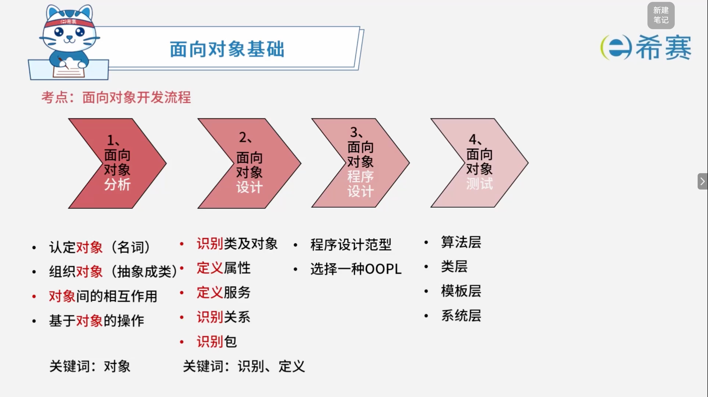

# 面向对象开发流程

## 1. 考点：面向对象开发流程

- **1、面向对象分析 (OOA)**

  - 认定对象（名词）
  - 组织对象（抽象成类）
  - 对象间的相互作用
  - 基于对象的操作
  - **关键词**：对象
- **2、面向对象设计 (OOD)**

  - 识别类及对象
  - 定义属性
  - 定义服务
  - 识别关系
  - 识别包
  - **关键词**：识别、定义
- **3、面向对象程序设计 (OOP)**

  - 程序设计范型
  - 选择一种 OOPL
- **4、面向对象测试 (OOT)**

  - 算法层
  - 类层
  - 模板层
  - 系统层

## 2. 经典例题

### 2.1 题目一

> **题目：**  面向对象分析的目的是为了获得对应用问题的理解，其主要活动不包括（ ）。
>
> - A、认定并组织对象
> - B、描述对象间的相互作用
> - C、面向对象程序设计
> - D、确定基于对象的操作

 **【解析】**

- **正确答案：C**
- **解析说明：**

  - **关于选项 C（面向对象程序设计）** ​：面向对象分析（OOA）的目的是获得对应用问题的理解，属于​**分析阶段**​；而面向对象程序设计（OOP）属于​**设计/实现阶段**，不是面向对象分析的主要活动。
  - **其他选项说明**：

    - **A、认定并组织对象**：属于面向对象分析的活动，分析阶段需要识别并组织对象。
    - **B、描述对象间的相互作用**：属于面向对象分析的活动，分析对象之间的交互关系。
    - **D、确定基于对象的操作**：属于面向对象分析的活动，确定对象应有的操作。

**正确答案：C（面向对象程序设计）。** 

‍
