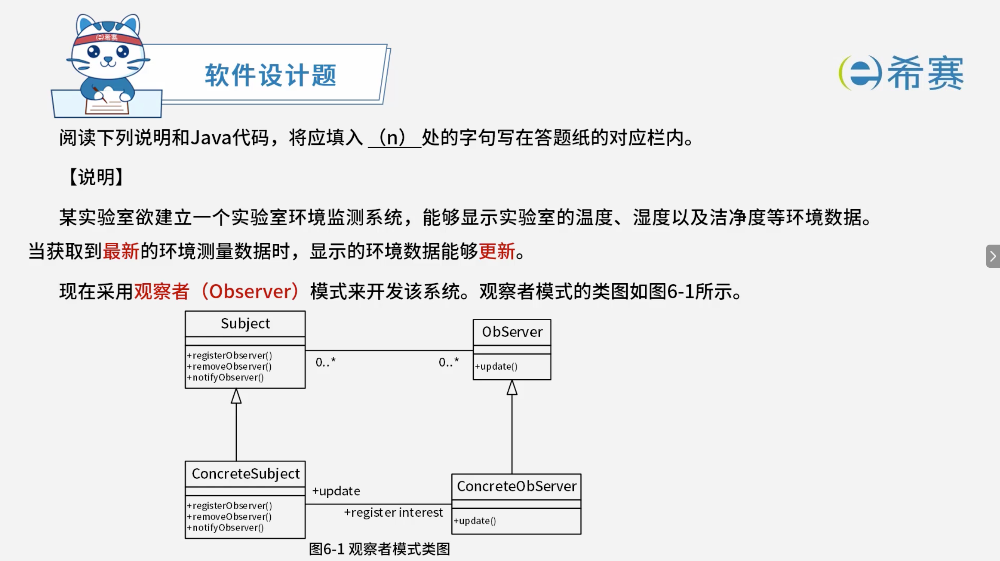
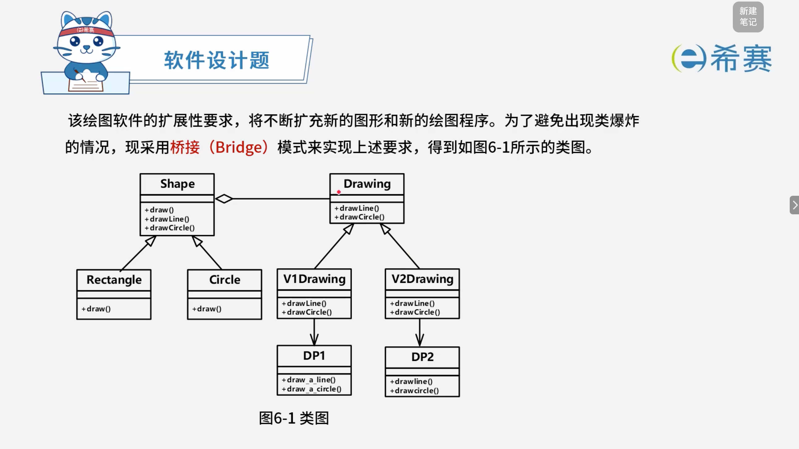

# 例子-合格

## 1. 题目一

> 
>
> ```JAVA
> interface Observer {
>     public void update(float temp, float humidity, float cleanness);
> }
>
> interface Subject {
>     public void registerObserver(Observer o); //注册对主题感兴趣的观察者
>     public void removeObserver(Observer o);   //删除观察者
>     public void notifyObservers();            //当主题发生变化时通知观察者
> }
>
> class EnvironmentData implements (1) { //子类实现父接口
>     private ArrayList observers;
>     private float temperature, humidity, cleanness;
>
>     public EnvironmentData() { observers = new ArrayList(); }
>
>     public void registerObserver(Observer o) { observers.add(o); }
>     public void removeObserver(Observer o) { /* 代码省略 */ }
> }
>
> public void notifyObservers() {
>     for (int i = 0; i < observers.size(); i++) {
>         Observer observer = (Observer) observers.get(i);
>         (2) ; //
>     }
> }
>
> public void measurementsChanged() { //测量发生变化
>     (3) ; //
> }
>
> public void setMeasurements(float temperature, float humidity, float cleanness) {
>     this.temperature = temperature;
>     this.humidity = humidity;
>     this.cleanness = cleanness;
>     (4) ; //设置最新数据，测量值发生变化。
> }
>
> class CurrentConditionsDisplay implements (5) {
>     private float temperature;
>     private float humidity;
>     private float cleanness;
>     private Subject envData;
>
>     public CurrentConditionsDisplay(Subject envData) {
>         this.envData = envData;
>         (6) ; //把当前观察者放在主体中。
>     }
>
>     public void update(float temperature, float humidity, float cleanness) {
>         this.temperature = temperature;
>         this.humidity = humidity;
>         this.cleanness = cleanness;
>         display(); //更新的时候，把数据展示出来。
>     }
>
>     public void display() { /* 代码省略 */ }
> }
> ```

### 1.1 正确答案

 **(1)** <span data-type="text" style="color: var(--b3-font-color6);"> </span>​`Subject`​

 **(2)** <span data-type="text" style="color: var(--b3-font-color6);"> </span>​`observer.update(temperature, humidity, cleanness)`​

- <span data-type="text" style="color: var(--b3-font-color6);">在 </span>​`notifyObservers()`​​<span data-type="text" style="color: var(--b3-font-color6);"> 方法中，遍历所有观察者，调用每个观察者的 </span>​`update`​​<span data-type="text" style="color: var(--b3-font-color6);"> 方法，并将最新的环境数据传递给它。</span>

 **(3)** <span data-type="text" style="color: var(--b3-font-color6);"> </span>​`notifyObservers()`​

- `measurementsChanged()`​​<span data-type="text" style="color: var(--b3-font-color6);"> 表示测量发生变化，此时应通知所有观察者，调用 </span>​`notifyObservers()`​​<span data-type="text" style="color: var(--b3-font-color6);">。</span>

 **(4)** <span data-type="text" style="color: var(--b3-font-color6);"> </span>​`measurementsChanged()`​

- `setMeasurements()`​​<span data-type="text" style="color: var(--b3-font-color6);"> 设置最新数据后，测量值发生变化，应调用 </span>​`measurementsChanged()`​​<span data-type="text" style="color: var(--b3-font-color6);"> 来触发通知。</span>

 **(5)** <span data-type="text" style="color: var(--b3-font-color6);"> </span>​`Observer`​

- `CurrentConditionsDisplay`​​<span data-type="text" style="color: var(--b3-font-color6);"> 作为具体观察者，需要实现 </span>​`Observer`​​<span data-type="text" style="color: var(--b3-font-color6);"> 接口，并实现其中的 </span>​`update`​​<span data-type="text" style="color: var(--b3-font-color6);"> 方法。</span>

 **(6)** <span data-type="text" style="color: var(--b3-font-color6);"> </span>​`envData.registerObserver(this)`​

- <span data-type="text" style="color: var(--b3-font-color6);">在构造方法中，需要把当前观察者对象注册到主题（</span>​`Subject`​​<span data-type="text" style="color: var(--b3-font-color6);">）中，即调用主题的 </span>​`registerObserver`​​<span data-type="text" style="color: var(--b3-font-color6);"> 方法，传入 </span>​`this`​​<span data-type="text" style="color: var(--b3-font-color6);">。</span>

## 2. 题目二

> 阅读下列说明和 JAVA 代码，将应填入空 (n) 处的字句写在答题纸的对应栏内。
>
>  **【说明】**
>
> 欲开发一个绘图软件，要求使用不同的绘图程序绘制不同的图形。
>
> 以绘制直线和圆形为例，对应的绘图程序如表 6-1 所示。
>
> **表 6-1 不同的绘图程序**
>
> ||DP1|DP2|
> | :---------------------------------------| :-----------------------------------| :-----------------------------------|
> |绘制直线|​`draw_a_line(x1, y1, x2, y2)`|​`drawline(x1, y1, x2, y2)`|
> |绘制圆|​`draw_a_circle(x, y, r)`|​`drawcircle(x, y, r)`|
>
> 
>
> ```JAVA
> (1) Drawing {
>     (2) ;
>     (3) ;
> }
>
> class DP1 {
>     static public void draw_a_line(double x1, double y1, double x2, double y2) { /*代码省略*/ }
>     static public void draw_a_circle(double x, double y, double r) { /*代码省略*/ }
> }
>
> class DP2 {
>     static public void drawline(double x1, double y1, double x2, double y2) { /*代码省略*/ }
>     static public void drawcircle(double x, double y, double r) { /*代码省略*/ }
> }
>
> class V1Drawing implements Drawing {
>     public void drawLine(double x1, double y1, double x2, double y2) { /*代码省略*/ }
>     public void drawCircle(double x, double y, double r) {
>         (4) ; 
> 	}
> }
> class V2Drawing implements Drawing {
>     public void drawLine(double x1, double y1, double x2, double y2) { /*代码省略*/ }
>     public void drawCircle(double x, double y, double r) { (5) ; }
> }
>
> abstract class Shape {
>     private Drawing _dp;
>     (6) ;
>     Shape(Drawing dp) { _dp = dp; }
>     public void drawLine(double x1, double y1, double x2, double y2) { 
> 		_dp.drawLine(x1, y1, x2, y2); 
> 	}
>     public void drawCircle(double x, double y, double r) { 
> 		_dp.drawCircle(x, y, r); 
> 	}
> }
> ```

### 2.1 正确答案

 **(1)** <span data-type="text" style="color: var(--b3-font-color6);"> </span>​`public interface`​​<span data-type="text" style="color: var(--b3-font-color6);"> 或 </span>​`interface`​

 **(2)** <span data-type="text" style="color: var(--b3-font-color6);"> </span>​`public void drawLine(double x1, double y1, double x2, double y2)`​

<span data-type="text" style="color: var(--b3-font-color6);">或 </span>​`void drawLine(double x1, double y1, double x2, double y2)`​

 **(3)** <span data-type="text" style="color: var(--b3-font-color6);"> </span>​`public void drawCircle(double x, double y, double r)`​

<span data-type="text" style="color: var(--b3-font-color6);">或 </span>​`void drawCircle(double x, double y, double r)`​

 **(4)** <span data-type="text" style="color: var(--b3-font-color6);"> </span>​`DP1.draw_a_circle(x, y, r)`​

 **(5)** <span data-type="text" style="color: var(--b3-font-color6);"> </span>​`DP2.drawcircle(x, y, r)`​

 **(6)** <span data-type="text" style="color: var(--b3-font-color6);"> </span>​`abstract public void draw()`​

<span data-type="text" style="color: var(--b3-font-color6);">或 </span>​`public abstract void draw()`​

‍
