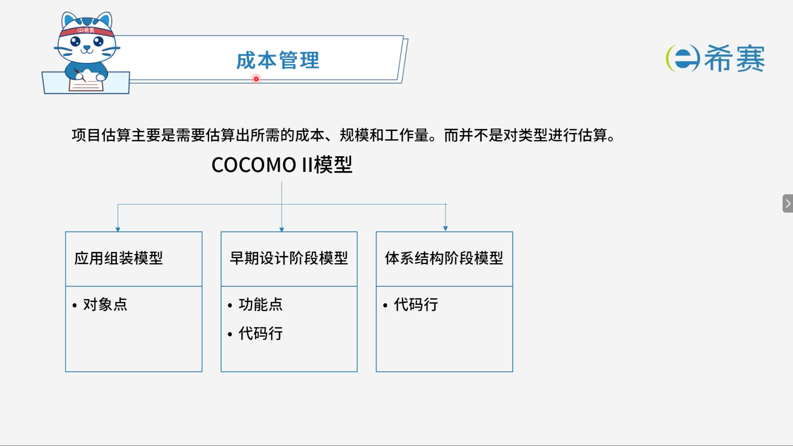

# 成本管理

## 1. **考点：成本管理**

- **项目估算**​：主要是需要估算出所需的​**成本、规模和工作量**，而并不是对类型进行估算。

### 1.1 **COCOMO II 模型**

- **应用组装模型**：

  - 对象点
- **早期设计阶段模型**：

  - 功能点
  - 代码行
- **体系结构阶段模型**：

  - 代码行
- **核心总结**：

  - **项目估算**的对象：成本、规模、工作量。
  - **COCOMO II 模型**分为三种：

    - **应用组装模型** → 用**对象点**估算。
    - **早期设计阶段模型** → 用**功能点**或**代码行**估算。
    - **体系结构阶段模型** → 用**代码行**估算。

## 2. 经典例题

### 2.1 题目一

> **题目：**  工作量估算模型 COCOMO II 的层次结构中，估算选择不包括（ ）。
>
> - A、对象点
> - B、功能点
> - C、用例数
> - D、源代码行

 **【解析】**

- **正确答案：C**
- **解析说明：**

  - **关于选项 C（用例数）** ​：COCOMO II 模型的估算选择中​**不包括用例数**。用例数通常用于其他估算方法（如用例点估算），但不是 COCOMO II 的层次结构中的估算选择。
  - **其他选项说明**：

    - **A、对象点**​：属于 COCOMO II 中**应用组装模型**的估算选择。
    - **B、功能点**​：属于 COCOMO II 中**早期设计阶段模型**的估算选择。
    - **D、源代码行**​：属于 COCOMO II 中**体系结构阶段模型**的估算选择，同时也出现在早期设计阶段模型中。

**正确答案：C（用例数）。**
