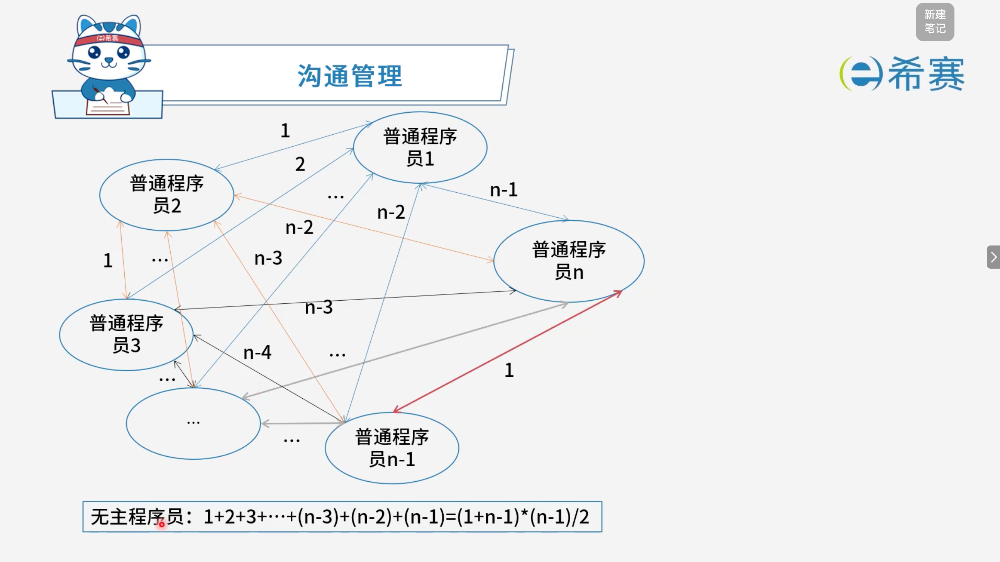
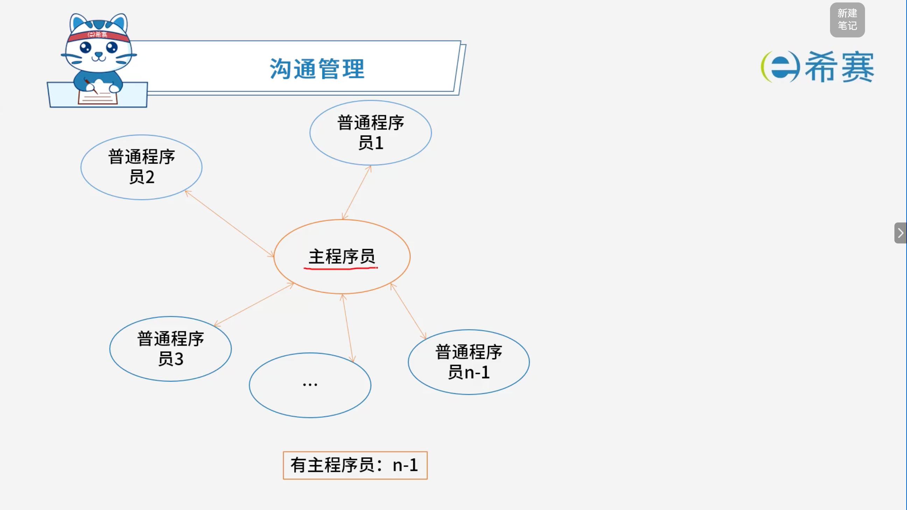

# 沟通管理

## 1. 考点：无主程序员

- **基本概念**：

  - 无主程序员团队（民主式团队）强调团队成员地位平等，没有绝对的技术专制或单一领导。
  - 团队成员之间需要进行高度的协作和​**两两沟通**。
- **核心公式（沟通路径计算）** ：

  - 设团队总人数为 $n$，由于每两个程序员之间都需要建立一条沟通路径，因此总沟通路径数的计算公式为：
  - $Path = \frac{n(n-1)}{2}$ （即 $1 + 2 + 3 + \dots + (n-1)$ 的等差数列求和）
- **核心结论与考点总结**：

  - **平方级增长**：沟通路径数随团队人数 $n$ 的增加呈​**平方级增长**。
  - **成本剧增**：随着团队规模扩大，沟通路径会呈爆炸式膨胀，导致协调成本过高、效率显著下降。
  - **适用场景**​：该模式由于沟通开销大，​**不适合大型团队**，通常适用于小型、高凝聚力、需要深度技术探讨的攻坚团队。

## 2. 考点：有主程序员

- **基本概念**：

  - 主程序员团队（主程序员制）设立一个核心的​**主程序员（Chief Programmer）** ，由其负责系统的大部分设计、核心编码和统筹协调工作。
  - 其他普通程序员围绕主程序员展开协同工作。
- **核心公式（沟通路径计算）** ：

  - **沟通路径数**：由于普通程序员之间通常不直接进行复杂的横向沟通，所有成员主要与主程序员单线联系，因此沟通路径数大幅减少。
  - **路径公式**：若团队总人数为 $n$（1个主程序员 + $n-1$ 个普通程序员），则总沟通路径数为 ​**$n - 1$**。
- **核心结论与考点总结**：

  - **线性增长**：相比于无主程序员团队呈平方级增长 ($\frac{n(n-1)}{2}$) 的沟通成本，主程序员团队的沟通路径呈​**线性增长**（$n-1$）。
  - **优缺点**：大大降低了沟通成本，提高了决策和开发效率；但对主程序员个人的技术与管理能力要求极高，容易产生“关键人风险”（主程序员离职或过载会导致项目瘫痪）。

## 3. 经典例题

### 3.1 题目一

> **题目：**  在进行软件开发时，采用无主程序员的开发小组，成员之间相互平等；而主程序员负责制的开发小组，由一个主程序员和若干成员组成，成员之间没有沟通。在一个由 8 名开发人员构成的小组中，无主程序员组和主程序员组的沟通路径分别是（ ）。
>
> - A、32和8
> - B、32和7
> - C、28和8
> - D、28和7

 **【解析】**

- **正确答案：D**
- **解析说明：**

  - **无主程序员组**：

    - 成员之间相互平等，两两之间都需要沟通。
    - 沟通路径数为 $\frac{n(n-1)}{2}$。
    - 当 $n=8$ 时，$\frac{8 \times (8-1)}{2} = \frac{8 \times 7}{2} = 28$。
  - **主程序员组**：

    - 由一个主程序员和若干成员组成，成员之间没有沟通。
    - 所有成员都只与主程序员沟通，沟通路径数等于成员数。
    - 当总人数为 8 时，主程序员 1 人，成员 7 人，沟通路径数为 $8-1=7$。

**正确答案：D（28和7）。**
