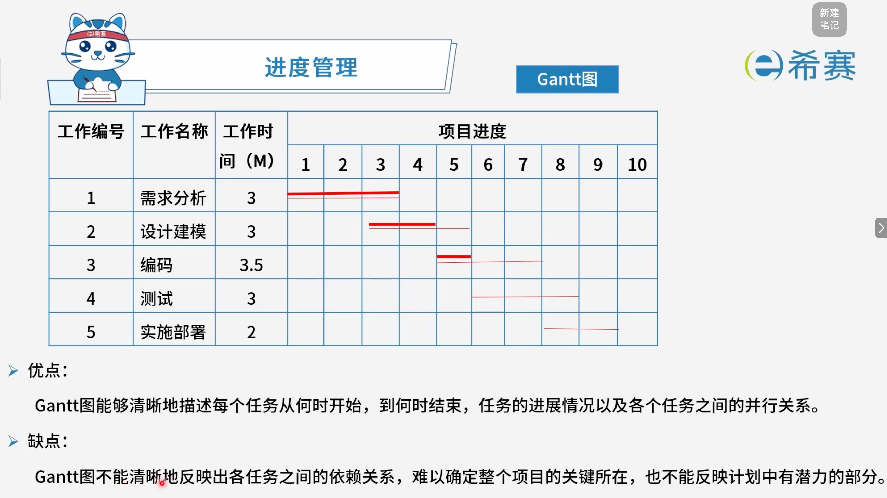
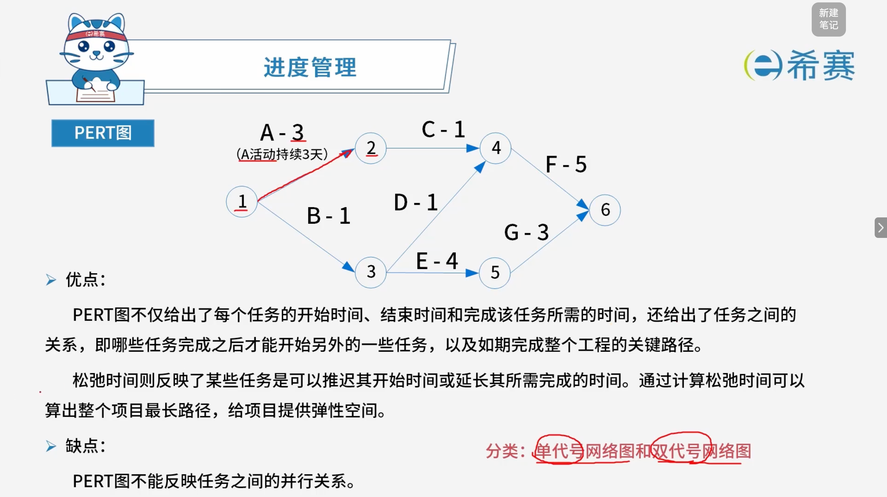
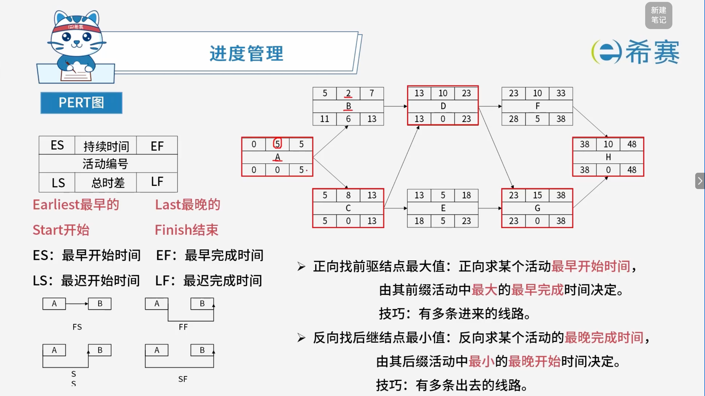
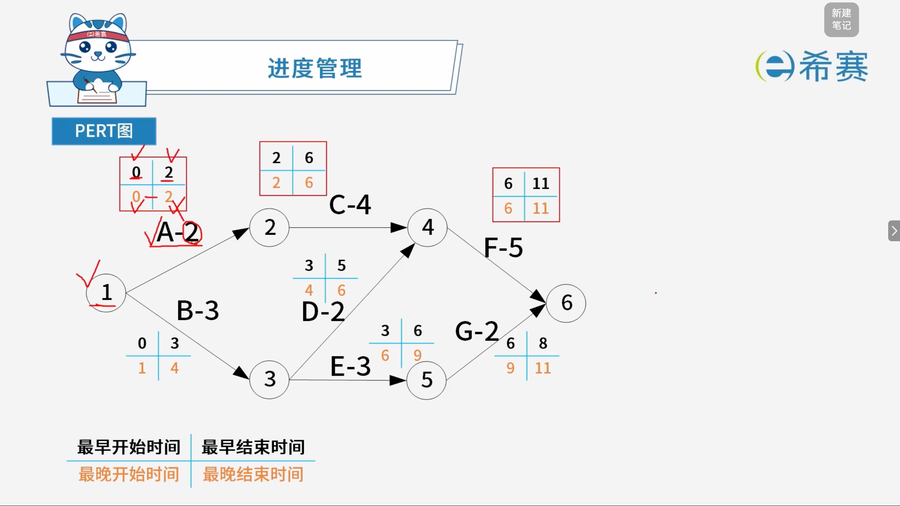
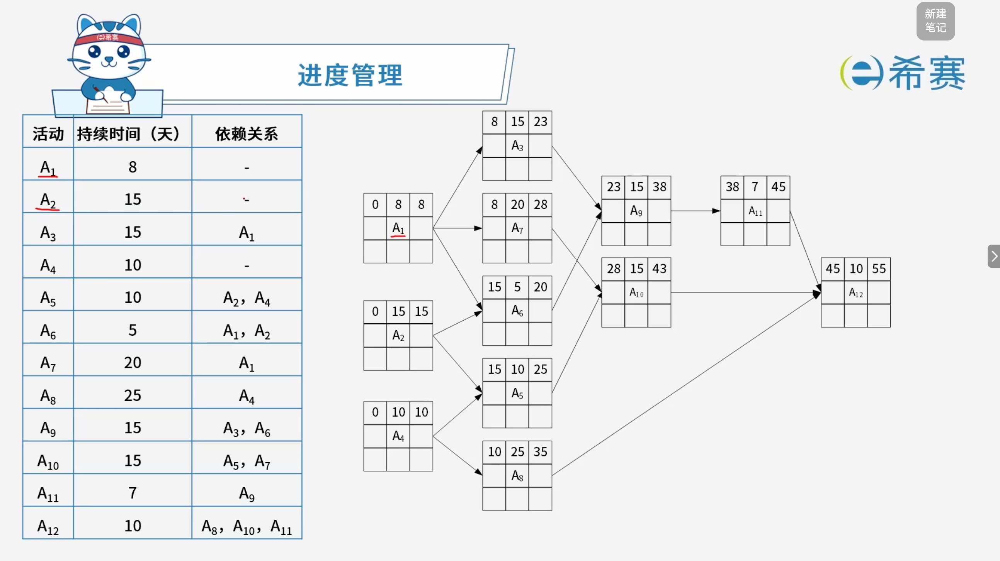
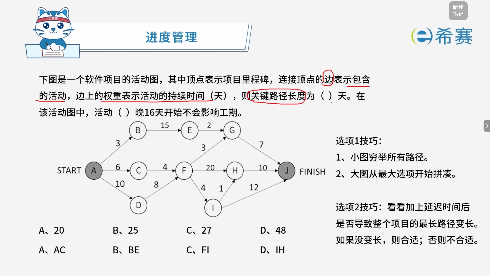
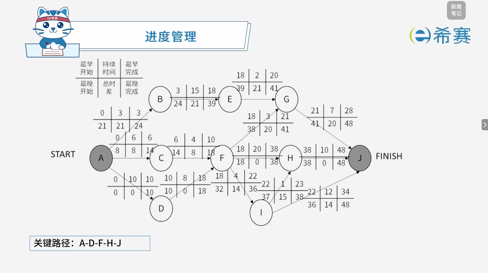

# 进度管理

## 1. 考点：**Gantt图（甘特图）**

- **示例**：

|工作编号|工作名称|工作时间（M）|1|2|3|4|5|6|7|8|9|10|
| ----------| ----------| ---------------| ----| ----| ----| ----| ----| ----| ----| ----| ----| ----|
|1|需求分析|3|█|█|█||||||||
|2|设计建模|3|||█|█|█||||||
|3|编码|3.5|||||█|█|█||||
|4|测试|3|||||||█|█|█||
|5|实施部署|2|||||||||█|█|

- **优点**：

  - Gantt图能够清晰地描述每个任务从何时开始，到何时结束，任务的进程情况以及各个任务之间的并行关系。
- **缺点**：

  - Gantt图不能清晰地反映出各任务之间的依赖关系，难以确定整个项目的关键所在，也不能反映计划中有潜力的部分。
- **核心总结**：

  - **Gantt图（甘特图）** ：横轴为时间，纵轴为任务，用条形表示任务的起止时间和持续时间。
  - **优点**：直观展示任务的开始/结束时间、进度、并行关系。
  - **缺点**：无法清晰反映任务依赖关系，难以确定项目关键路径和潜力部分。

## 2. 考点：**PERT图 Program Evaluation and Review Technique**（计划评审技术）

- **示例**：

  - 节点 1 → 节点 2：A - 3（A活动持续3天）
  - 节点 1 → 节点 3：B - 1
  - 节点 2 → 节点 4：C - 1
  - 节点 3 → 节点 4：D - 1
  - 节点 3 → 节点 5：E - 4
  - 节点 4 → 节点 6：F - 5
  - 节点 5 → 节点 6：G - 3
- **优点**：

  - PERT图不仅给出了每个任务的开始时间、结束时间和完成该任务所需的时间，还给出了任务之间的关系，即哪些任务完成之后才能开始另外一些任务，以及如期完成整个工程的关键路径。
  - 松弛时间则反映了某些任务是可以推迟其开始时间或延长其所需完成的时间。通过计算松弛时间可以算出整个项目最长路径，给项目提供弹性空间。
- **缺点**：

  - PERT图不能反映任务之间的并行关系。
- **分类**：

  - **单代号网络图**：

    - **表示方式**​：​**节点表示活动（任务）** ，箭线表示活动之间的依赖关系。
    - **特点**：每个节点代表一个活动，节点内通常标注活动名称、持续时间等信息。
    - **优点**：逻辑清晰，容易理解和绘制，不易产生歧义。
    - **缺点**：当活动较多时，箭线交叉较多，图形较复杂。
  - **双代号网络图**：

    - **表示方式**​：​**箭线表示活动（任务）** ，节点表示事件（活动的开始或结束）。
    - **特点**：每条箭线代表一个活动，箭尾节点表示活动开始，箭头节点表示活动结束。
    - **优点**：能清晰表达活动之间的逻辑关系，便于计算时间参数。
    - **缺点**​：可能需要引入​**虚活动**（持续时间为0的虚箭线）来表达逻辑关系，增加了复杂性。
- **核心总结**：

  - **PERT图**​：用节点表示事件，用箭头表示活动，能反映**任务依赖关系**和​**关键路径**。
  - **优点**：能体现任务先后顺序、关键路径、松弛时间。
  - **缺点**​：​**不能反映任务之间的并行关系**。
  - **分类**：单代号网络图、双代号网络图。

### 2.1 相关计算

- **关键路径**​：从开始到结束，需要**时间最长**的路径。
- **项目工期**：完成项目的最少时间，注意由关键路径即最长路径决定。
- **活动松弛时间（总时差）** ​：在不延误总工期的前提下，该活动的机动时间。活动的总时差等于该活动​**最迟完成时间与最早完成时间之差**​，或该活动​**最迟开始时间与最早开始时间之差**。
- **核心总结**：

  - 所有**松弛时间为 0** 的活动连起来就是​**最长路径**（关键路径）。
  - **关键路径**决定了​**项目工期**。
  - 关键路径上的活动​**松弛时间（总时差）为 0**，不能延误。
  - 非关键路径上的活动有松弛时间，可以在不影响总工期的前提下适当推迟。

### 2.2 实例讲解

#### 2.2.1 单代号网络图

#### 2.2.2 双代号网络图

## 3. 经典例题

### 3.1 题目一

> **题目：**  某项目的活动持续时间及其依赖关系如下表所示，则完成该项目的最少时间为（ ）天。
>
> |活动|持续时间（天）|依赖关系|
> | -------| ----------------| -------------------|
> |A₁|8|-|
> |A₂|15|-|
> |A₃|15|A₁|
> |A₄|10|-|
> |A₅|10|A₂, A₄|
> |A₆|5|A₁, A₂|
> |A₇|20|A₁|
> |A₈|25|A₄|
> |A₉|15|A₃, A₆|
> |A₁₀|15|A₅, A₇|
> |A₁₁|7|A₉|
> |A₁₂|10|A₈, A₁₀, A₁₁|
>
> - A、43
> - B、45
> - C、50
> - D、55

 **【解析】**

- **正确答案：D**
- **解析说明：**

  - **梳理各活动的最早完成时间**：

    - **A₁**：8（无依赖）
    - **A₂**：15（无依赖）
    - **A₄**：10（无依赖）
    - **A₃**​：依赖 A₁ → 8 + 15 \= 23
    - **A₆**​：依赖 A₁、A₂ → max(8, 15) + 5 \= 20
    - **A₇**​：依赖 A₁ → 8 + 20 \= 28
    - **A₅**​：依赖 A₂、A₄ → max(15, 10) + 10 \= 25
    - **A₈**​：依赖 A₄ → 10 + 25 \= 35
    - **A₉**​：依赖 A₃、A₆ → max(23, 20) + 15 \= 38
    - **A₁₀**​：依赖 A₅、A₇ → max(25, 28) + 15 \= 43
    - **A₁₁**​：依赖 A₉ → 38 + 7 \= 45
    - **A₁₂**​：依赖 A₈、A₁₀、A₁₁ → max(35, 43, 45) + 10 \= **55**
  - **确定关键路径**：

    - 路径 1：A₁ → A₃ → A₉ → A₁₁ → A₁₂ \= 8 + 15 + 15 + 7 + 10 \= 55
    - 路径 2：A₂ → A₆ → A₉ → A₁₁ → A₁₂ \= 15 + 5 + 15 + 7 + 10 \= 52
    - 路径 3：A₁ → A₇ → A₁₀ → A₁₂ \= 8 + 20 + 15 + 10 \= 53
    - 路径 4：A₄ → A₈ → A₁₂ \= 10 + 25 + 10 \= 45
    - 路径 5：A₂ → A₅ → A₁₀ → A₁₂ \= 15 + 10 + 15 + 10 \= 50
  - **最长路径**​：A₁ → A₃ → A₉ → A₁₁ → A₁₂，总时长 \= ​**55 天**。

**正确答案：D（55）。** 

### 3.2 题目二

> 

**解析】**

- **正确答案：第一空选 D，第二空选 B。**
- **解析说明：**

  - **第一空：关键路径长度为（ D ）天。**

    - **穷举所有路径**：

      - A → B → E → G → J：3 + 15 + 2 + 7 \= **27**
      - A → C → F → G → J：6 + 4 + 3 + 7 \= **20**
      - A → C → F → H → J：6 + 4 + 20 + 10 \= **40**
      - A → C → F → I → H → J：6 + 4 + 4 + 1 + 10 \= **25**
      - A → C → F → I → J：6 + 4 + 4 + 12 \= **26**
      - A → D → F → G → J：10 + 8 + 3 + 7 \= **28**
      - A → D → F → H → J：10 + 8 + 20 + 10 \= **48**
      - A → D → F → I → H → J：10 + 8 + 4 + 1 + 10 \= **33**
      - A → D → F → I → J：10 + 8 + 4 + 12 \= **34**
    - **最长路径**​：A → D → F → H → J，总时长 \= ​**48 天**。
    - 因此，关键路径长度为 ​**48 天**。
  - **第二空：活动（ B ）晚16天开始不会影响工期。**

    - **技巧**：看加上延迟时间后是否导致整个项目的最长路径变长。如果没变长，则合适；否则不合适。
    - **关键路径**​：A → D → F → H → J \= 48 天。
    - 逐个选项验证：

      - **A、AC**​：A → C → ...，最长路径变为 A → C → F → H → J \= 6 + 4 + 20 + 10 \= 40，加 16 天 \= 56 \> 48，会影响工期。
      - **B、BE**​：A → B → E → G → J \= 3 + 15 + 2 + 7 \= 27，加 16 天 \= 43 \< 48，不影响工期。✅
      - **C、FI**​：A → D → F → I → J \= 10 + 8 + 4 + 12 \= 34，加 16 天 \= 50 \> 48，会影响工期。
      - **D、IH**​：A → D → F → I → H → J \= 10 + 8 + 4 + 1 + 10 \= 33，加 16 天 \= 49 \> 48，会影响工期。
    - 因此，活动 **BE** 晚 16 天开始不会影响工期。

**正确答案：第一空 D（48），第二空 B（BE）。**
