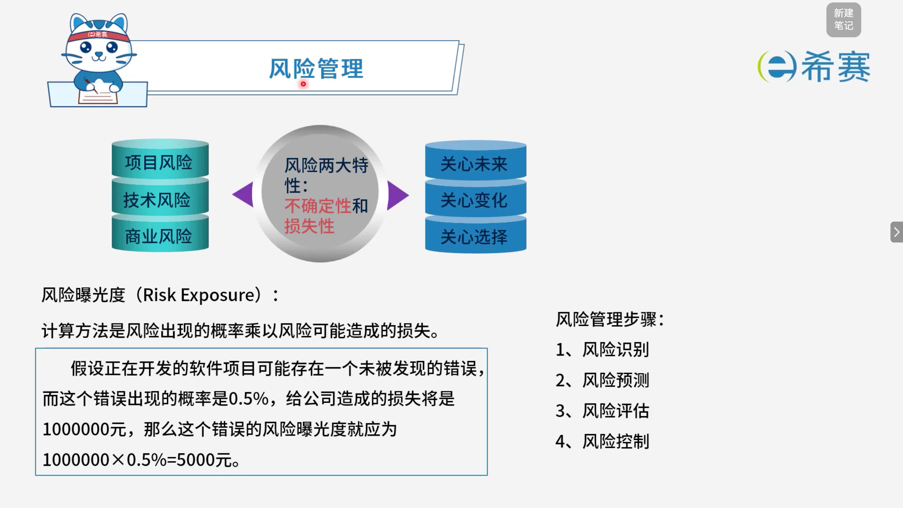

# 风险管理

## 1. 考点：基础概念

### 1.1 **风险分类与特征**

- **风险分类**：

  - 项目风险
  - 技术风险
  - 商业风险
- **风险两大特性**：

  - 不确定性
  - 损失性
- **风险管理关注点**：

  - 关心未来
  - 关心变化
  - 关心选择

### 1.2 **风险曝光度（Risk Exposure）**

- **计算方法**：风险出现的概率 × 风险可能造成的损失。
- **示例**：

  - 假设正在开发的软件项目可能存在一个未被发现的错误，而这个错误出现的概率是 0.5%，给公司造成的损失将是 1000000 元。
  - $\text{风险曝光度} = 1000000 \times 0.5\% = 5000\ \text{元}$。

### 1.3 **风险管理步骤**

1. 风险识别
2. 风险预测
3. 风险评估
4. 风险控制

- **核心总结**：

  - 风险分类：​**项目风险、技术风险、商业风险**。
  - 风险两大特性：​**不确定性、损失性**。
  - 风险管理关注：​**未来、变化、选择**。
  - 风险曝光度：​**概率 × 损失**。
  - 风险管理步骤：​**识别 → 预测 → 评估 → 控制**。

## 2. 经典例题

### 2.1 题目一

> **题目：**  以下叙述中，（ ）不是一个风险。
>
> - A、由另一个小组开发的子系统可能推迟交付，导致系统不能按时交付客户
> - B、客户不清楚想要开发什么样的软件，因此开发小组开发原型帮助其确定需求
> - C、开发团队可能没有正确理解客户的需求
> - D、开发团队核心成员可能在系统开发过程中离职

 **【解析】**

- **正确答案：B**
- **解析说明：**

  - **关于选项 B（客户不清楚想要开发什么样的软件，因此开发小组开发原型帮助其确定需求）** ：

    - 这描述的是一种​**应对措施或解决方案**，而不是风险本身。
    - 风险指的是​**可能发生的不利事件**​（具有不确定性和损失性）。选项 B 中“开发原型帮助确定需求”是开发小组采取的​**主动行动**，目的是消除或降低风险，所以它不是一个风险。
  - **其他选项说明**：

    - **A、由另一个小组开发的子系统可能推迟交付，导致系统不能按时交付客户**​：这是​**项目风险**，可能发生且会造成损失。
    - **C、开发团队可能没有正确理解客户的需求**​：这是​**技术风险/项目风险**，可能导致返工或交付失败。
    - **D、开发团队核心成员可能在系统开发过程中离职**​：这是​**人员风险**，属于项目风险，可能导致进度延误或知识流失。

**正确答案：B（客户不清楚想要开发什么样的软件，因此开发小组开发原型帮助其确定需求）。** 

### 2.2 题目三

> **题目：**  下列关于风险的叙述中，不正确的是（ ）。
>
> - A、风险是可能发生的事件
> - B、如果能预测到风险，则可以避免其发生
> - C、风险是可能会带来损失的事件
> - D、对于风险进行干预，以期减少损失

 **【解析】**

- **正确答案：B**
- **解析说明：**

  - **关于选项 B（如果能预测到风险，则可以避免其发生）** ​：说法不正确。风险具有​**不确定性**​，即使能够预测到风险，也​**不能完全避免其发生**​。预测风险的目的是为了提前制定应对措施，从而​**降低风险发生的概率或减少风险带来的损失**，而不是彻底避免。
  - **其他选项说明**：

    - **A、风险是可能发生的事件**：正确，风险具有不确定性。
    - **C、风险是可能会带来损失的事件**：正确，风险具有损失性。
    - **D、对于风险进行干预，以期减少损失**：正确，风险管理的目的是减少损失。

**正确答案：B（如果能预测到风险，则可以避免其发生）。** 

‍
